# 1. Fuentes de información en Geología

El término *Geología* deriva de las palabras griegas *Geo* *(Tierra)* y *Logos* *(Razonamiento)*. Por lo tanto, la Geología es la Ciencia que estudia la Tierra, su composición y estructura, los procesos físicos y químicos profundos o que repercuten en su superficie y en el medio ambiente, y que han sido activos durante su historia. La Geología trabaja con información muy diversa: datos de campo, mapas, cortes, columnas estratigráficas, fotografías aéreas, imágenes de satélite, textos técnicos y modelos. Es importante aprender a elegir la fuente adecuada, reconocer qué representa y usarla para responder una pregunta concreta sobre el territorio del planeta.

## 1.1. El mapa topográfico

**¿Qué es?** Un mapa topográfico es aquel que representa los accidentes de la geografía física (hidrografía, relieve), los elementos de la geografía humana (vías de comunicación, poblaciones), las divisiones administrativas y la toponimia (nombres de parajes y lugares).

**¿Para qué sirve?** Sirve para identificar los elementos del relieve y representar con detalle la superficie del terreno. El mapa topográfico también se suele usar como base para los mapas temáticos, que muestran la distribución de una característica ambiental del territorio (clima, uso del suelo, población, geología, riesgos, etc.).

Si bien los elementos tales como la hidrografía, las vías de comunicación, poblaciones, etc., son fáciles de representar en un mapa, el relieve puede ser un poco más complicado de representar en un plano.

::: {style="text-align:center;"}
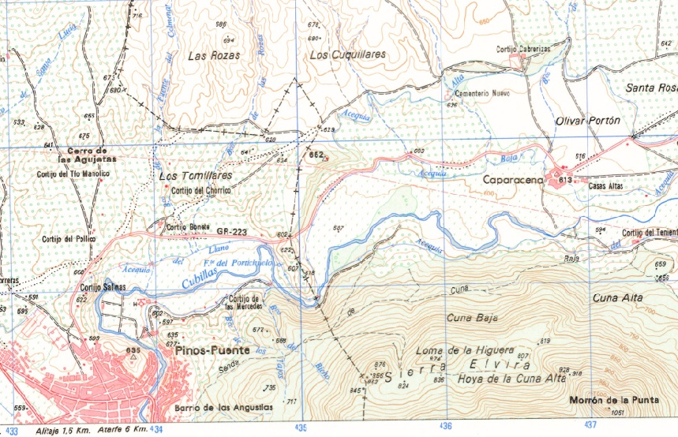{width="8in"}
:::

Para representar la altura en un plano bidimensional los mapas utilizan las curvas de nivel. Estas curvas conectan puntos que se encuentran a la misma altura en el terreno. La diferencia de altura entre dos líneas consecutivas se denomina equidistancia, y si bien esta equidistancia siempre será la misma en el plano vertical, puede cambiar bastante en el plano horizontal. Es decir, en un terreno muy escarpado las curvas de nivel estarán más juntas, en un terreno relativamente plano estas estarán más separadas.

::: {style="text-align:center;"}
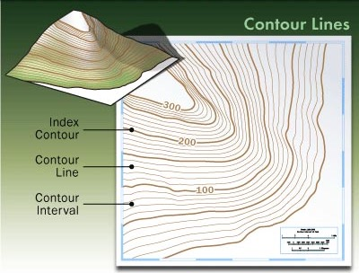{width="4.5in"}
:::

En algunos mapas topográficos también se utilizan otras características como sombreados o tintas hipsométricas (con distintos colores para distintas alturas) para dar una mejor sensación del relieve representado en el mapa.

::: {style="text-align:center;"}
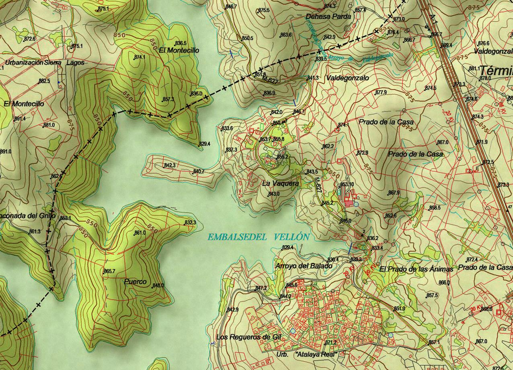{width="5.3in"}
:::

## 1.2. El mapa temático

**¿Qué es?** Es un tipo de mapa que muestra la distribución de una característica ambiental concreta, como por ejemplo el clima, la población, la geología, el tipo de suelo, el uso del suelo, la distribución de riesgos, peligrosidad, etc. Este tipo de mapas suele representarse teniendo como base un mapa topográfico, en el que podemos identificar de forma clara las principales características geográficas del territorio.

**¿Para qué sirve?** Un mapa temático sirve para representar y analizar una información concreta sobre un territorio. Sirve para ver, por ejemplo: dónde llueve más o menos, qué zonas tienen más población, qué tipos de rocas hay, dónde hay más riesgo de inundación, qué usos tiene el suelo, o cómo se distribuyen la vegetación, la temperatura o la contaminación. En resumen, sirve para entender cómo se reparte un fenómeno en el espacio y comparar unas zonas con otras.

::: {style="text-align:center;"}
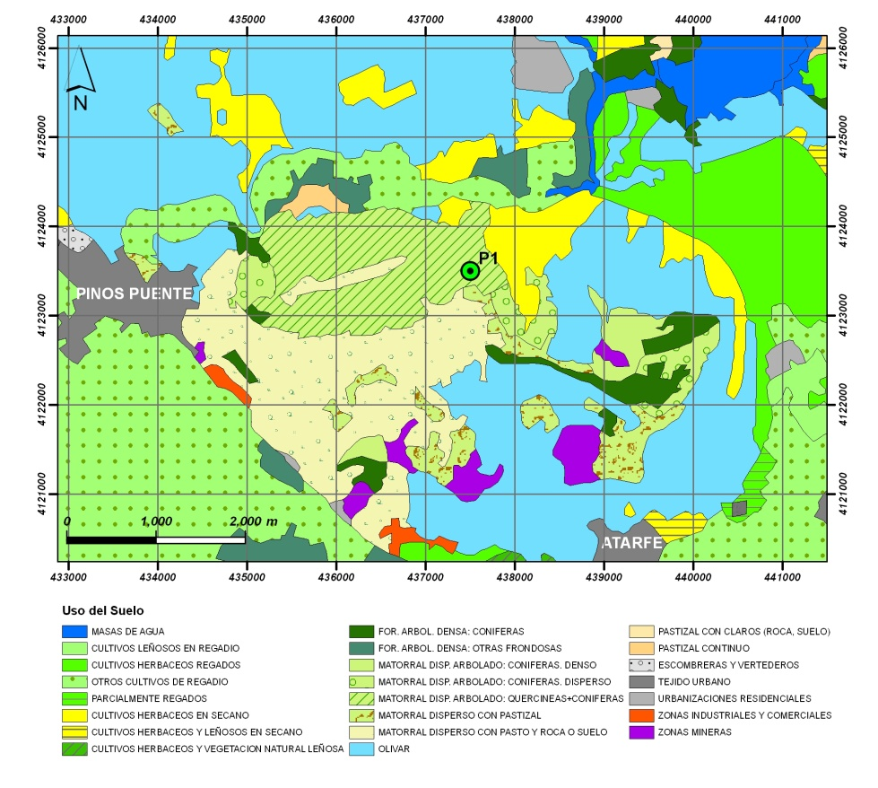{width="8in"}
:::

## 1.3. El mapa geológico

**¿Qué es?** Es un tipo de mapa temático que muestra los tipos de rocas que afloran en la superficie, su edad y las estructuras (como fallas o pliegues) que las afectan. Cada color representa una edad o un tipo de roca diferente.

**¿Para qué sirve?:** Si se construye una carretera, línea de tren o un edificio, el mapa representa si se va a excavar sobre roca blanda o dura, o si la zona se inunda cuando llueve mucho.

Los mapas geológicos más habituales en España son los de la serie MAGNA (Mapas Geológicos Nacionales), los cuales están realizados a escala 1:50,000 por el Instituto Geológico y Minero de España (IGME). Esta serie MAGNA se corresponde con la serie de cartografía geográfica nacional 1:50,000 del Instituto Geográfico Nacional (IGN).

Los mapas geológicos de la serie MAGNA han sido editados en papel por el IGME, pero también se encuentran disponibles en su página web para su descarga gratuita [https://info.igme.es/cartografiadigital/geologica/Magna50.aspx](https://info.igme.es/cartografiadigital/geologica/Magna50.aspx). Estos mapas constan de una hoja geológica y una memoria. La hoja geológica no solo contiene la información de los contactos geológicos sobre un mapa topográfico 1:50,000, sino que también incluye datos adicionales como una leyenda y columna litoestratigráfica, cortes geológicos realizados sobre el mapa, esquemas tectónicos, esquemas regionales, etc.

La memoria de los MAGNAS contiene una introducción al marco geológico regional y local del mapa, una descripción detallada de las distintas litologías que se pueden distinguir en la hoja, datos sobre la tectónica, sedimentología, estratigrafía, petrología, hidrogeología, geología económica, etc. (esta información puede variar en función de la hoja).

::: {style="text-align:center;"}

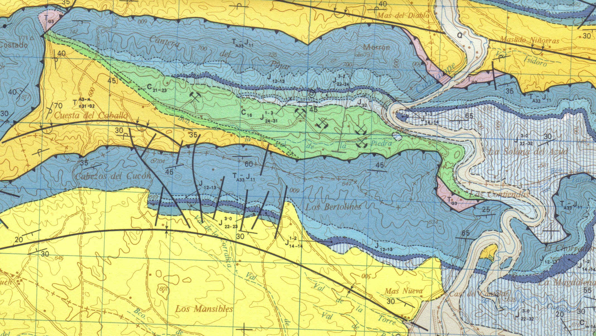{width="8in"}

:::

### Elementos de un mapa geológico

#### Contactos geológicos

Representan la intersección de las capas geológicas con la topografía. Las diferentes litologías o formaciones litológicas se representan por medio de colores y tramas. Los colores suelen indicar unidades litológicas de una edad determinada y aceptada internacionalmente. Las tramas suelen indicar el tipo de litología. En muchos casos también es normal expresar litologías y edades mediante etiquetas con números y letras.

::: {style="text-align:center;"}
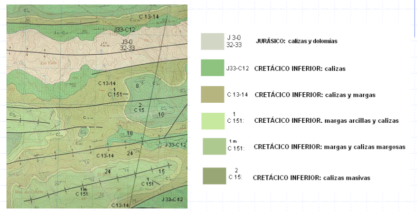{width="7in" }
:::

Las líneas de los contactos geológicos indican la posición del plano de unión entre distintas unidades, y varían su forma y/o grosor para indicar distintos tipos de contactos (contacto concordante, discordante, fallas, etc.). Los contactos separan unidades litológicas sucesivas o diferentes, aunque a veces también pueden separar la misma unidad si el contacto representa una estructura como una falla que afecte a tal unidad.

::: {style="text-align:center;"}
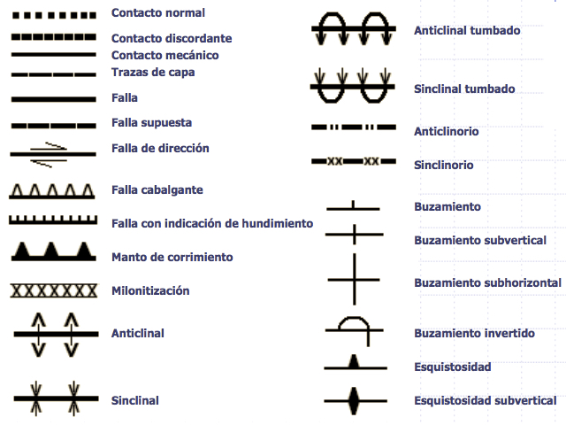{width="6in"}
:::

#### Leyenda

La leyenda es muy importante en un mapa geológico, pues nos indica el tipo de formación geológica y con frecuencia también su edad. Las leyendas en los mapas geológicos de la serie MAGNA suelen ser muy completas, dando información de las unidades, sus edades, e incluso su relación estratigráfica.

::: {style="text-align:center;"}
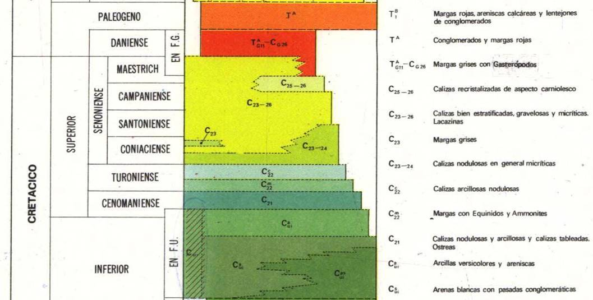{width="8in"}
:::

#### Esquemas regionales y tectónicos

En un mapa geológico también encontraremos esquemas tectónicos y regionales, que ayudan a tener una visión global de las formaciones y estructuras geológicas de la hoja 1:50,000, y en especial su relación con las demás hojas.

:::: {style="display:flex; justify-content:center; gap:5%; align-items:flex-start;"}

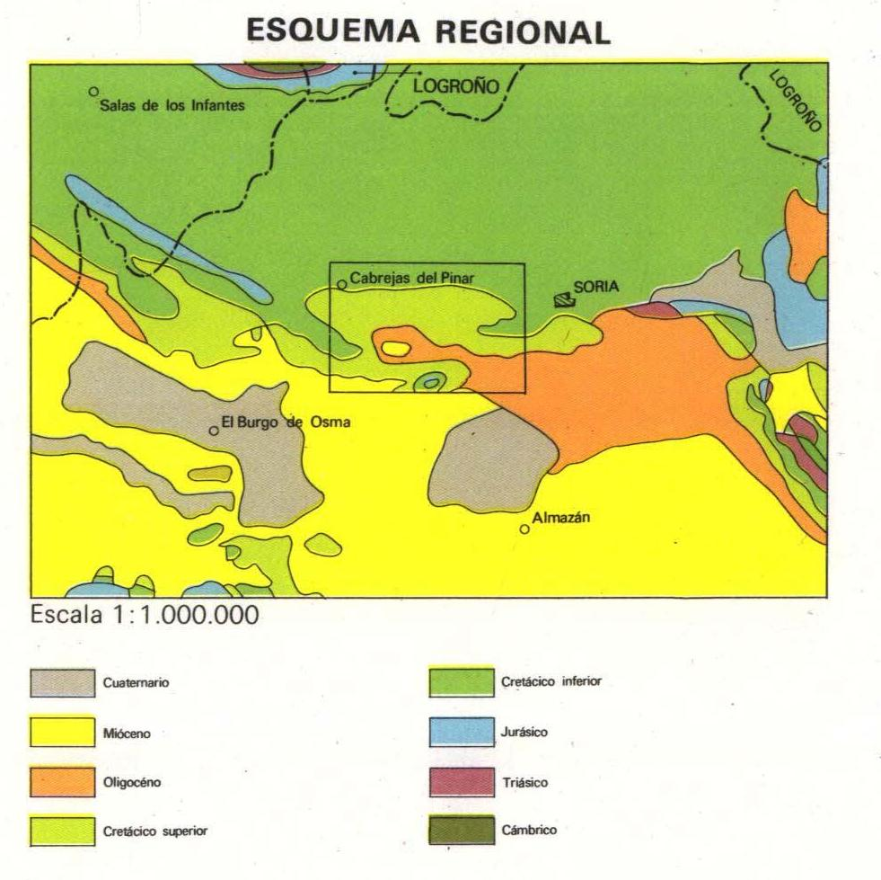{width="4in"}

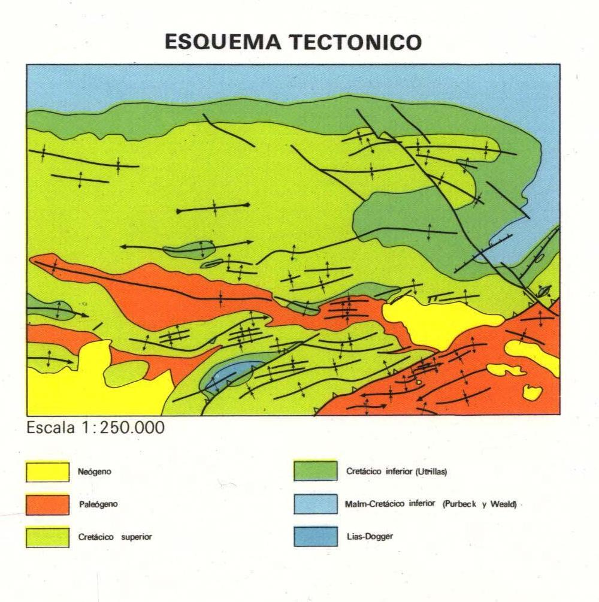{width="4in"}

::::

::: {style="text-align:center;"}
<figcaption class="figure-caption">
  Esquemas regional y tectónico incluidos en un mapa de la serie MAGNA
</figcaption>
:::

## 1.4. El corte geológico

Si el mapa permite ver la Tierra desde arriba, el corte geológico es darle un \"hachazo\" al terreno y mirar el interior de perfil.

**¿Qué es?** Un dibujo bidimensional que simula lo que veríamos si hiciéramos una zanja vertical profunda. Utiliza la información de la superficie (del mapa) y de los sondeos subterráneos para interpretar cómo continúan las rocas en profundidad.

**¿Para qué sirve?:** Es vital en la ingeniería civil (para diseñar túneles) y en la búsqueda de recursos (por ejemplo, para saber a qué profundidad exacta se encuentra un acuífero de agua potable o una bolsa de gas).

::: {style="text-align:center;"}
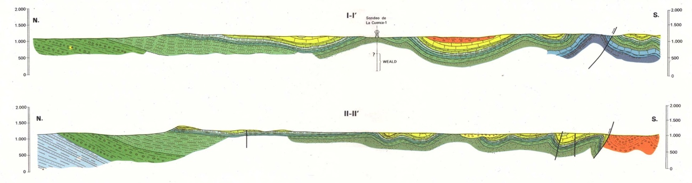{width="8in"}
:::

## 1.5. La columna estratigráfica

Las rocas sedimentarias se depositan en capas (o estratos), donde la capa más vieja se encuentra por debajo de la más joven. Una columna es el \"libro de historia\" de una zona concreta.

**¿Qué es?** Una representación vertical (una torre de bloques) donde se dibujan los estratos uno encima de otro tal y como se encuentran en la naturaleza.

**¿Cómo se lee?**

  - El grosor: Indica el espesor de la capa, cuánto tiempo duró ese ambiente o cuánta arena/barro se acumuló.

  - El relieve: Los salientes indican rocas duras (como la caliza) y los entrantes rocas blandas (como las arcillas).

  - Símbolos: Se añaden pequeños dibujos que indican si hay fósiles, grietas de desecación, o restos de carbón.

**¿Para qué sirve?:** Para reconstruir el pasado. Por ejemplo, si en una capa profunda hay huellas de dinosaurio y en una más joven hay fósiles de conchas marinas, la columna está contando que ese lugar pasó de ser un río a convertirse en un océano.

::: {style="text-align:center;"}

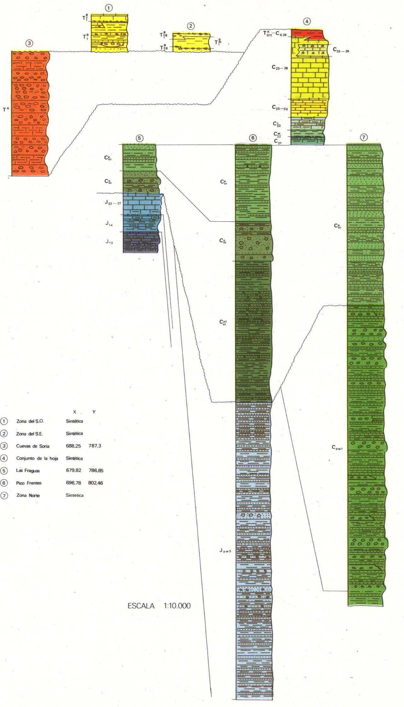{width="7in"}

:::

## 1.6. Las fotografías aéreas

**¿Qué es?** Una fotografía aérea es una fotografía de la superficie terrestre tomada desde un vehículo aéreo (avión tripulado operando a gran altura, aviones ligeros teledirigidos, globos aerostáticos, helicópteros, dirigibles, etc.).

**¿Para qué sirve?** Una fotografía aérea nos da una imagen general del territorio desde un punto de vista elevado con una perspectiva amplia. Con una imagen aérea podemos observar un territorio desde arriba y ver cómo está organizado; ver ríos, montañas, cultivos, bosques o costas, estudiar cambios en el paisaje, analizar el uso del suelo, planificar obras, rutas o actuaciones en el territorio, etc.

La primera fotografía aérea fue tomada por encima del pueblo de Petit-Bicerre (Francia) por Felix Tournachon (Nadar) en 1858 desde un globo, pero esta no se conserva. La más antigua conservada data de 1860, de la ciudad de Boston.

::: {style="text-align:center;"}

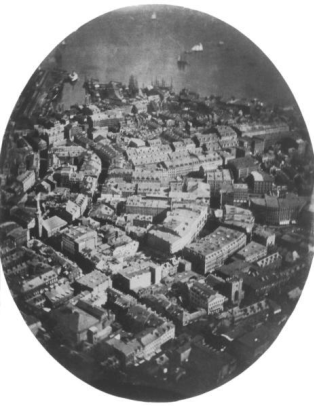{width="3.5in"}

:::

La fotografía aérea tuvo una gran evolución durante la Primera y la Segunda Guerra Mundial. En ellas era frecuente el uso de imágenes aéreas para planificar campañas, observar y marcar objetivos, reconocer el terreno, etc.

:::: {style="display:flex; justify-content:center; gap:5%; align-items:flex-start;"}

:::{style="text-align:center;"}

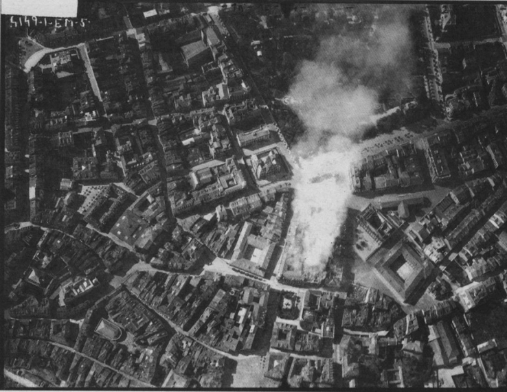{width="4in"}

:::

::: {style="text-align:center;"}
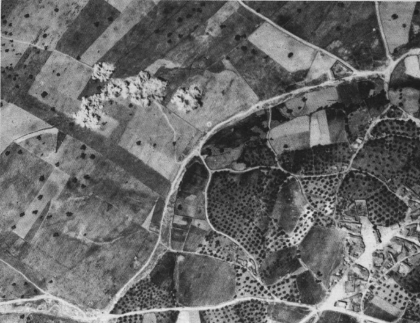{width="4in"}
:::
::::

Al terminar la Primera Guerra Mundial en 1918, cientos de pilotos, aviones y cámaras avanzadas quedaron disponibles para el sector civil. En 1919 comenzó la creación de empresas comerciales dedicadas a mapas a gran escala para empresas y gobiernos. Durante los años 20 y 30, empresarios como Sherman Fairchild en EE. UU. perfeccionaron cámaras de alta velocidad para estudios de erosión del suelo, agricultura, arqueología y urbanismo.

Estas imágenes aéreas tuvieron un gran impacto en geología, pues proporcionaron un tipo de datos que aportaba mucha información. De hecho, gran parte de la cartografía actual de España se realizó mediante fotografías áreas tomadas en los años 50, con la técnica conocida como "Vuelo Americano" o Serie B. Este vuelo fue el primer levantamiento cartográfico fotográfico, completo, sistemático y preciso de todo el territorio español.

Realizado entre marzo de 1956 y septiembre de 1957, nació gracias a un acuerdo de cooperación bilateral entre el gobierno español y el gobierno de los Estados Unidos a través de su agencia cartográfica militar, el Army Map Service (AMS).

Para la historia y la ciencia en España, este vuelo captura lo que los expertos denominan el \"paisaje fósil\" del país: una radiografía exacta en blanco y negro de la geografía, los pueblos y las ciudades españolas justo antes de que se iniciara el éxodo rural, la burbuja del desarrollo turístico e inmobiliario y la industrialización masiva de los años 60. De hecho, sus fotografías son utilizadas hoy en día, debido a que en algunos sitios son la única forma de observar el territorio virgen debido a la gran proliferación sucesiva de edificios y construcciones.

::: {style="text-align:center;"}
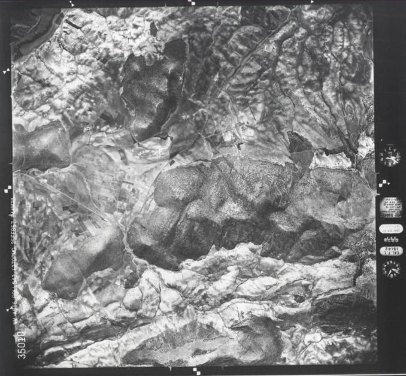{width="7in"}
:::

## 1.7. Las imágenes de satélite

Las imágenes de satélite, junto con la fotografía área, constituyen otra de las fuentes principales de información para geología.

**¿Qué es?** Una imagen de satélite es una imagen de la superficie terrestre obtenida mediante un satélite que orbita la Tierra.

**¿Para qué sirve?** Una imagen de satélite nos proporciona una imagen global y sinóptica de la superficie terrestre. Como el satélite está en órbita, tiene la capacidad de adquirir imágenes de la misma zona con una determinada frecuencia temporal, lo que convierte este tipo de imágenes en datos muy valiosos para estudios temporales.

El primer satélite en adquirir imágenes del territorio de forma sistemática fue el LandSat 1, operativo desde 1972. Este programa sigue activo hoy en día con los satélites Landsat 8 y 9. Actualmente, en torno a medio millar de satélites ópticos de observación terrestre están en órbita y operativos, aunque la cifra exacta cambia constantemente. Si se cuentan los lanzados históricamente, el número supera el millar. La agencia espacial europea (ESA) tiene en órbita la serie de satélites Sentinel, con una resolución espectral y temporal bastante buena. Actualmente el satélite de mayor resolución espacial puede tomar imágenes de cualquier parte de la Tierra con una precisión de 30 cm.

::: {style="text-align:center;"}
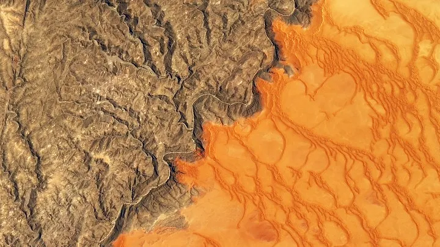{width="9in"}
:::

## 1.8. Diagramas de flujo y bloques diagrama

La geología y el medio ambiente no son estáticos, son una red de procesos interconectados.

**Diagramas de flujo ambientales:** son esquemas con flechas y cajas de texto que explican cómo se mueve la materia o la energía. El ejemplo clásico es el Ciclo del Agua o el Ciclo del Carbono. En la gestión ambiental, se usan para trazar la ruta de un contaminante desde que sale por ejemplo de la chimenea de una fábrica, pasa a la atmósfera, cae con la lluvia al suelo, y termina en la lechuga que te comes.

**Bloques diagrama**: son dibujos en 3D (como un bloque de queso cortado) que combinan la vista del mapa (arriba) y el corte geológico (en los lados). Son perfectos para que los alumnos visualicen de un solo vistazo un paisaje completo (por ejemplo, un volcán por fuera y su cámara magmática por dentro).

::: {style="text-align:center;"}
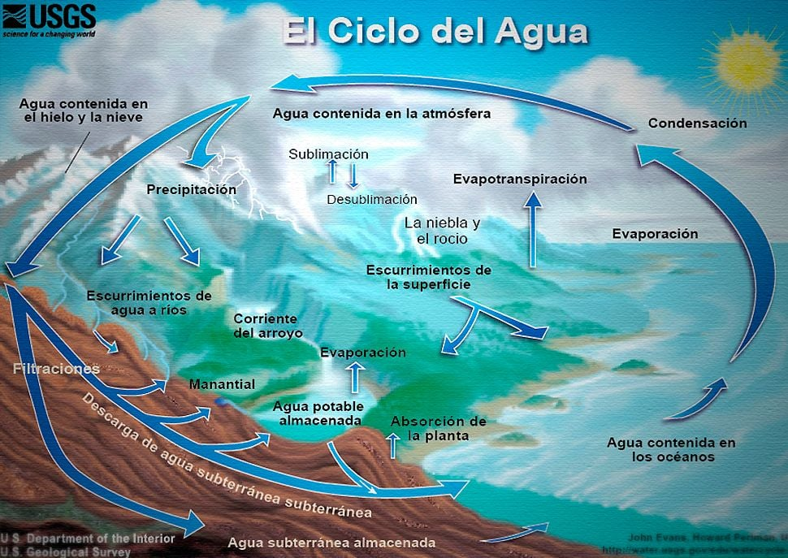{width="8in"}
:::

## 1.9. Textos, memorias e informes

Una fuente importante de información en geología son los textos, memorias e informes previos. En ellos se recopilan observaciones de campo, descripciones de afloramientos, análisis realizados a las rocas, edades de las formaciones geológicas y los métodos empleados para obtener dichos datos.

Estos documentos permiten conocer el estado previo del conocimiento sobre una zona antes de iniciar un nuevo estudio geológico. Por ejemplo, las memorias de los mapas geológicos describen las unidades litológicas presentes, su distribución, su edad, sus relaciones estratigráficas y las estructuras tectónicas más relevantes. Junto a ellas, también son fuentes fundamentales los artículos científicos, las tesis doctorales, los informes geotécnicos, los estudios hidrogeológicos y los informes de impacto ambiental.

Los informes técnicos suelen elaborarse para obras civiles, explotaciones mineras, estudios ambientales o proyectos de ordenación territorial. En ellos se interpreta la información geológica con una finalidad concreta, como valorar la estabilidad de una ladera, analizar la idoneidad de un terreno para construir, estudiar la disponibilidad de aguas subterráneas o evaluar la presencia de materiales aprovechables.

Por tanto, los textos, memorias e informes constituyen una base documental esencial, ya que permiten comparar datos nuevos con estudios anteriores, detectar cambios en la interpretación geológica de una región y planificar mejor el trabajo de campo y laboratorio.

# 2. Métodos de estudio en Geología

## 2.1. El trabajo de campo

El trabajo de campo es la esencia de la Geología y las Ciencias Ambientales. Aquí recolectamos los datos brutos directamente de la naturaleza utilizando herramientas clásicas.

#### *Herramientas geológicas clásicas*

- **La brújula:** No solo sirve para no perderse. Su función principal es medir la orientación (rumbo) y la inclinación (buzamiento) de las capas de roca (estratos) y de sus estructuras (fallas, pliegues). Es clave para entender cómo se deformaron las rocas hace millones de años.

- **El martillo:** Tiene un lado plano para romper roca fresca y un lado en punta o cincel para hacer palanca o limpiar fósiles.

- **La lupa de mano:** Es el \"microscopio del campo\". Esencial para identificar minerales a simple vista o texturas en la roca.

- **Cinta métrica:** Esencial para medir el espesor de los estratos, afloramientos, tamaños de minerales, estructuras o fósiles.

::: {style="text-align:center;"}
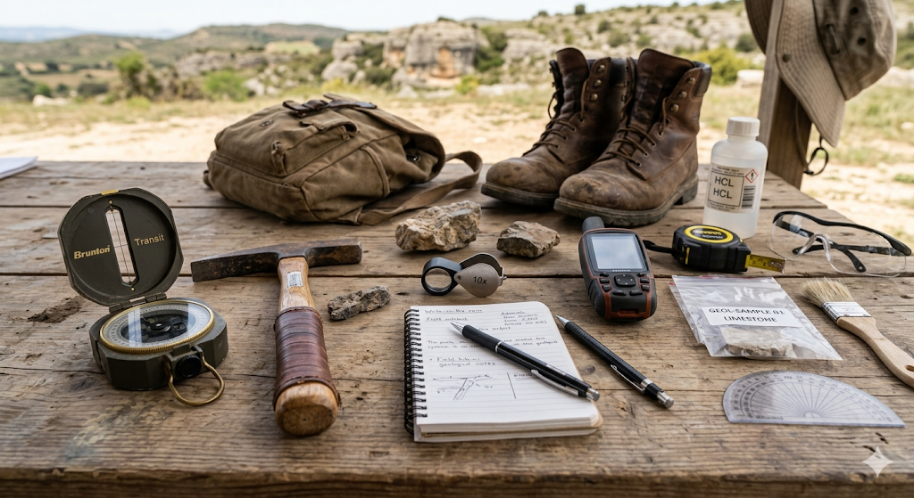{width="5.908333333333333in" height="3.216666666666667in"}
:::

#### *Instrumentos ambientales de campo*

- **Sondeos:** Cilindros metálicos que se entierran para extraer una \"columna\" de rocas sin alterar sus capas, ideal para estudiar el sustrato de las regiones llanas donde no hay afloramientos de rocas.

- **Sondas multiparamétricas:** Dispositivos portátiles que se sumergen en ríos o lagos para medir in situ y en segundos las características del agua: pH, temperatura, conductividad eléctrica (salinidad) y oxígeno disuelto.

::: {style="text-align:center;"}
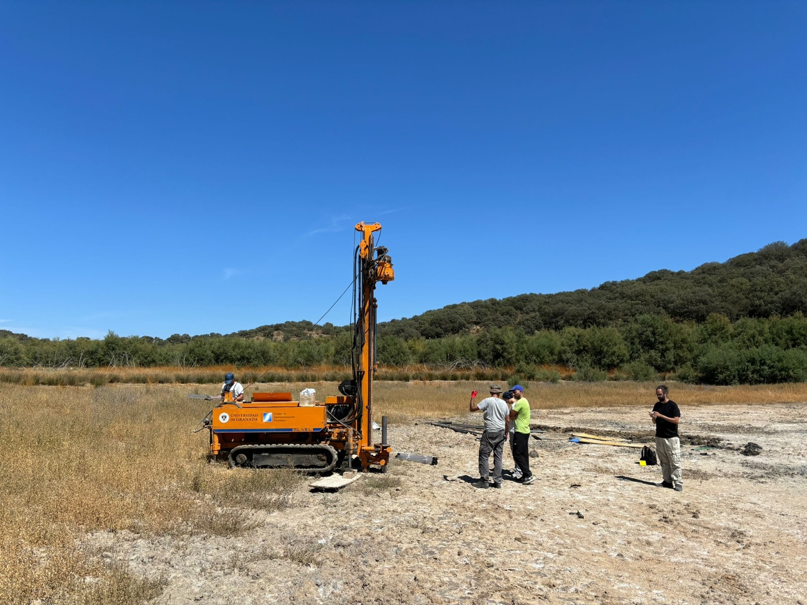{width="5.908333333333333in" height="4.425in"}
:::

## 2.2. El laboratorio

Una vez recogidas las muestras, volvemos al laboratorio para analizar lo que el ojo humano no puede ver a simple vista.

#### *Análisis geológico*

- **Microscopio petrográfico:** No es un microscopio común ya que utiliza luz polarizada. Las rocas se cortan tan finas (0.03 mm de espesor) que se vuelven transparentes. Al pasar la luz polarizada a través de ellas, los minerales se pueden identificar con precisión.

- **Lupas binoculares:** Para observar microfósiles, partículas de sedimentos (por ejemplo, arenas) o fragmentos de rocas.

::: {style="text-align:center;"}
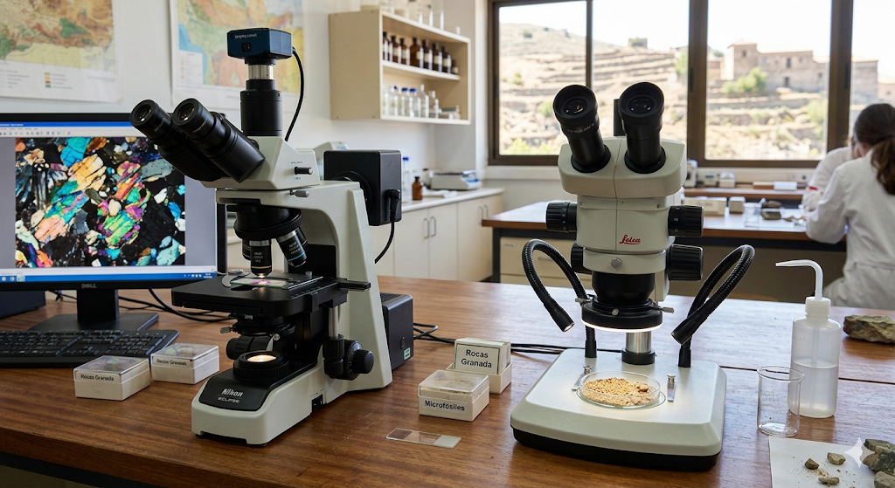{width="5.908333333333333in" height="3.216666666666667in"}
:::

#### *Análisis ambiental*

- **Analizador elemental:** Instrumento de laboratorio automatizado que se utiliza para determinar la composición química (por ejemplo, en carbono, hidrógeno, nitrógeno y azufre) cuantitativa de una muestra geológica.

- **Escáner de fluorescencia de rayos X:** Sirve para determinar la composición elemental (química) de una muestra de roca, suelo o sedimento de forma casi instantánea, y en muchos casos, sin destruir la muestra. Es muy utilizado en minería y exploración minera para saber si hay algunos elementos químicos deseables y también en el estudio de contaminación de suelos.

- **Espectrofotómetros:** Instrumentos que miden cuánta luz absorbe una muestra de agua química tratada. Sirve para detectar concentraciones exactas de contaminantes como nitratos, fosfatos o metales pesados.

- **Estufas de secado y balanzas de precisión:** Fundamentales para calcular la humedad del suelo o la cantidad de materia orgánica mediante la pérdida de peso por quema (calcinación).

## 2.3. Las nuevas tecnologías

Hoy en día, la Geología y las Ciencias Ambientales son disciplinas hipertecnológicas. Ya no solo se mira al suelo, se mira desde el espacio y con algoritmos.

- **GPS Diferencial:** No es como el del móvil (que falla por metros). Estos equipos tienen precisión de milímetros. Se usan para medir cómo se mueve una falla sísmica o si un volcán se está \"inflando\" antes de una erupción.

- **Software GIS (como QGIS o ArcGIS):** El \"Photoshop\" de los mapas. Permite superponer capas de datos: mapas de rocas, pendientes del terreno, zonas inundables y densidad de población para predecir riesgos naturales (como desprendimientos o inundaciones).

# 3. Métodos y principios para el estudio del registro geológico

¿Cómo sabemos que los dinosaurios vivieron antes que los mamuts? ¿Cómo puede un geólogo mirar una montaña cortada por una carretera y saber que un río pasó por ahí hace millones de años? Para descifrar el pasado, la Geología combina dos métodos de datación y se apoya en una serie de principios fundamentales.

## 3.1. Métodos para medir el tiempo

Antes de aplicar las leyes, los científicos necesitan saber cómo van a medir el tiempo en las rocas:

- **Datación relativa:** no nos dice la edad exacta en números de años, pero nos permite ordenar los acontecimientos cronológicamente gracias a los fósiles (saber qué ocurrió antes y qué ocurrió después).

- **Datación absoluta:** nos da una fecha numérica precisa (por ejemplo: \"esta roca tiene 125 ± 2 millones de años\"). Se consigue en el laboratorio utilizando la radiocronología (midiendo la descomposición de isótopos radiactivos inestables como el carbono-14, o los isótopos de uranio y plomo en los minerales).

## 3.2. Los principios geológicos fundamentales

Para realizar la datación relativa y reconstruir la historia de una zona, aplicamos seis principios lógicos básicos:

1. *Principio del uniformismo o actualismo*

   - **La regla:** "El presente es la clave del pasado". Los procesos geológicos que ocurren hoy en día (como la sedimentación de arena en una playa o el enfriamiento de la lava) son los mismos que ocurrieron hace millones de años y producen los mismos resultados.

   - **Aplicación:** si hoy vemos ondas de arena (*ripples*) grabadas en una roca de una montaña, deducimos que esa roca se formó en una playa o río del pasado.

   ::: {style="text-align:center;"}

   {width="7in"}

   :::

1. *Principio de la horizontalidad original*

   - **La regla:** los sedimentos se depositan normalmente en capas (estratos) horizontales y paralelas a la superficie de la Tierra debido a la gravedad.

   - **Aplicación:** si en el campo nos encontramos con capas de roca que están inclinadas o completamente verticales, sabemos que algo las empujó y las plegó después de haberse formado.

1. *Principio de superposición de los estratos*

   - **La regla:** en una serie de estratos sedimentarios que no ha sido invertida, la capa más baja es la más antigua y la capa más alta es la más moderna.

   - **Aplicación:** es la base para leer las columnas estratigráficas de abajo hacia arriba como si fueran las páginas de un libro.

   ::: {style="text-align:center;"}

   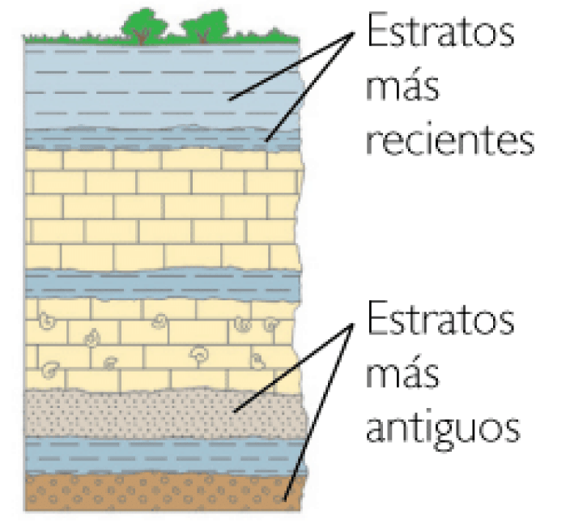{width="4in"}

   :::

1. *Principio de sucesión faunística (o de los fósiles)*

   - **La regla:** los organismos fósiles se suceden unos a otros en el registro geológico en un orden definido y determinable. Cada época de la historia de la Tierra tiene sus propios fósiles característicos (fósiles guía).

   - **Aplicación:** si encontramos un trilobite en una roca de España y otro en una de América, sabemos que ambas rocas se formaron en la misma época (el Paleozoico), aunque estén en continentes distintos.
   
   ::: {style="text-align:center;"}
   
   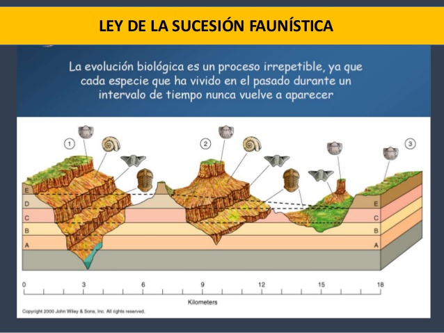{width="6in"}
   
   :::

1. *Principio de las relaciones de corte (o de intrusión)*

   - **La regla:** lo que corta es más moderno que lo que es cortado.

   - **Aplicación:** si una falla (fractura) rompe tres capas de roca, o si un filón de magma (intrusión) atraviesa unos estratos, la falla o el magma son necesariamente más jóvenes que las rocas a las que han afectado.
    
   ::: {style="text-align:center;"}
    
   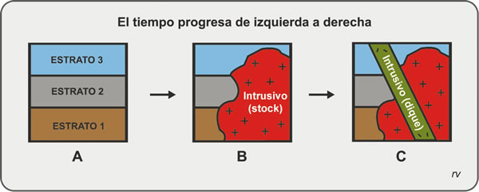{width="6.5in"}
    
   :::

1. *Principio de inclusión*

   - **La regla:** los fragmentos de roca que quedan atrapados dentro de otra roca son más antiguos que la roca que los contiene.

   - **Aplicación:** si un granito troceado queda envuelto dentro de una capa de arenisca, el granito ya existía y sufrió erosión antes de que se depositara la arenisca.
   
   ::: {style="text-align:center;"}
   
   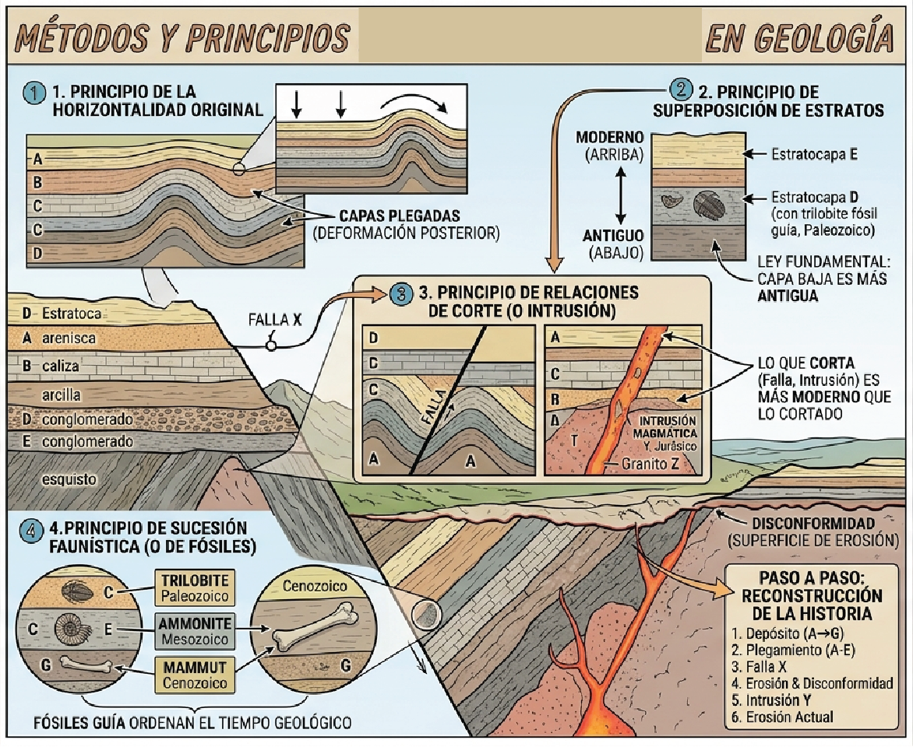{width="8in"}
   
   :::

