# 1. La Geosfera

## 1.1. ¿Qué es la Geosfera?

La Geosfera es la parte sólida de la Tierra. Incluye desde las rocas que forman la superficie terrestre hasta las zonas más profundas del planeta, situadas a miles de kilómetros bajo nuestros pies. Aunque normalmente asociamos la Geosfera con montañas, continentes, minerales o volcanes, en realidad es un sistema mucho más amplio: comprende la corteza, el manto y el núcleo terrestre.

La Geosfera constituye el soporte físico sobre el que se desarrollan muchos procesos naturales. En ella se forman los relieves, se generan los terremotos, se originan los volcanes, se encuentran los minerales y se almacenan recursos como el agua subterránea, los combustibles fósiles o la energía geotérmica.

::: {style="text-align:center;"}
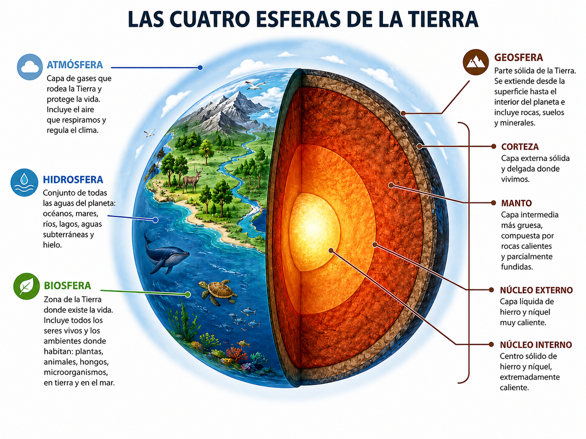{width="5.5in"}
:::

A simple vista, la Tierra puede parecer un planeta rígido y estable. Sin embargo, la Geosfera está en continua transformación. Las placas tectónicas se desplazan lentamente, las montañas se elevan y erosionan, los volcanes construyen nuevos terrenos y los terremotos liberan energía acumulada en el interior terrestre. Estos cambios suelen producirse a escalas de tiempo muy largas, de miles o millones de años, aunque algunos fenómenos, como las erupciones volcánicas o los terremotos, pueden ocurrir de forma repentina.

## 1.2. Importancia para la vida y la actividad humana

La Geosfera es esencial para la vida y para la actividad humana. Los suelos donde se cultivan los alimentos se forman a partir de la alteración de las rocas. Los minerales proporcionan materias primas para fabricar herramientas, edificios, dispositivos electrónicos, fertilizantes, medicamentos y medios de transporte. Además, muchos recursos energéticos proceden de la Geosfera, como el carbón, el petróleo, el gas natural, el uranio o la energía geotérmica.

También tiene una gran importancia en la planificación del territorio. Construir una ciudad, una carretera, una presa o una central energética exige conocer las características del terreno. La estabilidad de las rocas, la presencia de fallas, la posibilidad de deslizamientos, la existencia de acuíferos o la actividad sísmica de una zona son factores fundamentales para tomar decisiones seguras.

Además, muchos riesgos naturales tienen su origen en la dinámica de la Geosfera. Los terremotos, las erupciones volcánicas, los tsunamis, los deslizamientos de ladera y algunos hundimientos del terreno están relacionados con procesos geológicos internos o externos. Comprender la Geosfera permite reducir daños, organizar mejor el territorio y proteger a la población.

## 1.3. Elementos químicos más abundantes en la Geosfera

La Geosfera está formada por materia sólida, principalmente por minerales y rocas. Desde el punto de vista químico, los elementos más abundantes en la parte externa de la Tierra son el oxígeno, el silicio, el aluminio, el hierro, el calcio, el sodio, el potasio y el magnesio.

El oxígeno y el silicio son especialmente importantes porque se combinan para formar silicatos, que son los minerales más abundantes de la corteza y del manto. Los silicatos forman minerales como el cuarzo, los feldespatos, las micas, el olivino o los piroxenos. Estos minerales aparecen en muchas rocas comunes, como el granito, el basalto o el gneis.

En las zonas más profundas de la Tierra, la composición cambia. El núcleo terrestre está formado principalmente por hierro y níquel, mientras que el manto contiene una gran cantidad de minerales ricos en magnesio y hierro.

La composición química de la Geosfera permite explicar muchas de sus propiedades. Por ejemplo, las rocas ricas en sílice (SiO~2~) suelen ser menos densas que las rocas ricas en hierro y magnesio. Esta diferencia de densidad ayuda a entender por qué la corteza continental y la corteza oceánica tienen características distintas.

::: {style="text-align:center;"}
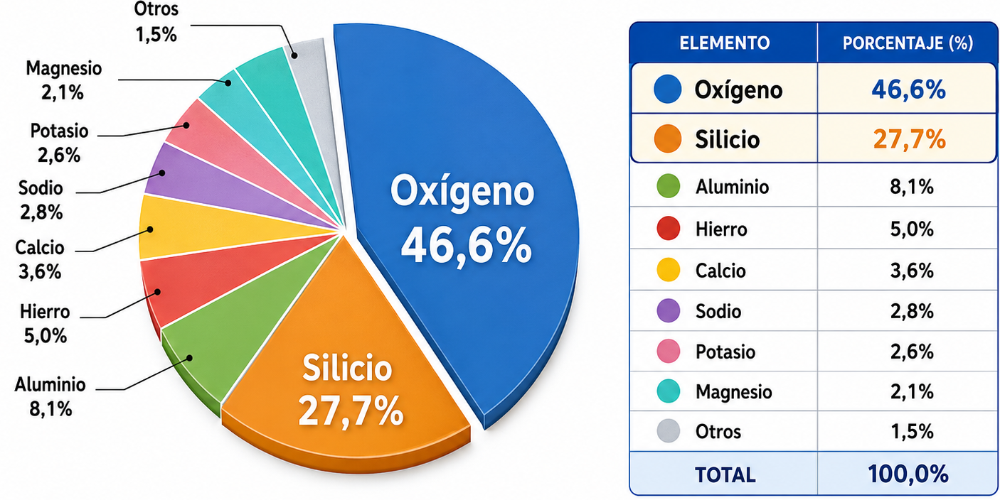{width="5.5in"}
:::

## 1.4. Estructura interna de la Tierra

El interior de la Tierra no puede observarse directamente en su totalidad. Las minas y sondeos solo alcanzan una pequeña parte de la corteza. Por ello, el conocimiento de la estructura interna terrestre procede sobre todo de métodos indirectos, especialmente del estudio de las ondas sísmicas.

Para describir el interior terrestre se utilizan dos modelos principales: el modelo geoquímico y el modelo dinámico o geodinámico. Ambos son correctos, pero clasifican el interior de la Tierra usando criterios diferentes.

El modelo geoquímico se basa en la composición química de las capas. El modelo dinámico se basa en el comportamiento mecánico de los materiales, es decir, en si se comportan como sólidos rígidos, materiales plásticos o fluidos.

### Modelo geoquímico

El modelo geoquímico divide la Tierra en tres grandes capas: corteza, manto y núcleo. Esta clasificación se basa en la composición de los materiales.

***Corteza***

La corteza es la capa más externa y delgada de la Tierra. Es la parte sobre la que vivimos y la mejor conocida. Su espesor varía mucho: es más fina bajo los océanos y más gruesa bajo los continentes.

La corteza continental tiene una composición media más rica en sílice y aluminio, mientras que la corteza oceánica es más rica en hierro y magnesio. Aunque la corteza representa una pequeña parte del volumen terrestre, es fundamental para la vida humana porque contiene suelos, aguas subterráneas, minerales útiles y la mayor parte de los recursos que explotamos directamente.

***Manto***

El manto se sitúa bajo la corteza y llega hasta unos 2900 km de profundidad. Es la capa más voluminosa de la Tierra. Está formado por rocas ricas en silicatos de hierro y magnesio. Aunque muchas veces se imagina como una capa líquida, el manto es mayoritariamente sólido. Sin embargo, a lo largo de grandes escalas de tiempo, algunos materiales del manto pueden deformarse lentamente y fluir de manera plástica.

Este comportamiento permite que en el manto se produzcan movimientos de convección, esenciales para explicar el desplazamiento de las placas tectónicas.

***Núcleo***

El núcleo es la capa más interna de la Tierra y se extiende desde unos 2900 km de profundidad hasta el centro del planeta, situado a unos 6371 km. Está formado principalmente por hierro y níquel.

El núcleo se divide en dos partes desde el punto de vista físico: el núcleo externo, que es líquido, y el núcleo interno, que es sólido. Esta diferencia se debe a las condiciones extremas de presión y temperatura. El movimiento del hierro líquido en el núcleo externo está relacionado con la generación del campo magnético terrestre.

::: {style="text-align:center;"}
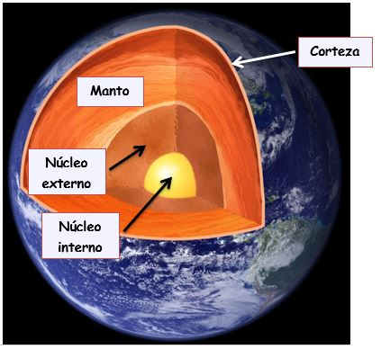{width="3.8in"}
:::

### Modelo geodinámico

El modelo geodinámico divide la Tierra según el comportamiento físico de los materiales. Este modelo es especialmente útil para comprender la tectónica de placas, la actividad sísmica y la dinámica interna del planeta.

***Litosfera***

La litosfera es la capa más externa y rígida de la Tierra. Incluye la corteza y la parte superior más rígida del manto. Está fragmentada en placas tectónicas que se desplazan lentamente sobre materiales más plásticos situados debajo.

Existen placas litosféricas oceánicas, continentales y mixtas. Estas placas no coinciden exactamente con los continentes, ya que una misma placa puede incluir parte continental y parte oceánica.

***Astenosfera***

La astenosfera se encuentra bajo la litosfera. Es una zona del manto superior con comportamiento más plástico. Sus materiales siguen siendo sólidos en gran parte, pero pueden deformarse lentamente. Esta capacidad de deformación permite que las placas litosféricas se desplacen sobre ella.

La astenosfera no debe imaginarse como un océano de magma. Es más adecuado entenderla como una capa sólida caliente, capaz de fluir lentamente cuando actúan fuerzas durante largos periodos de tiempo.

***Mesosfera***

La mesosfera corresponde al manto inferior. Sus materiales están sometidos a presiones muy elevadas y se comportan de forma más rígida que los de la astenosfera, aunque también pueden participar en movimientos convectivos a escala profunda.

Esta capa tiene un papel importante en la transferencia de calor desde el interior terrestre hacia zonas más externas.

***Núcleo externo***

El núcleo externo es líquido y está formado principalmente por hierro y níquel. En él se producen movimientos de materiales metálicos fundidos. Estos movimientos, combinados con la rotación terrestre, generan el campo magnético terrestre.

El campo magnético protege la Tierra frente a parte de la radiación procedente del Sol y permite la existencia de la magnetosfera.

***Núcleo interno***

El núcleo interno es sólido, aunque su temperatura es muy elevada. Se mantiene en estado sólido debido a la enorme presión existente en el centro de la Tierra. Está compuesto principalmente por hierro y níquel.

::: {style="text-align:center;"}
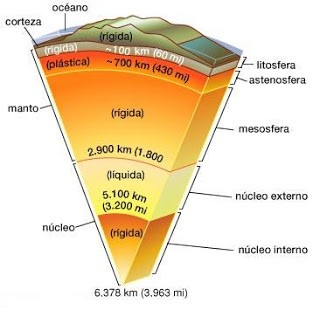{width="3.7in"}
:::

## 1.5. Dinámica de la Geosfera

La dinámica de la Geosfera se debe a que la Tierra conserva una importante actividad interna. Esta actividad procede del calor acumulado durante la formación del planeta, del descenso de materiales densos hacia el núcleo y de la desintegración de elementos radiactivos en el manto y la corteza.

Ese calor interno provoca procesos como el movimiento del manto, la formación de magma, el desplazamiento de las placas tectónicas, los terremotos, los volcanes y la formación de montañas.

El gradiente geotérmico es el aumento de la temperatura con la profundidad. En la corteza superficial suele aumentar unos 25-30 ºC por kilómetro, aunque varía según la zona. En áreas volcánicas o tectónicamente activas puede ser mayor. El calor interno se transmite sobre todo por conducción y por convección.

Las corrientes de convección son movimientos lentos del material del manto causados por diferencias de temperatura y densidad. El material caliente asciende y el frío desciende. Estos movimientos ayudan a explicar la tectónica de placas: el ascenso de material favorece la formación de dorsales oceánicas y el descenso de material frío se relaciona con las zonas de subducción.

La tectónica de placas explica que la litosfera está dividida en placas rígidas que se mueven sobre zonas más plásticas del manto superior. Sus límites pueden ser:

- Divergentes, cuando las placas se separan y se forma nueva corteza oceánica, como en las dorsales.

- Convergentes, cuando las placas chocan. Pueden originar subducción, fosas oceánicas, volcanes y cordilleras, o grandes montañas si chocan dos placas continentales.

- Transformantes, cuando las placas se deslizan lateralmente y pueden generar terremotos, como en la falla de San Andrés.

La mayoría de los terremotos, volcanes y cordilleras se concentran en los límites de placas. Los terremotos se producen por la liberación brusca de energía acumulada en fallas. Los volcanes aparecen cuando el magma asciende hasta la superficie. Las montañas se forman sobre todo en límites convergentes, donde los materiales se comprimen, pliegan, fracturan y elevan.

## 1.6. Métodos de estudio de la Geosfera

El estudio de la Geosfera plantea una dificultad evidente: no podemos acceder directamente a la mayor parte del interior terrestre. El radio de la Tierra es de unos 6371 km, pero los sondeos más profundos apenas han alcanzado algo más de 12 km. Esto significa que la exploración directa solo permite conocer una fracción muy pequeña del planeta.

Por este motivo, los geólogos utilizan dos grandes tipos de métodos: los métodos directos y los métodos indirectos.

### Métodos directos

Los métodos directos permiten estudiar materiales terrestres de forma física, mediante observación, recogida de muestras o perforaciones. Son muy importantes porque proporcionan datos reales sobre rocas, minerales, estructuras geológicas y condiciones del subsuelo cercano.

**Minas**

Las minas permiten observar rocas situadas a cierta profundidad. Gracias a ellas se estudian minerales, vetas, fallas, pliegues y relaciones entre distintos tipos de rocas. También ofrecen información sobre la temperatura, la presión y la circulación de aguas subterráneas en el subsuelo. Sin embargo, las minas alcanzan profundidades limitadas en comparación con el tamaño de la Tierra. Incluso las minas más profundas solo exploran una pequeña parte de la corteza.

**Sondeos**

Los sondeos son perforaciones realizadas en la corteza terrestre para extraer muestras, estudiar capas profundas o buscar recursos como agua, petróleo, gas o minerales. Los testigos de sondeo permiten analizar directamente las rocas atravesadas por la perforación.

Los sondeos son fundamentales en geología aplicada, ingeniería civil, hidrogeología y exploración de recursos. Aun así, su alcance es limitado. La perforación más profunda realizada hasta la actualidad llegó a algo más de 12 km, una profundidad muy pequeña comparada con los más de 6000 km que separan la superficie del centro terrestre.

::: {style="text-align:center;"}
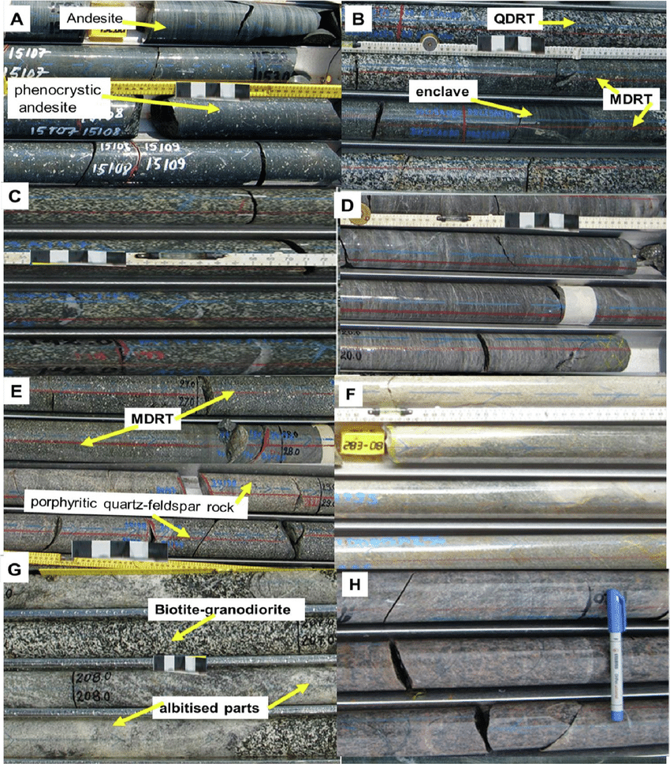{width="4.6in"}
:::

**Material volcánico**

Los volcanes proporcionan materiales procedentes del interior de la Tierra, como lavas, cenizas, gases y fragmentos de rocas profundas llamados xenolitos. Estos materiales permiten conocer la composición de ciertas zonas del manto y de la corteza profunda. Por ejemplo, algunos basaltos contienen fragmentos de peridotita, una roca característica del manto superior. Su estudio aporta información sobre materiales que normalmente no pueden observarse directamente.

A pesar de su valor, el material volcánico también tiene limitaciones. El magma puede modificarse durante su ascenso, mezclarse con otras rocas o cambiar su composición antes de llegar a la superficie.

### Métodos indirectos

Los métodos indirectos permiten estudiar el interior terrestre sin acceder físicamente a él. Se basan en analizar señales, campos físicos o materiales externos que aportan información sobre la estructura y composición del planeta.

Entre los métodos indirectos más importantes destacan los métodos sísmicos, la gravimetría, el magnetismo terrestre, el flujo térmico y el estudio de meteoritos.

**Métodos sísmicos**

Los métodos sísmicos son los más importantes para conocer la estructura interna de la Tierra. Se basan en el estudio de las ondas sísmicas generadas por terremotos o por fuentes artificiales.

Cuando se produce un terremoto, la energía liberada se propaga por el interior terrestre en forma de ondas. Estas ondas cambian de velocidad y dirección según las propiedades de los materiales que atraviesan. Al analizar cómo llegan a diferentes estaciones sísmicas, los científicos pueden deducir la estructura interna del planeta.

Las discontinuidades sísmicas son zonas del interior terrestre donde las ondas sísmicas cambian bruscamente de velocidad o dirección. Estos cambios indican que las ondas han pasado de un material a otro con propiedades diferentes.

::: {style="text-align:center;"}
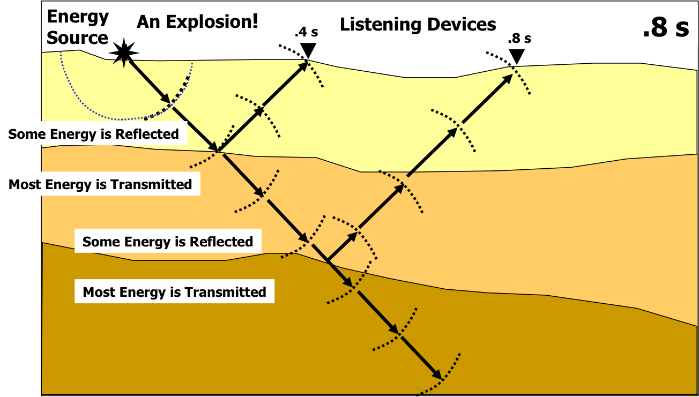{width="5.4in"}
:::

**Gravimetría**

La gravimetría estudia las variaciones del campo gravitatorio terrestre. La gravedad no es exactamente igual en todos los puntos del planeta, porque depende de la distribución de masas en el interior de la Tierra.

Las zonas con rocas más densas pueden producir anomalías gravitatorias positivas, mientras que las zonas con materiales menos densos pueden producir anomalías negativas. Estas variaciones ayudan a detectar estructuras geológicas ocultas, cuencas sedimentarias, cuerpos magmáticos, yacimientos minerales o diferencias de espesor en la corteza.

La gravimetría se utiliza mucho en exploración geológica y en estudios de la estructura profunda de la litosfera.

**Magnetometría**

La Tierra posee un campo magnético generado por el movimiento del hierro líquido en el núcleo externo. Este campo magnético se puede estudiar en la superficie y proporciona información sobre el interior terrestre.

Además, muchas rocas conservan una especie de "memoria magnética". Cuando una lava se enfría, algunos minerales magnéticos quedan orientados según el campo magnético terrestre existente en ese momento. Este fenómeno se llama paleomagnetismo.

El paleomagnetismo fue una prueba clave para confirmar la expansión de los fondos oceánicos y la tectónica de placas. En las dorsales oceánicas se observan bandas magnéticas simétricas a ambos lados de la dorsal, lo que indica que se ha ido formando nueva corteza oceánica a medida que las placas se separan.

::: {style="text-align:center;"}
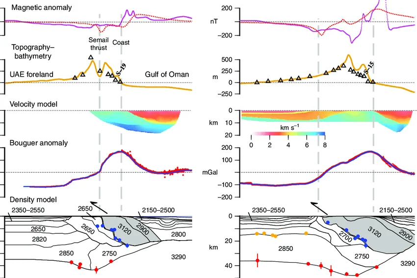{width="5.0in"}
:::

**Flujo térmico**

El flujo térmico es la cantidad de calor que sale desde el interior de la Tierra hacia la superficie. Se mide especialmente en fondos oceánicos, zonas volcánicas, continentes estables y regiones tectónicamente activas.

El flujo térmico suele ser alto en dorsales oceánicas, zonas volcánicas y áreas con actividad geotérmica. En cambio, suele ser más bajo en zonas continentales antiguas y estables.

Este método ayuda a conocer cómo se distribuye el calor interno y permite localizar zonas con potencial para aprovechar energía geotérmica.

**Estudio de meteoritos**

Los meteoritos son fragmentos de cuerpos rocosos o metálicos procedentes del espacio. Su estudio ayuda a comprender la composición primitiva del Sistema Solar y, por comparación, la composición interna de la Tierra.

Algunos meteoritos metálicos están formados por hierro y níquel, por lo que se consideran análogos de los materiales que podrían formar el núcleo terrestre. Otros meteoritos rocosos tienen composiciones parecidas a las de materiales primitivos a partir de los cuales se formaron los planetas.

Aunque los meteoritos no proceden del interior de la Tierra, aportan información valiosa sobre los materiales que participaron en la formación del planeta.

# 2. La tectónica de placas

## 2.1. La tierra como planeta dinámico

  La Tierra no es un planeta estático. Aunque desde nuestra escala humana los continentes, las montañas y los océanos parecen estructuras permanentes, en realidad forman parte de un sistema geológico en continuo cambio. La superficie terrestre se transforma lentamente por la acción combinada de procesos internos y externos. Los procesos externos, como la erosión, el transporte y la sedimentación, modelan el relieve desde fuera. Los procesos internos, en cambio, tienen su origen en la energía interna del planeta y son responsables de fenómenos como los terremotos, el vulcanismo, la formación de cordilleras y la apertura o cierre de océanos.

  La idea fundamental de la tectónica de placas es que la capa más externa y rígida de la Tierra, llamada litosfera, está fragmentada en grandes bloques llamados placas tectónicas. Estas placas se desplazan lentamente sobre una zona más plástica del manto superior, denominada astenosfera. Aunque su velocidad suele ser de unos pocos centímetros al año, a lo largo de millones de años estos movimientos producen cambios enormes en la distribución de continentes y océanos.

  La tectónica de placas permite comprender que fenómenos aparentemente independientes, como una erupción volcánica en Islandia, un terremoto en Japón o la formación del Himalaya, responden a un mismo marco explicativo. Todos ellos están relacionados con el movimiento de las placas litosféricas y con la energía interna terrestre.

## 2.2. Nacimiento de la teoría de la tectónica de placas

  La teoría de la tectónica de placas nació a mediados del siglo XX, pero no surgió de la nada. Su antecedente principal fue la teoría de la deriva continental, propuesta por Alfred Wegener a comienzos del siglo XX. Wegener defendía que los continentes actuales habían estado unidos en el pasado formando un gran supercontinente, llamado Pangea, que después se fragmentó y dio lugar a la distribución actual de los continentes.

  Aunque Wegener reunió pruebas importantes, como el encaje entre continentes, la coincidencia de fósiles y la continuidad de estructuras geológicas, su teoría fue rechazada durante mucho tiempo porque no pudo explicar qué mecanismo movía los continentes. Décadas después, nuevos descubrimientos permitieron completar esa explicación.

::: {style="text-align:center;"}
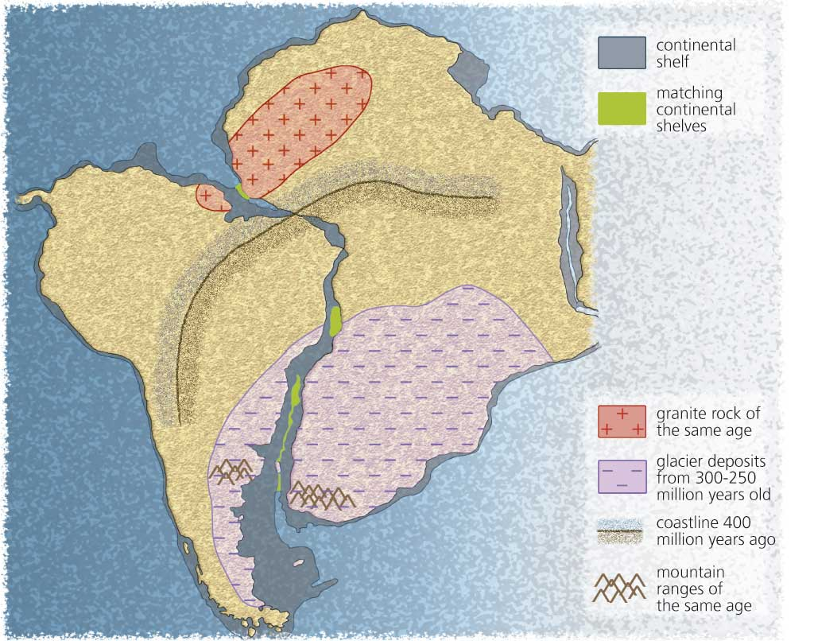{width="5.5in"}
:::

  Uno de los avances más importantes fue el estudio de los fondos oceánicos. Gracias al uso del sonar, se descubrió que el fondo marino no era plano, sino que tenía grandes cordilleras submarinas llamadas dorsales oceánicas. En estas zonas asciende material caliente del manto, se forma magma y se crea nueva corteza oceánica.

::: {style="text-align:center;"}
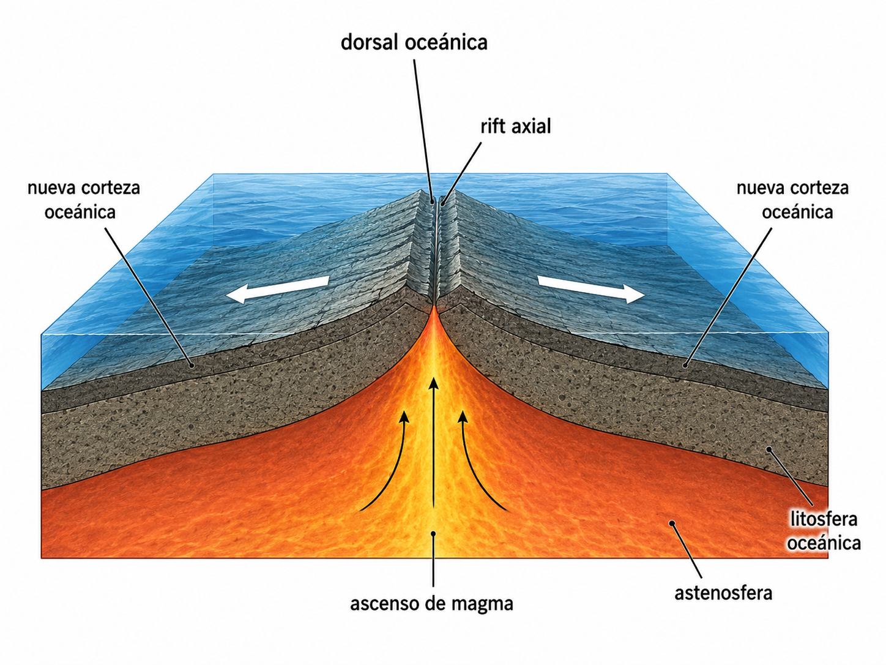{width="4.5in"}
:::

  Este descubrimiento permitió proponer la expansión del fondo oceánico. Según esta idea, la corteza oceánica se forma en las dorsales y se desplaza lentamente hacia ambos lados. Así se explicaba cómo podían separarse los continentes: no se movían atravesando el fondo oceánico, como pensaba Wegener, sino formando parte de placas litosféricas más grandes.

  Otra prueba fundamental fue el paleomagnetismo. Cuando las lavas del fondo oceánico se enfrían, algunos minerales conservan la orientación del campo magnético terrestre. Como el campo magnético ha cambiado varias veces de polaridad, en el fondo oceánico aparecen bandas magnéticas alternas y simétricas a ambos lados de las dorsales. Esta simetría confirmó que la corteza oceánica se iba creando de forma progresiva.

  También se observó que los terremotos y volcanes se concentran en franjas concretas del planeta. Estas franjas coinciden con los límites de las placas tectónicas, lo que permitió delimitar las placas y comprender que sus bordes son las zonas de mayor actividad geológica.

  A partir de todos estos descubrimientos se formuló la teoría de la tectónica de placas. Según esta teoría, la litosfera está dividida en placas rígidas que se mueven lentamente sobre la astenosfera. Estas placas pueden incluir corteza continental, corteza oceánica o ambas. Por eso, la tectónica de placas completó y corrigió la deriva continental de Wegener: los continentes sí se mueven, pero lo hacen integrados dentro de placas litosféricas.

## 2.3. Las placas tectónicas

  La superficie terrestre está dividida en varias placas principales y numerosas placas menores. Estas placas se desplazan unas respecto a otras y sus interacciones explican gran parte de la actividad geológica del planeta.

###  Principales placas tectónicas

  **Placa Pacífica**

  La placa Pacífica es la mayor placa tectónica de la Tierra y está formada casi por completo por litosfera oceánica. Ocupa gran parte del fondo del océano Pacífico. Sus bordes son muy activos, especialmente donde se introduce bajo otras placas en zonas de subducción.

  Alrededor de esta placa se localiza el llamado Cinturón de Fuego del Pacífico, una de las regiones con mayor actividad sísmica y volcánica del planeta. Allí se encuentran numerosas fosas oceánicas, arcos volcánicos e islas volcánicas.

  **Placa Norteamericana**

  La placa Norteamericana incluye América del Norte, Groenlandia y parte del fondo oceánico del Atlántico y del Ártico. Su límite occidental es especialmente activo, ya que allí interactúa con la placa Pacífica y otras placas menores.

  Uno de sus límites más conocidos es la falla de San Andrés, en California, donde la placa Pacífica y la placa Norteamericana se desplazan lateralmente una respecto a otra.

  **Placa Sudamericana**

  La placa Sudamericana incluye el continente sudamericano y parte del fondo del océano Atlántico. Su borde occidental es un límite convergente muy activo, donde la placa de Nazca subduce bajo Sudamérica. Este proceso ha originado la cordillera de los Andes y un intenso vulcanismo asociado.

  En su borde oriental, la placa Sudamericana se separa de la placa Africana en la dorsal mesoatlántica, lo que provoca la expansión del océano Atlántico.

  **Placa Euroasiática**

  La placa Euroasiática incluye gran parte de Europa y Asia, aunque algunas regiones del sur de Asia participan en complejas zonas de colisión. Esta placa presenta límites muy variados: dorsales oceánicas en el Atlántico norte, zonas de colisión en el Himalaya y límites complejos en el Mediterráneo y Asia oriental.

  La colisión entre la India y Eurasia ha dado lugar al Himalaya, la cordillera más alta del planeta.

  **Placa Africana**

  La placa Africana incluye el continente africano y partes de los océanos Atlántico e Índico. Presenta límites divergentes en el Atlántico y en el Índico, y una zona de rift continental muy importante en el este de África.

  El valle del Rift africano es una región donde la placa Africana se está fragmentando. Si el proceso continúa durante millones de años, podría formarse un nuevo océano.

  **Placa Indoaustraliana**

  En muchos modelos se habla de placa Indoaustraliana, aunque en estudios más detallados se suele diferenciar entre placa India y placa Australiana debido a su comportamiento relativo. Esta gran región litosférica incluye la India, Australia y parte del océano Índico.

  La parte india se mueve hacia el norte y colisionó con Eurasia, formando el Himalaya. La parte australiana interactúa con placas del Pacífico y del sureste asiático, generando una zona tectónicamente compleja.

  **Placa Antártica**

  La placa Antártica incluye el continente antártico y el fondo oceánico que lo rodea. Está rodeada en gran parte por límites divergentes, donde se separa de placas vecinas. Su actividad sísmica y volcánica es menor que la de otras placas, aunque existen zonas activas en sus bordes.

  **Placas menores relevantes**

  Además de las grandes placas, existen placas menores que tienen una gran importancia geológica.

  La placa de Nazca se localiza en el océano Pacífico oriental y subduce bajo la placa Sudamericana, generando los Andes y frecuentes terremotos en la costa occidental de Sudamérica.

  La placa del Caribe se sitúa entre América del Norte y América del Sur. Sus límites producen actividad sísmica y volcánica en América Central y las Antillas.

  La placa Filipina se localiza en el Pacífico occidental y está rodeada por zonas de subducción. Es una de las regiones tectónicas más complejas y activas del planeta.

  La placa Arábiga se desplaza hacia el norte y colisiona con Eurasia, contribuyendo a la formación de montañas en Oriente Medio. También está relacionada con la apertura del mar Rojo.

  La placa de Cocos se localiza frente a América Central y subduce bajo la placa del Caribe y la placa Norteamericana, generando volcanismo y terremotos en México y Centroamérica.

  La placa de Scotia se encuentra entre Sudamérica y la Antártida. Su dinámica está relacionada con el arco de las Sandwich del Sur y con la compleja conexión tectónica entre el Atlántico sur y el océano Austral.

::: {style="text-align:center;"}
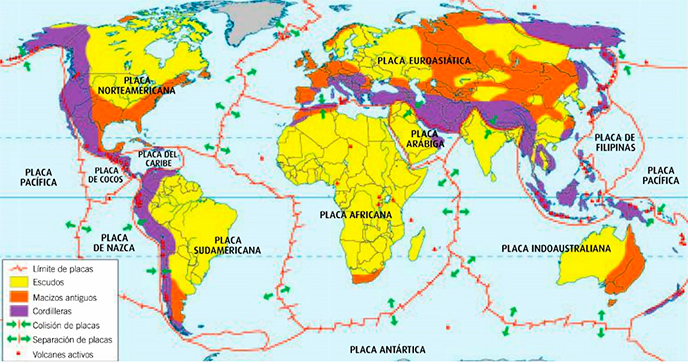{width="6.6in"}
:::

## 2.4. Límites entre placas

  Los límites de placas son las zonas donde dos placas tectónicas interactúan. En ellos se concentra la mayor parte de la actividad geológica interna del planeta. Según el tipo de movimiento relativo, se distinguen tres grandes tipos de límites: divergentes, convergentes y transformantes.

###  Límites divergentes

  Los límites divergentes son zonas donde dos placas se separan. Al separarse, asciende material caliente procedente del manto. Este material puede fundirse parcialmente y generar magma, que al enfriarse forma nueva litosfera oceánica.

  Las dorsales oceánicas son el ejemplo más característico de límite divergente. Se encuentran en el fondo de los océanos y forman largas cordilleras submarinas. En el eje de la dorsal se genera nueva corteza oceánica mediante la solidificación de magmas basálticos.

  A medida que se forma nueva corteza, las placas se desplazan hacia ambos lados. Por eso, las dorsales son zonas de expansión oceánica. También presentan terremotos superficiales y vulcanismo basáltico, generalmente menos explosivo que el de las zonas de subducción.

::: {style="text-align:center;"}
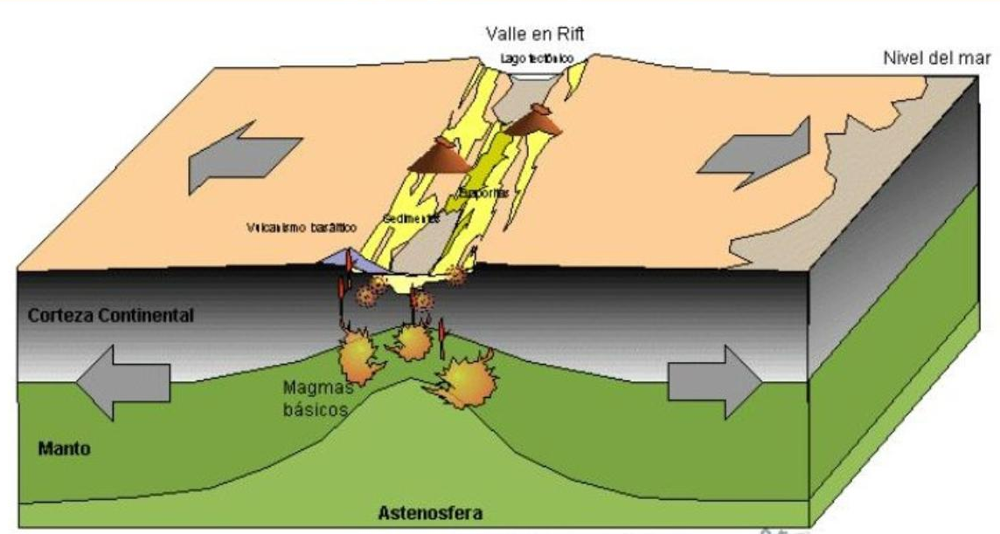{width="6.6in"}
:::

  Un rift continental es una zona donde una placa continental comienza a estirarse y fracturarse. El adelgazamiento de la litosfera permite el ascenso de material caliente del manto, lo que puede provocar vulcanismo y terremotos.

  Si el proceso continúa durante millones de años, el continente puede llegar a romperse por completo y formarse un nuevo océano. En ese caso, el rift continental evoluciona hacia una dorsal oceánica.

  El valle del Rift africano es un ejemplo actual de rift continental. En esta zona, el este de África se está separando lentamente del resto del continente africano.

###  Límites convergentes

  Los límites convergentes son zonas donde dos placas se aproximan. En estos límites se destruye litosfera o se deforman intensamente los bordes continentales. Según el tipo de placas que colisionan, se distinguen tres casos principales: océano-océano, océano-continente y continente-continente.

  ***Convergencia océano-océano***

  Cuando convergen dos placas oceánicas, una de ellas suele hundirse bajo la otra en un proceso llamado subducción. La placa que subduce se introduce en el manto y forma una fosa oceánica profunda.

  A medida que la placa desciende, libera agua y otros fluidos. Estos fluidos favorecen la fusión parcial del manto situado encima de la placa subducida. El magma generado asciende y puede formar volcanes. Como el proceso ocurre en el océano, los volcanes pueden formar arcos insulares.

  Un ejemplo es el arco de las Islas Marianas, asociado a una de las fosas oceánicas más profundas del planeta.

::: {style="text-align:center;"}
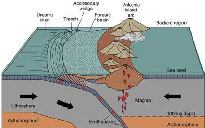{width="5.5in"}
:::

  ***Convergencia océano-continente***

  Cuando una placa oceánica converge hacia una placa continental, normalmente subduce la placa oceánica porque es más densa. La placa oceánica se hunde bajo el continente, formando una fosa oceánica junto al margen continental.

  Este tipo de límite produce terremotos intensos, vulcanismo continental y deformación de la corteza. El magma generado asciende a través de la corteza continental y alimenta volcanes. Además, la compresión contribuye al levantamiento de cordilleras.

  El ejemplo más representativo es la cordillera de los Andes, formada por la subducción de la placa de Nazca bajo la placa Sudamericana.

::: {style="text-align:center;"}
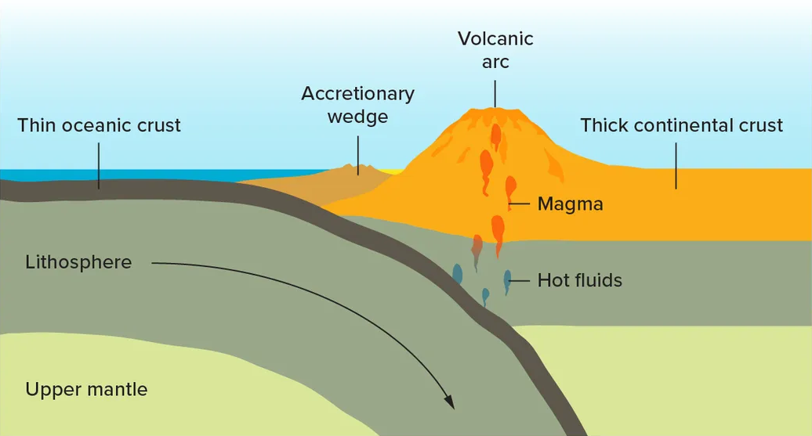{width="5.2in"}
:::

  ***Convergencia continente-continente***

  Cuando dos placas continentales chocan, ninguna subduce fácilmente, porque la corteza continental es menos densa que la oceánica. En lugar de hundirse profundamente en el manto, los materiales se comprimen, se pliegan, se fracturan y se engrosan.

  Este proceso da lugar a grandes cordilleras de colisión. El ejemplo más claro es el Himalaya, formado por la colisión entre la India y Eurasia. Esta colisión comenzó hace decenas de millones de años y todavía continúa, por lo que la región sigue siendo tectónicamente activa.

  En estos límites se producen grandes terremotos, aunque el vulcanismo suele ser menos importante que en las zonas de subducción oceánica.

::: {style="text-align:center;"}
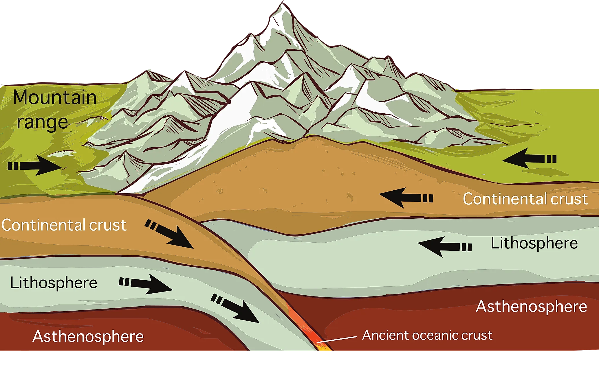{width="5.0in"}
:::

### Límites transformantes

  Los límites transformantes son zonas donde dos placas se deslizan lateralmente una respecto a otra. En estos límites no se crea ni se destruye litosfera, pero se acumulan grandes tensiones debido al rozamiento entre las placas.

  Cuando la tensión acumulada supera la resistencia de las rocas, se produce una ruptura brusca y se libera energía en forma de terremotos. Por eso, los límites transformantes pueden generar terremotos muy destructivos.

  El ejemplo más conocido es la falla de San Andrés, en California. Allí, la placa Pacífica se desplaza lateralmente respecto a la placa Norteamericana.

::: {style="text-align:center;"}
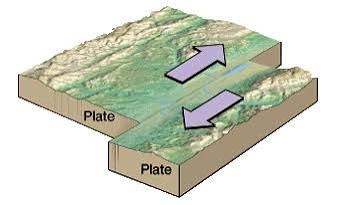{width="4.2in"}
:::

## 2.5. Motores del movimiento de las placas

  El movimiento de las placas tectónicas está relacionado con la energía interna de la Tierra, procedente del calor conservado desde la formación del planeta y de la desintegración de elementos radiactivos en rocas profundas. Este calor genera diferencias de temperatura y densidad en el manto, favoreciendo el movimiento lento de los materiales.

  Durante mucho tiempo se explicó este movimiento solo mediante corrientes de convección, en las que el material caliente asciende y el material frío desciende. Este modelo sigue siendo importante, aunque actualmente se sabe que el desplazamiento de las placas depende de varios mecanismos combinados.

  Uno de ellos es el empuje de dorsal. En las dorsales oceánicas se forma litosfera nueva, caliente y elevada. Al alejarse de la dorsal, la litosfera se enfría, aumenta su densidad y desciende, favoreciendo el deslizamiento de la placa hacia zonas más bajas.

  Otro mecanismo fundamental es la tracción de placa. Se produce cuando una placa oceánica fría y densa se hunde en una zona de subducción y tira del resto de la placa. Actualmente se considera uno de los motores más importantes del movimiento tectónico.

  Por tanto, los modelos actuales entienden la tectónica de placas como un sistema complejo en el que actúan conjuntamente la convección del manto, el empuje de dorsal, la tracción de placa y la interacción entre la litosfera y el manto. Las placas no solo se desplazan sobre el manto, sino que también modifican su dinámica al hundirse, enfriarse o separarse.

::: {style="text-align:center;"}
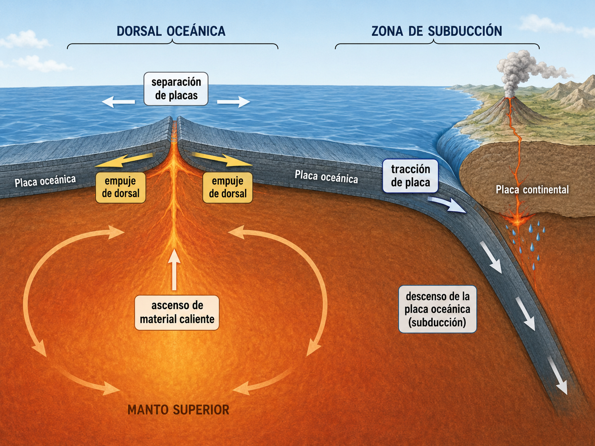{width="5.8in"}
:::

## 2.6. Consecuencias de la tectónica de placas

  La tectónica de placas explica muchos de los grandes procesos geológicos que transforman la superficie terrestre. Sus efectos se observan especialmente en los límites de placas, donde se concentran terremotos, volcanes, cordilleras, fosas oceánicas y zonas de subducción.

  Los **terremotos** se producen cuando las rocas se rompen o se desplazan bruscamente a lo largo de fallas. Son frecuentes en los límites de placas porque allí se acumulan grandes tensiones. En las dorsales suelen ser superficiales y moderados; en las fallas transformantes pueden ser destructivos, y en las zonas de subducción pueden alcanzar gran magnitud y generar tsunamis.

  El **vulcanismo** también está relacionado con la tectónica. En las dorsales y rifts, el magma se forma por descompresión al separarse las placas. En las zonas de subducción, la placa que se hunde libera fluidos que favorecen la formación de magmas más viscosos y explosivos. También existen volcanes intraplaca, como los de Hawái, asociados a puntos calientes en el manto.

  La **formación de cordilleras** ocurre principalmente en límites convergentes. En zonas de subducción océano-continente se forman cordilleras como los Andes, mientras que en colisiones continente-continente se originan grandes cadenas montañosas como el Himalaya. Estos procesos duran millones de años e implican compresión, plegamiento, fracturación y engrosamiento de la corteza.

  La tectónica de placas también explica la **apertura y cierre de océanos**. Un océano puede comenzar con la fractura de un continente, evolucionar hasta convertirse en un océano amplio y, finalmente, cerrarse si aparece una zona de subducción. Este proceso forma parte del **ciclo de Wilson**.

  Además, la tectónica influye en la **distribución de recursos minerales y energéticos**. Muchos depósitos metálicos se forman en zonas de subducción, dorsales oceánicas o ambientes hidrotermales. Las cuencas sedimentarias asociadas a márgenes continentales pueden acumular petróleo, gas o carbón.

  Por último, la tectónica de placas es fundamental para comprender los **riesgos geológicos**. Terremotos, volcanes y tsunamis se concentran en zonas tectónicamente activas. Su estudio permite evaluar peligros, planificar mejor el territorio, diseñar construcciones más seguras y reducir daños en la población.

::: {style="text-align:center;"}
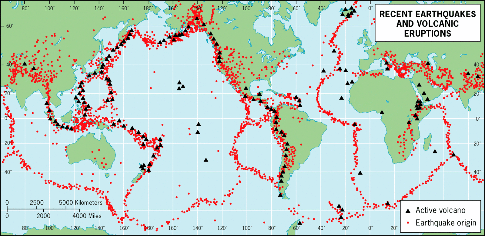{width="6.7in"}
:::

# 3. El ciclo de Wilson

  El Ciclo de Wilson es un modelo que explica cómo los continentes pueden fragmentarse, separarse, formar nuevos océanos y, tras cientos de millones de años, volver a aproximarse hasta cerrar esos océanos y generar grandes cordilleras. Es, por tanto, una forma de entender la evolución a largo plazo de la litosfera terrestre.

  Este ciclo está directamente relacionado con la tectónica de placas, porque depende del movimiento de las placas litosféricas sobre el manto. Cuando las placas se separan, se forman rifts y océanos nuevos; cuando convergen, se inicia la subducción, se consume litosfera oceánica y los continentes pueden acabar colisionando. El concepto procede de las ideas de J. Tuzo Wilson sobre la apertura y cierre repetidos de cuencas oceánicas dentro de la dinámica global de las placas.

  El proceso completo es muy lento. No ocurre en miles ni en unos pocos millones de años, sino en escalas de cientos de millones de años. Además, las fases no siempre son perfectamente ordenadas ni idénticas en todos los casos, ya que cada océano y cada continente tienen una historia geológica propia.

## 3.1. Estadio embrionario: formación de un rift continental

  El ciclo comienza cuando una zona de la corteza continental empieza a estirarse y fracturarse. Esto suele relacionarse con el ascenso de material caliente del manto, que debilita la litosfera y favorece la aparición de grandes fallas. Como consecuencia, el continente comienza a hundirse en una franja alargada, formando una depresión tectónica llamada rift continental.

  En esta fase todavía no existe un océano. Lo que aparece es una zona continental inestable, con fallas normales, volcanismo frecuente y terremotos. La corteza se va adelgazando poco a poco, como si el continente empezara a romperse por una línea de debilidad.

  Ejemplo actual: el Valle del Rift africano, donde África oriental se está separando lentamente del resto del continente africano.

## 3.2. Estadio juvenil: apertura inicial del océano

  Si el estiramiento continúa, el continente acaba rompiéndose y entre los dos bloques continentales comienza a formarse nueva corteza oceánica. El agua marina invade la depresión y aparece un mar estrecho y alargado.

  En esta fase ya existe expansión oceánica, aunque el océano todavía es joven y estrecho. En el centro puede desarrollarse una dorsal incipiente, donde asciende magma y se crea nueva litosfera oceánica. Los márgenes de los continentes recién separados empiezan a enfriarse y hundirse lentamente.

  Ejemplo actual: el Mar Rojo, situado entre África y la península arábiga. Representa un océano joven en proceso de apertura.

## 3.3. Estadio maduro: océano amplio con márgenes pasivos

  Con el paso de millones de años, la expansión continúa y el océano se hace cada vez más ancho. La dorsal oceánica sigue creando nueva corteza, mientras los continentes se alejan progresivamente.

  En este estadio el océano es amplio y estable. Sus bordes suelen ser márgenes pasivos, es decir, zonas donde el continente y el océano forman parte de la misma placa y apenas hay actividad sísmica o volcánica intensa. En estos márgenes se acumulan grandes espesores de sedimentos procedentes de la erosión continental.

  Ejemplo actual: el océano Atlántico, que presenta una dorsal central activa y márgenes pasivos en muchas de sus costas. Es un buen ejemplo de océano en fase madura.

## 3.4. Estadio de declive: inicio de la subducción

  El ciclo cambia de tendencia cuando en alguno de los bordes del océano comienza la subducción. Esto ocurre cuando la litosfera oceánica, al hacerse más antigua, fría y densa, empieza a hundirse bajo otra placa.

  Desde ese momento, el océano deja de crecer de forma dominante y empieza a consumirse. Aparecen fosas oceánicas, arcos volcánicos y terremotos profundos. La creación de corteza en la dorsal puede continuar, pero la destrucción de litosfera oceánica en las zonas de subducción se vuelve cada vez más importante.

  Ejemplo actual: el océano Pacífico, rodeado por numerosas zonas de subducción. Por eso se asocia al llamado Cinturón de Fuego del Pacífico, con intensa actividad volcánica y sísmica. Conviene matizar que el Pacífico es un caso complejo, porque todavía conserva dorsales activas, aunque globalmente se considera un océano en retroceso relativo.

## 3.5. Estadio terminal: cierre progresivo del océano

  En esta fase, la subducción ha consumido gran parte de la litosfera oceánica. El océano se estrecha y los continentes situados a ambos lados se aproximan. La actividad tectónica es intensa: se forman cadenas montañosas, cuencas sedimentarias deformadas, volcanes y frecuentes terremotos.

  El océano ya no es una gran cuenca abierta, sino un espacio cada vez más reducido entre masas continentales. Pueden quedar mares residuales, fragmentos de corteza oceánica y zonas muy deformadas.

  Ejemplo actual: el mar Mediterráneo, que puede interpretarse como un resto de antiguos océanos situados entre África y Eurasia. Su evolución está marcada por la convergencia entre ambas placas y por el cierre progresivo de espacios oceánicos anteriores.

## 3.6. Estadio de sutura: colisión continental

  La última fase se produce cuando la litosfera oceánica desaparece casi por completo y dos masas continentales chocan. Como la corteza continental es menos densa que la oceánica, no subduce fácilmente. En lugar de hundirse, se comprime, se pliega, se engrosa y se eleva, formando grandes cordilleras.

  La zona donde quedan unidos los antiguos continentes se llama sutura continental. En ella pueden conservarse restos de rocas oceánicas, sedimentos marinos deformados y fragmentos de antiguos fondos oceánicos, conocidos como ofiolitas. Estas estructuras permiten reconstruir la existencia de océanos desaparecidos.

  Ejemplo actual: el Himalaya, formado por la colisión entre la India y Eurasia tras el cierre del océano de Tetis. Es uno de los mejores ejemplos de cordillera de colisión continental

::: {style="text-align:center;"}
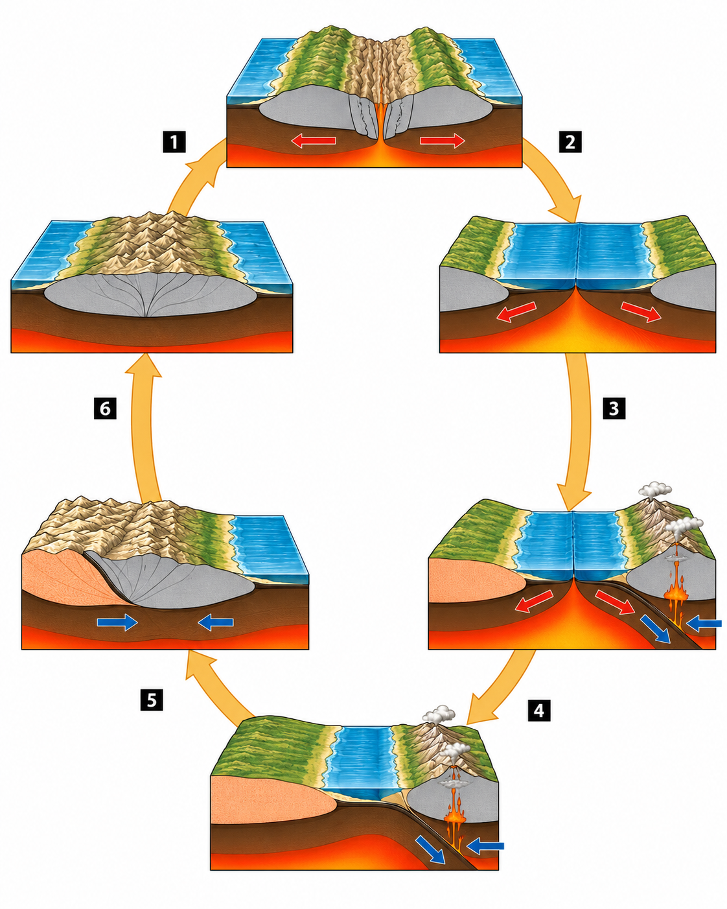{width="6.7in"}
:::