# 1. Introducción

La Tierra es un planeta dinámico. Aunque desde nuestra escala humana pueda parecer sólida, estable e inmóvil, en realidad está sometida a cambios continuos. Algunos de estos cambios son rápidos y visibles, como una erupción volcánica, un terremoto o un deslizamiento de ladera. Otros son extremadamente lentos y solo pueden comprenderse a escala geológica, como la formación de cordilleras, la apertura de océanos o el desplazamiento de los continentes.

La dinámica terrestre depende de dos grandes fuentes de energía. Por un lado, la energía externa procede principalmente del Sol. Esta energía actúa sobre la atmósfera, la hidrosfera y la superficie terrestre, y es responsable de procesos como la meteorización, la erosión, el transporte y la sedimentación. Por otro lado, la energía interna procede del calor acumulado en el interior del planeta. Esta energía mueve lentamente los materiales del manto, provoca la deformación de la litosfera, genera magmas, origina terremotos y participa en la formación de grandes relieves.

Los procesos geológicos internos son fundamentales porque explican la estructura profunda de la Tierra y la evolución de su superficie. Gracias a ellos se forman montañas, se destruye y se crea corteza oceánica, aparecen volcanes, se producen terremotos y se concentran muchos recursos minerales. Estos procesos también tienen una gran importancia social, ya que pueden generar riesgos naturales que afectan a la población, a las infraestructuras y a la ordenación del territorio.

La teoría que permite interpretar la mayoría de estos fenómenos es la tectónica de placas. Según esta teoría, la litosfera está fragmentada en placas rígidas que se desplazan sobre la astenosfera, una zona del manto superior con comportamiento más plástico. Las placas pueden separarse, chocar o deslizarse lateralmente entre sí. En sus límites se concentra la mayor parte de la actividad sísmica, volcánica y orogénica del planeta.

# 2. Origen de la energía interna terrestre

## 2.1. La formación de la Tierra

La Tierra se formó hace unos 4.500 millones de años a partir de una nube de gas y polvo que rodeaba al Sol primitivo. En esa nube, las partículas sólidas comenzaron a atraerse por gravedad y fueron formando cuerpos cada vez mayores. Este proceso se conoce como acreción planetaria. Primero se unieron pequeños fragmentos, después planetesimales y finalmente cuerpos de tamaño planetario.

Durante la acreción, la Tierra recibió numerosos impactos meteoríticos. Cada choque liberaba una enorme cantidad de energía en forma de calor. A esto se sumaba la presión creciente producida por la acumulación de materiales. Como consecuencia, la Tierra primitiva alcanzó temperaturas muy elevadas y parte de sus materiales llegaron a fundirse.

En ese estado parcialmente fundido se produjo la diferenciación gravitacional. Los materiales más densos, ricos en hierro y níquel, descendieron hacia el centro del planeta y formaron el núcleo. Los materiales menos densos quedaron en zonas más externas y dieron lugar al manto y la corteza. Este proceso también liberó calor, porque el desplazamiento de los materiales densos hacia el interior transformó energía gravitatoria en energía térmica.

## 2.2. Fuentes actuales de calor interno

Aunque gran parte del calor terrestre procede de la formación del planeta, la Tierra sigue generando y conservando calor en la actualidad. Una fuente muy importante es la desintegración radiactiva de elementos como el uranio, el torio y el potasio. Estos elementos se encuentran en pequeñas cantidades en las rocas, especialmente en la corteza y el manto, y al desintegrarse liberan energía térmica.

Otra fuente es el calor residual de formación. La Tierra aún conserva parte del calor generado durante la acreción, los impactos meteoríticos y la diferenciación interna. Este calor se pierde lentamente hacia el espacio, pero el proceso es muy lento debido al gran tamaño del planeta y al carácter aislante de las rocas.

También contribuye la cristalización del núcleo interno. El núcleo externo es líquido, mientras que el núcleo interno es sólido. A medida que parte del hierro líquido del núcleo externo se solidifica y se incorpora al núcleo interno, se libera calor latente. Este proceso, además, participa en la generación del campo magnético terrestre.

## 2.3. El gradiente geotérmico

El gradiente geotérmico es el aumento de la temperatura con la profundidad. En la corteza terrestre superficial, como valor medio aproximado, la temperatura suele aumentar unos 25-30 ºC por kilómetro, aunque este valor cambia mucho según la zona.

En áreas tectónicamente estables, alejadas de volcanes y límites de placas, el gradiente suele ser menor. En cambio, en zonas volcánicas, dorsales oceánicas, regiones con corteza adelgazada o áreas con circulación de fluidos calientes, el gradiente puede ser mucho mayor. Por eso en algunos lugares existen fuentes termales, géiseres o posibilidades de aprovechamiento geotérmico.

El gradiente geotérmico demuestra que el interior terrestre conserva energía. Esa energía no permanece inmóvil: se transfiere hacia el exterior mediante conducción, convección y procesos magmáticos. La convección del manto, aunque lenta, es uno de los motores fundamentales de la tectónica de placas.

# 3. Deformación de la litosfera

La litosfera está formada por rocas rígidas, aunque eso no significa que sea indeformable. Cuando las rocas están sometidas a fuerzas durante suficiente tiempo, pueden doblarse, fracturarse o desplazarse. La deformación de la litosfera explica la formación de pliegues, fallas, cordilleras, cuencas sedimentarias y muchos relieves geológicos.

Para entender estos procesos hay que diferenciar dos conceptos. El esfuerzo es la fuerza que actúa sobre una roca por unidad de superficie. La deformación es el cambio que experimenta esa roca como respuesta al esfuerzo. Según la intensidad del esfuerzo, la presión, la temperatura, la profundidad, el tiempo de actuación y el tipo de roca, la respuesta puede ser muy diferente.

## 3.1. Tipos de esfuerzos

**Compresión**

La compresión aparece cuando las fuerzas empujan los materiales unos contra otros. Este tipo de esfuerzo acorta y engrosa la corteza. Es característico de los límites convergentes, donde chocan placas tectónicas. La compresión favorece la formación de pliegues, fallas inversas, cabalgamientos y cordilleras.

**Tensión**

La tensión se produce cuando las fuerzas tienden a separar los materiales. En este caso, la corteza se estira y adelgaza. Es propia de zonas de rift continental y dorsales oceánicas. La distensión genera fallas normales y puede iniciar la apertura de nuevos océanos.

**Cizalla**

La cizalla aparece cuando dos bloques de roca se desplazan lateralmente en sentidos opuestos o a diferente velocidad. Es típica de los límites transformantes, donde las placas no se crean ni se destruyen, sino que se deslizan una junto a otra. Este esfuerzo produce fallas de desgarre o fallas transformantes.

::: {style="text-align:center;"}
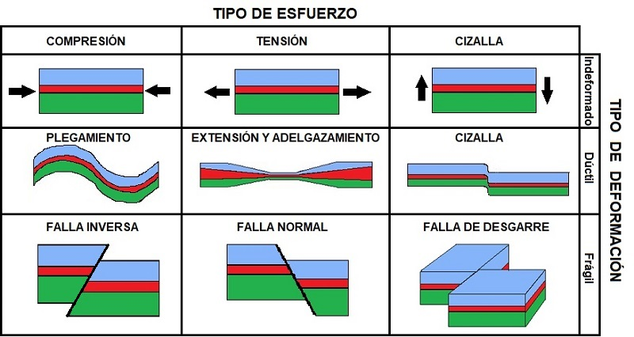{width="6.7in"}
:::

# 4. Pliegues

Los pliegues son deformaciones onduladas de las rocas. Se forman cuando los estratos, originalmente más o menos horizontales, son sometidos a esfuerzos compresivos y se doblan sin llegar a romperse. Para que se formen pliegues, las rocas deben comportarse de manera plástica o dúctil. Esto suele ocurrir cuando están enterradas a cierta profundidad o cuando la deformación actúa lentamente durante largos periodos.

Los pliegues son muy frecuentes en cordilleras, porque estas se originan por compresión. Cuando dos placas convergen, los materiales sedimentarios acumulados en antiguos mares pueden comprimirse, elevarse y deformarse, formando grandes sistemas de pliegues.

## 4.1. Elementos de un pliegue

La charnela es la zona de máxima curvatura del pliegue. Es el punto o línea donde los estratos cambian de inclinación de manera más marcada.

Los flancos son los lados del pliegue. En ellos los estratos aparecen inclinados en una dirección u otra. La inclinación de los flancos permite interpretar la intensidad y el sentido de la deformación.

El plano axial es un plano imaginario que divide el pliegue en dos partes. Si el pliegue es simétrico, el plano axial queda aproximadamente en el centro. Si el pliegue está inclinado o tumbado, el plano axial también aparece inclinado.

::: {style="text-align:center;"}
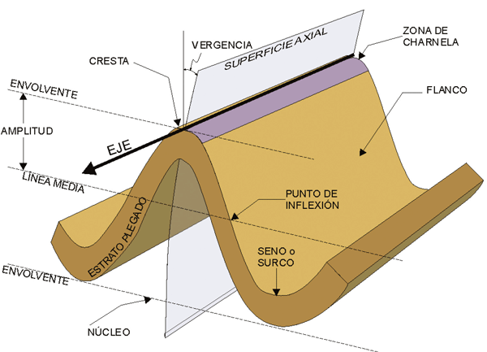{width="6.2in"}
:::

## 4.2. Tipos de pliegues

Los anticlinales son pliegues convexos hacia arriba. En ellos, los materiales más antiguos suelen encontrarse en el núcleo, siempre que la serie estratigráfica conserve su posición normal. Su forma recuerda a un arco.

Los sinclinales son pliegues cóncavos hacia arriba. En ellos, los materiales más modernos suelen ocupar el núcleo. Su forma recuerda a una cubeta.

Según la posición del plano axial podemos tener pliegues rectos (plano axial a 90 grados), inclinados (plano axial entre 85 y 10º), tumbados (plano axial buza menos de 10º) o invertidos (plano axial ha girado más de 90º con respecto a la posición vertical).

Si el plano axial divide al pliegue en dos mitades simétricas tenemos un pliegue simétrico, si lo hace en dos mitades diferentes, tenemos un pliegue asimétrico.

::: {style="text-align:center;"}
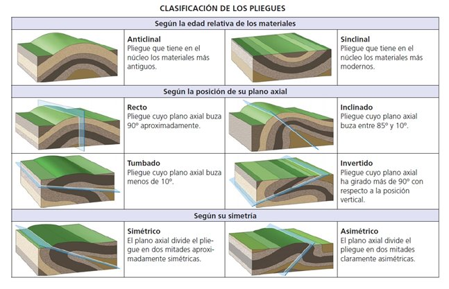{width="6.2in"}
:::

# 5. Fallas

Las fallas son fracturas de las rocas en las que se ha producido desplazamiento relativo entre dos bloques. A diferencia de una simple diaclasa o grieta, en una falla los bloques situados a ambos lados de la fractura se han movido. Las fallas se forman cuando las rocas responden de manera frágil ante los esfuerzos tectónicos.

Las fallas son estructuras fundamentales para comprender la dinámica interna de la Tierra, porque muchas de ellas son zonas de debilidad por las que se libera energía acumulada. Cuando una falla se desplaza bruscamente, puede producirse un terremoto.

## 5.1. Elementos de una falla

El plano de falla es la superficie de fractura por la que se desplazan los bloques. Puede ser vertical, inclinado o casi horizontal.

El bloque superior, también llamado bloque de techo, es el bloque situado por encima del plano de falla cuando este está inclinado. El bloque inferior o bloque de muro es el que queda por debajo.

El salto de falla es la distancia relativa por la que se han desplazado los bloques. Puede ser de pocos centímetros o alcanzar varios kilómetros en grandes estructuras tectónicas.

::: {style="text-align:center;"}
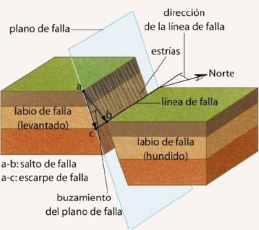{width="3.9in"}
:::

## 5.2. Tipos principales de fallas

La falla normal se produce por esfuerzos distensivos. En ella, el bloque de techo desciende respecto al bloque de muro. Este tipo de falla aparece en zonas donde la corteza se estira, como los rifts continentales o las dorsales oceánicas.

La falla inversa se forma por compresión. En ella, el bloque de techo asciende respecto al bloque de muro. Es típica de zonas de convergencia entre placas.

El cabalgamiento es una falla inversa de bajo ángulo. En este caso, un conjunto de rocas se desplaza sobre otro a lo largo de una superficie poco inclinada. Los cabalgamientos son muy importantes en la formación de cordilleras, porque permiten acortar y engrosar grandes sectores de corteza.

La falla transformante o de desgarre se produce por esfuerzos de cizalla. Los bloques se desplazan lateralmente, sin que predomine el movimiento vertical. Son características de límites transformantes de placas.

::: {style="text-align:center;"}
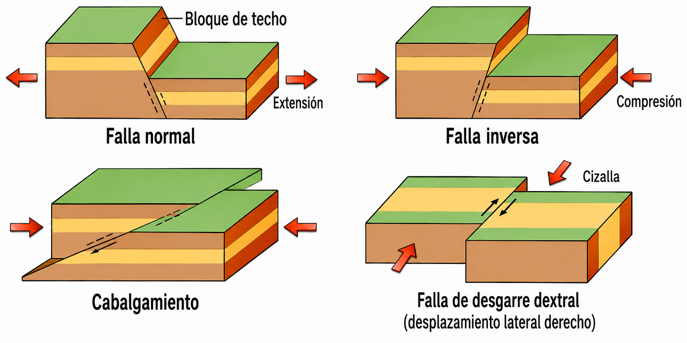{width="6.2in"}
:::

# 6. Terremotos

Un terremoto es una vibración brusca del terreno causada por la liberación repentina de energía acumulada en el interior de la Tierra. La mayoría se producen por el movimiento súbito de una falla. Durante años, décadas o siglos, las rocas situadas a ambos lados de una falla pueden acumular deformación elástica. Cuando la tensión supera la resistencia de la roca o el rozamiento que bloquea la falla, se produce la ruptura y los bloques se desplazan.

## 6.1. Teoría del rebote elástico

La teoría del rebote elástico explica cómo se originan muchos terremotos tectónicos. Según esta teoría, las rocas se deforman lentamente mientras acumulan energía. Cuando se alcanza el límite de resistencia, la falla se rompe o se desplaza de forma repentina. Entonces las rocas recuperan parcialmente su forma anterior, liberando energía en forma de ondas sísmicas.

Esta teoría permite entender por qué los terremotos no se distribuyen al azar. Se concentran en zonas donde las placas interactúan y las rocas acumulan esfuerzos: límites convergentes, divergentes y transformantes.

## 6.2. Hipocentro y epicentro

El hipocentro o foco sísmico es el punto del interior terrestre donde se inicia la ruptura. Puede situarse a poca profundidad o a varios cientos de kilómetros, especialmente en zonas de subducción.

El epicentro es el punto de la superficie situado justo encima del hipocentro. Suele ser el área donde se percibe con más intensidad el terremoto, aunque los daños dependen también de la profundidad, la magnitud, el tipo de terreno, la distancia, la duración de la sacudida y la vulnerabilidad de las construcciones.

::: {style="text-align:center;"}
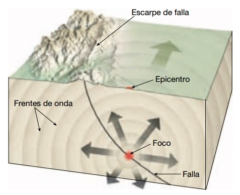{width="4.3in"}
:::

## 6.3. Ondas sísmicas

Existen diferentes tipos de ondas sísmicas. Las ondas P son ondas primarias. Son las más rápidas y las primeras en llegar a los sismógrafos. Se transmiten por compresión y expansión del material, de forma parecida a una onda sonora. Pueden atravesar sólidos, líquidos y gases.

Las ondas S son ondas secundarias. Son más lentas que las ondas P y deforman el material de manera transversal a la dirección de propagación. Solo se transmiten por materiales sólidos. El hecho de que no atraviesen líquidos permitió deducir que el núcleo externo terrestre es líquido.

Las ondas superficiales se propagan por la superficie terrestre. Suelen llegar después que las ondas P y S, pero pueden ser las más destructivas, porque producen movimientos complejos del suelo y afectan directamente a edificios e infraestructuras.

::: {style="text-align:center;"}
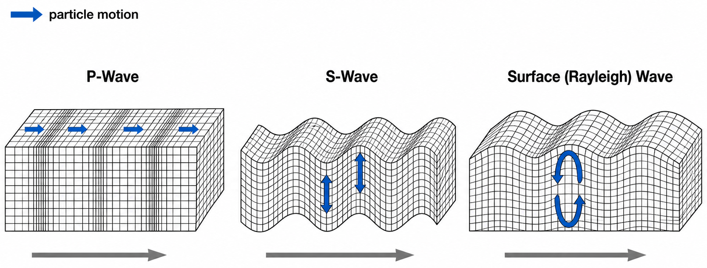{width="6.0in"}
:::

## 6.4. Magnitud e intensidad

La magnitud mide la energía liberada por un terremoto. Es un valor instrumental y se calcula a partir de los registros sísmicos. La escala de magnitud de momento es la más utilizada para terremotos importantes.

La intensidad mide los efectos observados en la superficie: daños en edificios, percepción por parte de la población, cambios en el terreno y otros impactos. Por eso un mismo terremoto tiene una sola magnitud, pero puede tener intensidades diferentes según la localidad.

## 6.5. Distribución mundial

Los terremotos se concentran principalmente en los límites de placas litosféricas. En las dorsales oceánicas suelen ser superficiales y de magnitud moderada. En las fallas transformantes son también superficiales, pero pueden ser muy destructivos si afectan a zonas pobladas. En las zonas de subducción pueden producirse terremotos muy grandes, desde superficiales hasta profundos, porque la placa oceánica desciende hacia el manto.

El cinturón de fuego del Pacífico es la región con mayor actividad sísmica y volcánica del planeta. Incluye zonas como Japón, Indonesia, Chile, Alaska, México y la costa occidental de Norteamérica y Sudamérica.

## 6.6. Riesgos sísmicos

El riesgo sísmico depende de tres factores: peligrosidad, exposición y vulnerabilidad. La peligrosidad se refiere a la probabilidad de que ocurra un terremoto de cierta intensidad en una zona. La exposición indica cuántas personas, edificios e infraestructuras se encuentran en esa zona. La vulnerabilidad expresa el grado de daño que pueden sufrir esos elementos.

Por eso un terremoto de magnitud moderada puede causar una catástrofe si afecta a una ciudad con edificios vulnerables, mientras que un terremoto mayor puede tener menos consecuencias si ocurre en una zona despoblada o bien preparada.

::: {style="text-align:center;"}
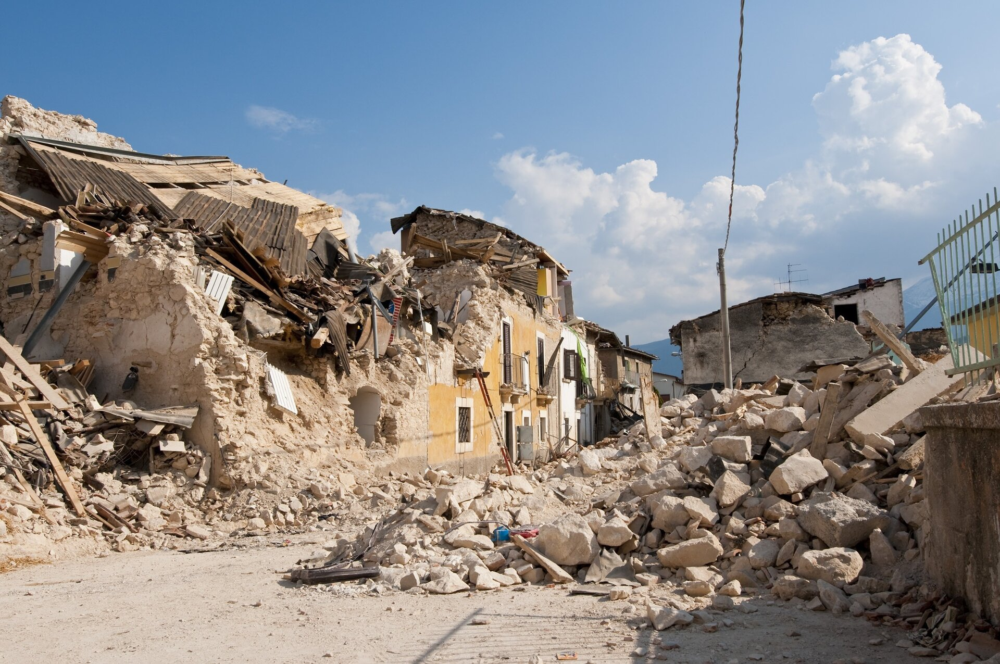{width="6.3in"}
:::

# 7. Vulcanismo

El vulcanismo es el conjunto de procesos mediante los cuales el magma asciende desde el interior terrestre y llega a la superficie o queda cerca de ella. Cuando el magma alcanza la superficie se denomina lava. El vulcanismo es una manifestación directa de la energía interna terrestre.

## 7.1. Origen del magma

El magma se forma por fusión parcial de rocas del manto o de la corteza. Esta fusión puede producirse por tres mecanismos principales. El primero es el aumento de temperatura, que puede fundir parcialmente las rocas. El segundo es la disminución de presión, típica de dorsales y rifts, donde el material del manto asciende y se funde al descomprimirse. El tercero es la incorporación de agua y otros volátiles, especialmente en zonas de subducción, donde estos fluidos reducen el punto de fusión de las rocas del manto.

El magma contiene una mezcla de líquido fundido, cristales y gases disueltos. Su composición química condiciona su viscosidad, su temperatura, su contenido en gases y el tipo de erupción que puede producir.

## 7.2. Tipos de magma

El magma basáltico es pobre en sílice, caliente y poco viscoso. Fluye con facilidad y suele producir erupciones efusivas, con coladas de lava extensas. Es característico de dorsales oceánicas, puntos calientes y muchas islas volcánicas oceánicas.

El magma andesítico tiene una composición intermedia y una viscosidad mayor. Suele aparecer en zonas de subducción. Puede generar erupciones mixtas, con emisión de lava y explosiones.

El magma riolítico es rico en sílice, más viscoso y generalmente más explosivo. Al ser muy viscoso, dificulta la salida de gases. Cuando la presión aumenta demasiado, pueden producirse erupciones violentas con abundantes piroclastos.

## 7.3. Productos volcánicos

Las lavas son materiales fundidos que fluyen por la superficie. La forma de los flujos de lava depende de la composición, la temperatura, la pendiente y la velocidad de enfriamiento. Las lavas basálticas suelen ser más fluidas; las lavas ricas en sílice son más espesas y pueden formar domos.

Los piroclastos son fragmentos sólidos expulsados durante una erupción explosiva. Según su tamaño se clasifican en cenizas, lapilli, bombas y bloques. Las cenizas pueden viajar largas distancias y afectar a la salud, la aviación, los cultivos y las infraestructuras.

Los gases volcánicos incluyen vapor de agua, dióxido de carbono, dióxido de azufre y otros compuestos. Aunque muchas veces pasan desapercibidos, pueden ser peligrosos, especialmente en zonas deprimidas donde se acumulan gases densos.

::: {style="text-align:center;"}
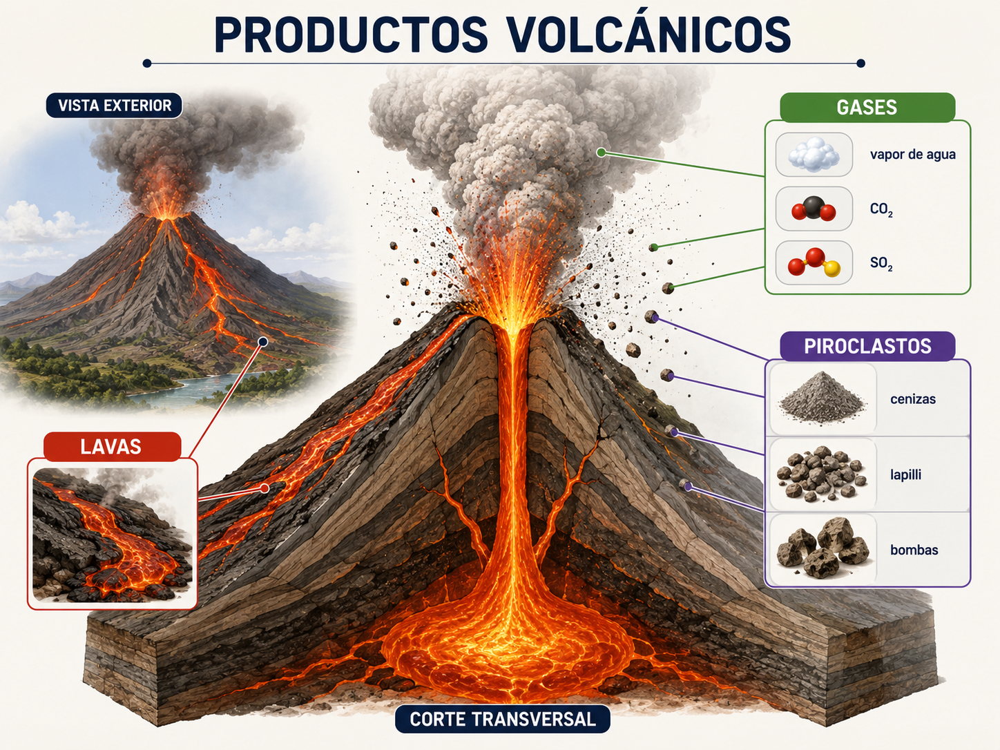{width="5.0in"}
:::

## 7.4. Tipos de erupciones

Las erupciones efusivas se caracterizan por la emisión tranquila de lava. Suelen estar asociadas a magmas basálticos poco viscosos. Aunque son menos explosivas, pueden destruir viviendas, carreteras y cultivos por avance de las coladas.

Las erupciones explosivas se producen cuando el magma es viscoso y rico en gases. La presión aumenta hasta fragmentar el magma y expulsarlo violentamente. Estas erupciones pueden generar columnas eruptivas, caída de cenizas, flujos piroclásticos y lahares.

Muchas erupciones combinan fases efusivas y explosivas. La peligrosidad depende del tipo de magma, la cantidad de gases, la interacción con agua, la topografía y la proximidad de la población.

::: {style="text-align:center;"}
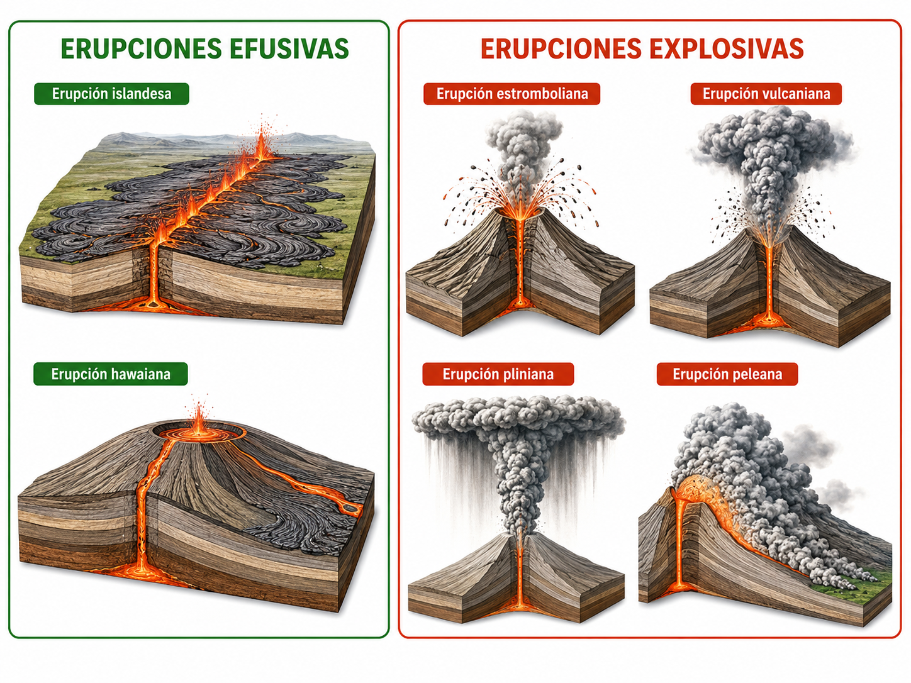{width="6.3in"}
:::

## 7.5. Relación con la tectónica de placas

El vulcanismo se concentra en tres contextos principales. En las dorsales oceánicas, el ascenso del manto por descompresión genera magma basáltico y crea nueva corteza oceánica. En las zonas de subducción, la placa que desciende libera agua y favorece la formación de magmas, muchas veces andesíticos. En los puntos calientes, columnas térmicas del manto originan volcanes en el medio de las placas, como ocurre en Hawái.

# 8. Riesgos geológicos asociados

Los procesos internos son naturales, pero se convierten en riesgos cuando afectan a personas, bienes o actividades humanas. El riesgo geológico no depende solo de la peligrosidad del fenómeno, sino también de la exposición y la vulnerabilidad.

## 8.1. Riesgo sísmico

El riesgo sísmico aparece en zonas donde pueden producirse terremotos capaces de causar daños. Para reducirlo es fundamental conocer la peligrosidad sísmica, aplicar normas de construcción sismorresistente, revisar edificios vulnerables, planificar emergencias y educar a la población.

La predicción exacta de un terremoto, indicando día, hora y lugar, no es posible actualmente. Sin embargo, sí puede evaluarse la probabilidad de que una zona sufra terremotos en un periodo determinado. Esta información permite elaborar mapas de peligrosidad y mejorar la planificación territorial.

8.2 Riesgo volcánico

El riesgo volcánico depende del tipo de volcán, el estilo eruptivo, la frecuencia de actividad y la ocupación humana del territorio. Los peligros volcánicos incluyen coladas de lava, caída de cenizas, gases, flujos piroclásticos, lahares, deformaciones del terreno y sismicidad asociada.

La vigilancia volcánica combina varias técnicas: registro de terremotos, medición de deformaciones, análisis de gases, observación térmica, imágenes de satélite y seguimiento visual. Aunque una erupción no siempre puede predecirse con precisión absoluta, la monitorización permite detectar señales de reactivación y tomar decisiones preventivas.

## 8.3. Tsunamis

Un tsunami es una serie de olas de gran longitud de onda generadas normalmente por un desplazamiento brusco del fondo marino. La causa más frecuente son terremotos submarinos asociados a fallas inversas en zonas de subducción, aunque también pueden originarse por deslizamientos submarinos o erupciones volcánicas.

::: {style="text-align:center;"}
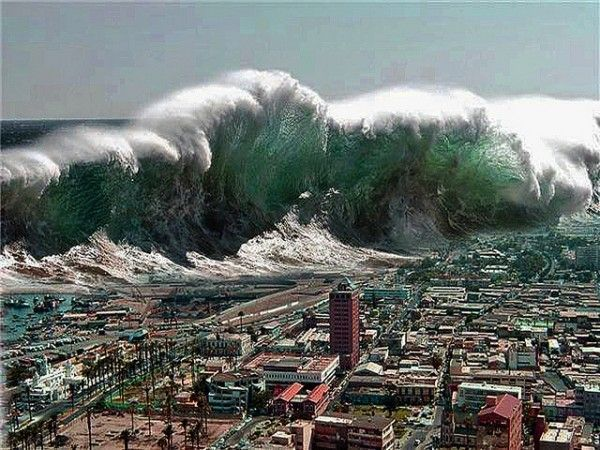{width="5.3in"}
:::

Los tsunamis son especialmente peligrosos porque pueden viajar a gran velocidad por el océano y afectar a costas muy alejadas del punto de origen. La prevención requiere sistemas de alerta temprana, educación ciudadana y planificación de las zonas costeras.

## 8.4. Movimientos de ladera

Los terremotos y las erupciones volcánicas pueden desencadenar movimientos de ladera. Una sacudida sísmica puede desestabilizar taludes y provocar desprendimientos, deslizamientos o avalanchas rocosas. La acumulación de cenizas volcánicas en pendientes también puede favorecer la formación de lahares cuando se mezcla con agua.

Estos procesos son especialmente peligrosos en zonas montañosas, carreteras, valles estrechos y áreas urbanizadas sobre laderas inestables.

::: {style="text-align:center;"}
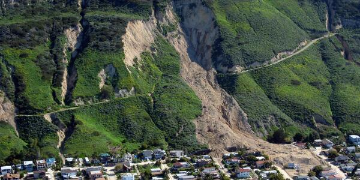{width="6.1in"}
:::

## 8.5. Prevención y monitorización

La prevención se basa en conocer el territorio. Los mapas geológicos, sísmicos, volcánicos y geomorfológicos permiten identificar zonas peligrosas. La monitorización permite seguir la evolución de procesos activos. La ordenación territorial evita ubicar viviendas, hospitales, colegios o infraestructuras críticas en áreas de alto riesgo.

La gestión del riesgo requiere combinar ciencia, planificación y educación. Un fenómeno natural no siempre puede evitarse, pero sus consecuencias pueden reducirse mucho con preparación adecuada.

# 9. Aplicaciones del estudio de la dinámica interna

El estudio de la dinámica interna del planeta tiene numerosas aplicaciones prácticas.

En la prospección de recursos minerales, permite comprender dónde se forman yacimientos. Muchos minerales metálicos se concentran en ambientes relacionados con magmatismo, hidrotermalismo, subducción o deformación tectónica. Conocer estos procesos ayuda a localizar recursos de forma más eficiente y responsable.

En la explotación de energía geotérmica, el conocimiento del calor interno y de la circulación de fluidos permite aprovechar el subsuelo para producir electricidad, calefacción o climatización. Las zonas con alto gradiente geotérmico, actividad volcánica o aguas termales son especialmente interesantes.

En la Ingeniería geológica, el estudio de fallas, fracturas, tipos de roca y estabilidad del terreno es esencial para construir túneles, presas, carreteras, edificios y otras infraestructuras. Ignorar la dinámica geológica puede aumentar el riesgo de daños, sobrecostes o accidentes.

En la ordenación del territorio, la Geología ayuda a decidir dónde construir y qué zonas deben protegerse. No todas las áreas son igual de adecuadas para urbanizar. Algunas presentan riesgo sísmico, volcánico, inundable, de subsidencia o de movimientos de ladera. Incorporar la información geológica a la planificación reduce pérdidas futuras.

Finalmente, el estudio de la dinámica interna es fundamental para la predicción y gestión de riesgos naturales. Aunque no siempre se pueda predecir exactamente cuándo ocurrirá un fenómeno, sí se pueden identificar zonas peligrosas, mejorar los sistemas de alerta, diseñar planes de emergencia y construir sociedades más preparadas.

En conjunto, la dinámica interna terrestre muestra que la Tierra es un planeta activo. Sus procesos han construido continentes, océanos y cordilleras, han generado recursos esenciales y también han producido riesgos naturales. Comprenderlos es imprescindible para interpretar el paisaje, aprovechar los recursos de forma responsable y convivir mejor con un planeta que sigue cambiando.