# 1. Introducción

La superficie terrestre no es una estructura fija. Aunque a escala humana las montañas, los valles, las costas o las llanuras parecen elementos estables, en realidad forman parte de un sistema dinámico que cambia continuamente. El relieve se modifica por la acción combinada de la energía interna de la Tierra, responsable de levantar cordilleras, formar volcanes o generar fallas, y de la energía externa, que desgasta, transporta y deposita materiales.

La geodinámica externa estudia precisamente los procesos que actúan sobre la superficie terrestre: meteorización, erosión, transporte y sedimentación. Estos procesos dependen de factores como el clima, la gravedad, el tipo de roca, la vegetación y la actividad humana. Por ejemplo, una misma montaña puede evolucionar de forma diferente si se encuentra en un clima húmedo, árido o glaciar.

También es importante distinguir entre proceso geológico natural y riesgo natural. Un proceso geológico natural es cualquier fenómeno que forma parte del funcionamiento normal del planeta, como la crecida de un río, el retroceso de un acantilado o un deslizamiento de ladera. Hablamos de riesgo natural cuando ese proceso puede causar daños a personas, viviendas, infraestructuras o actividades económicas. Por tanto, el riesgo depende tanto del fenómeno natural como de la presencia humana en zonas vulnerables.

::: {style="text-align:center;"}
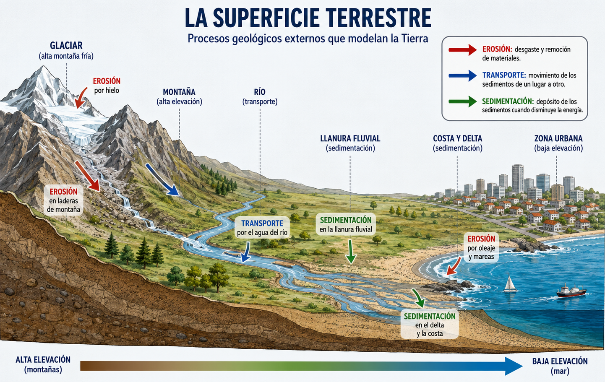{width="5.4in"}
:::

# 2. Factores que controlan el modelado del relieve

El modelado del relieve es el resultado de la interacción entre varios factores. Ninguno actúa de forma aislada; el paisaje final depende de cómo se combinan entre sí.

## 2.1. Energía externa: radiación solar y gravedad

La radiación solar es el motor principal de muchos procesos externos. Calienta de forma desigual la superficie terrestre, genera diferencias de temperatura, mueve la atmósfera, favorece la evaporación del agua y participa en el ciclo hidrológico. Gracias a esta energía se producen lluvias, vientos, cambios térmicos y circulación de agua.

La gravedad actúa desplazando materiales desde las zonas elevadas hacia las más bajas. Hace que el agua fluya por los cauces, que los sedimentos sean transportados pendiente abajo y que se produzcan movimientos de ladera, como desprendimientos o deslizamientos.

## 2.2. Papel del clima

El clima condiciona la intensidad y el tipo de procesos externos. En zonas húmedas, el agua corriente y la meteorización química suelen ser muy importantes. En zonas áridas, predominan la escorrentía esporádica, la erosión intensa durante lluvias torrenciales y la acción del viento. En zonas frías, el hielo y los ciclos de congelación y deshielo tienen un papel fundamental.

Por eso, el relieve de un desierto, de una selva tropical o de una región glaciar presenta formas muy distintas.

## 2.3. Agentes geológicos externos

Los agentes geológicos externos son los elementos capaces de modificar el relieve. Los principales son el agua, el hielo, el viento, el mar, la gravedad y los seres vivos. Cada agente erosiona, transporta y deposita materiales de una manera diferente, generando formas características.

Por ejemplo, los ríos excavan valles, los glaciares forman valles en U, el viento crea dunas y el mar modela acantilados, playas y plataformas de abrasión.

::: {style="text-align:center;"}
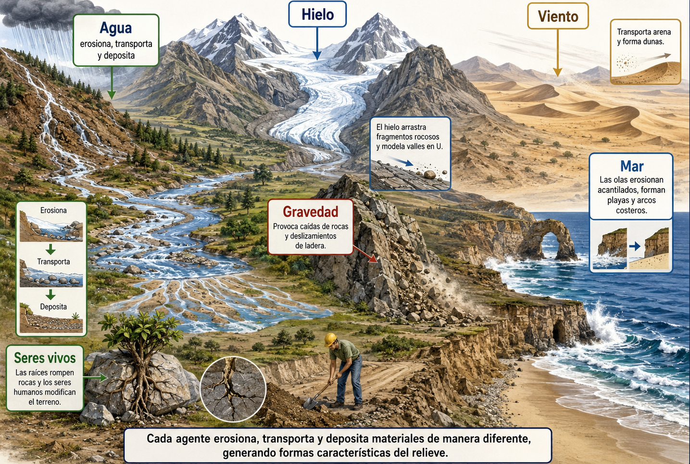{width="5.7in"}
:::

## 2.4. Litología: tipo de roca predominante

La litología es el tipo de roca que forma un terreno. No todas las rocas resisten igual la erosión. El granito suele formar relieves redondeados y bloques; la caliza puede disolverse y originar paisajes kársticos; las arcillas se erosionan con facilidad y pueden formar cárcavas o *badlands*.

Por tanto, el relieve depende mucho de la resistencia, composición y permeabilidad de las rocas.

::: {style="text-align:center;"}
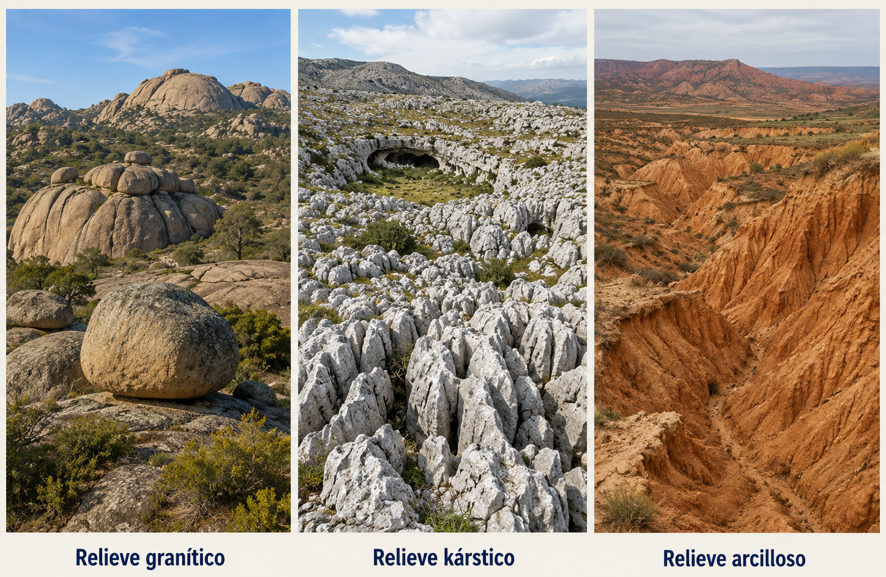{width="4.8in"}
:::

## 2.5. Estructura geológica

La disposición de las rocas también influye en el relieve. Los estratos horizontales, inclinados o plegados condicionan la forma de las montañas y valles. Las fallas y fracturas pueden facilitar la erosión y orientar los cauces de los ríos.

Un mismo tipo de roca puede originar relieves diferentes si aparece en capas horizontales, inclinadas o muy fracturadas.

::: {style="text-align:center;"}
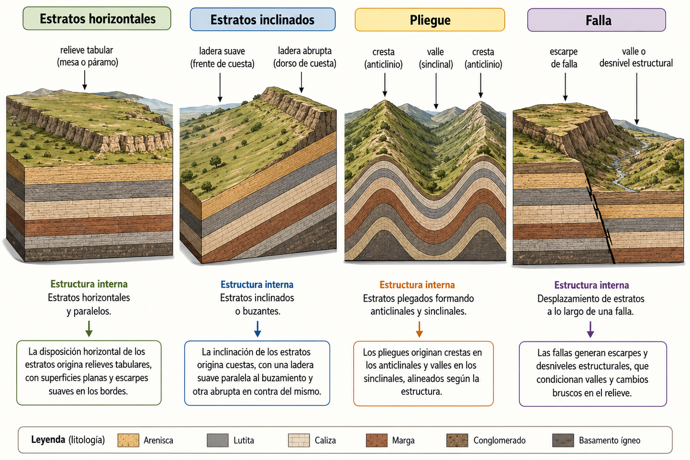{width="6.6in"}
:::

## 2.6. Tiempo geológico

El relieve necesita tiempo para evolucionar. Algunos procesos, como un desprendimiento o una avenida torrencial, pueden modificar el paisaje en minutos u horas. Otros, como la formación de un valle amplio o el retroceso de una cordillera, necesitan miles o millones de años.

El paisaje actual es el resultado acumulado de muchos procesos actuando durante largos periodos.

## 2.7. Vegetación y actividad humana

La vegetación protege el suelo, reduce la erosión y favorece la infiltración del agua. Las raíces sujetan los materiales y disminuyen la escorrentía superficial. Cuando se elimina la cubierta vegetal, el suelo queda más expuesto a la erosión.

La actividad humana también modifica el relieve: construcción de carreteras, urbanización, presas, minería, agricultura intensiva, deforestación o canalización de ríos. Estas acciones pueden acelerar procesos naturales y aumentar el riesgo.

# 3. Procesos geológicos externos

Los procesos geológicos externos actúan sobre las rocas y los sedimentos de la superficie terrestre. Aunque se estudian por separado, en la naturaleza funcionan de forma encadenada.

::: {style="text-align:center;"}
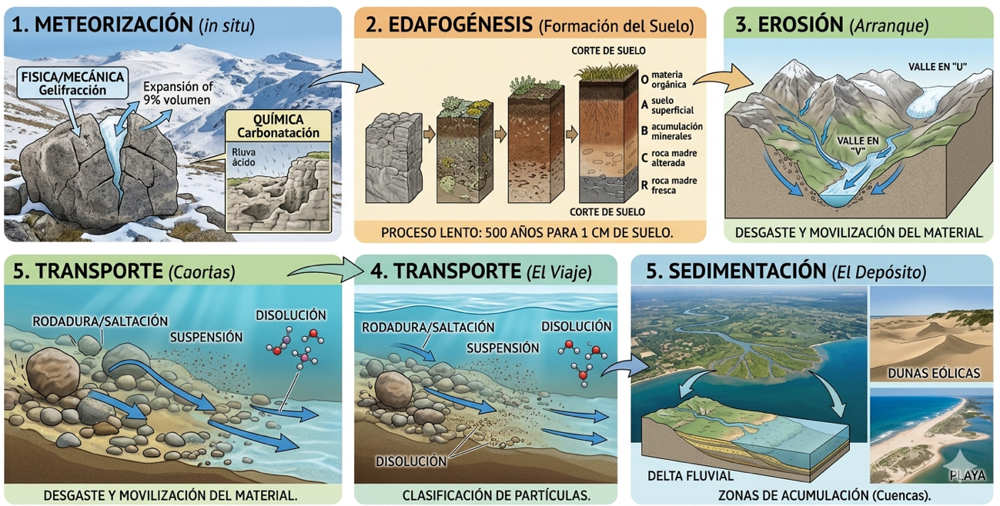{width="6.2in"}
:::

## 3.1. Meteorización

Es el primer paso. Consiste en la fragmentación o alteración química de las rocas in situ (en el mismo lugar), debido a la acción de la atmósfera, el agua o los seres vivos. No hay movimiento de materiales. Existen tres tipos principales:

*Meteorización física (o mecánica):*

Rompe la roca en pedazos más pequeños sin cambiar su composición. Un ejemplo claro de este proceso es la gelifracción. El agua se infiltra en las grietas de la roca, se congela por la noche, aumenta su volumen un 9% (actúa como una cuña) y termina rompiendo la roca.

*Meteorización química:*

Cambia la composición química de los minerales de la roca, debilitándola. Un ejemplo clave de este proceso es la carbonatación (el agua de lluvia con CO~2~ disuelto se vuelve ácida y disuelve rocas como la caliza, creando cuevas y paisajes kársticos).

*Meteorización biológica:*

La meteorización biológica se debe a la acción de los seres vivos. Las raíces pueden abrir grietas, los líquenes alteran minerales y algunos animales remueven el suelo.

::: {style="text-align:center;"}
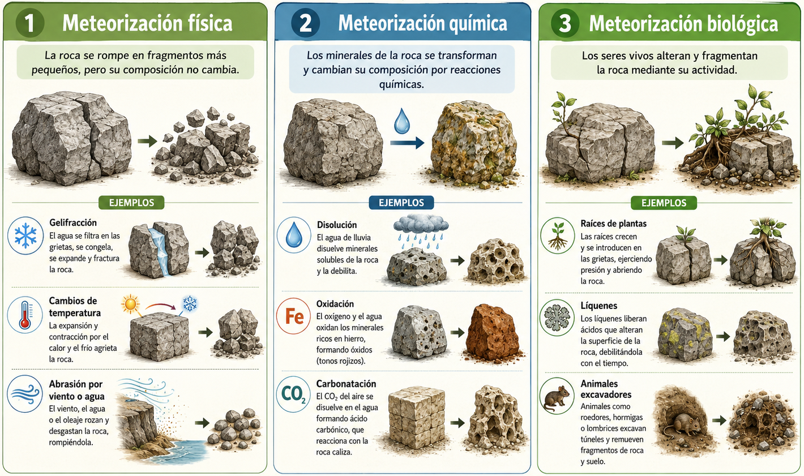{width="6.8in"}
:::

## 3.2. Edafogénesis: el nacimiento del suelo

La edafogénesis es el proceso por el cual la roca madre se transforma en suelo fértil. Es un proceso lentísimo (¡pueden hacer falta 500 años para crear un solo centímetro de suelo!).

***¿Cómo ocurre?*** Las rocas rotas por la meteorización (sección 3.1) empiezan a ser colonizadas por líquenes, musgos y bacterias. Al morir, estos seres vivos aportan materia orgánica (humus). El agua de lluvia va filtrando los nutrientes, organizando el suelo en capas horizontales llamadas horizontes.

***Efecto en el relieve:*** El suelo actúa como una \"piel\" protectora. Un relieve con un suelo sano y cubierto de vegetación apenas sufre erosión. Si el suelo se pierde, la roca queda desprotegida.

::: {style="text-align:center;"}
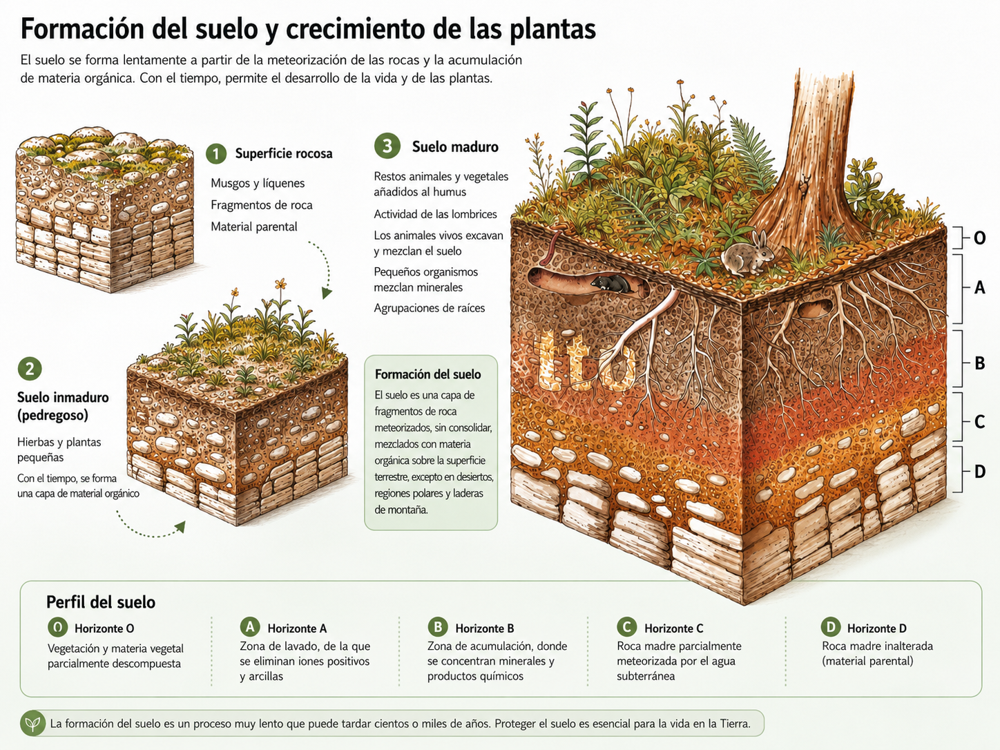{width="6.2in"}
:::

## 3.3. Erosión: el arranque del material

A diferencia de la meteorización, la erosión implica desgaste y movilización. Es la fase en la que el agua, el viento o el hielo desprenden y retiran los fragmentos de roca que ya estaban debilitados.

En el relieve, la erosión crea las formas más espectaculares del paisaje. El agua de los ríos excava valles en forma de \"V\", los glaciares esculpen valles en forma de \"U\", y el viento cargado de arena lija la base de las rocas creando \"rocas en seta\".

::: {style="text-align:center;"}
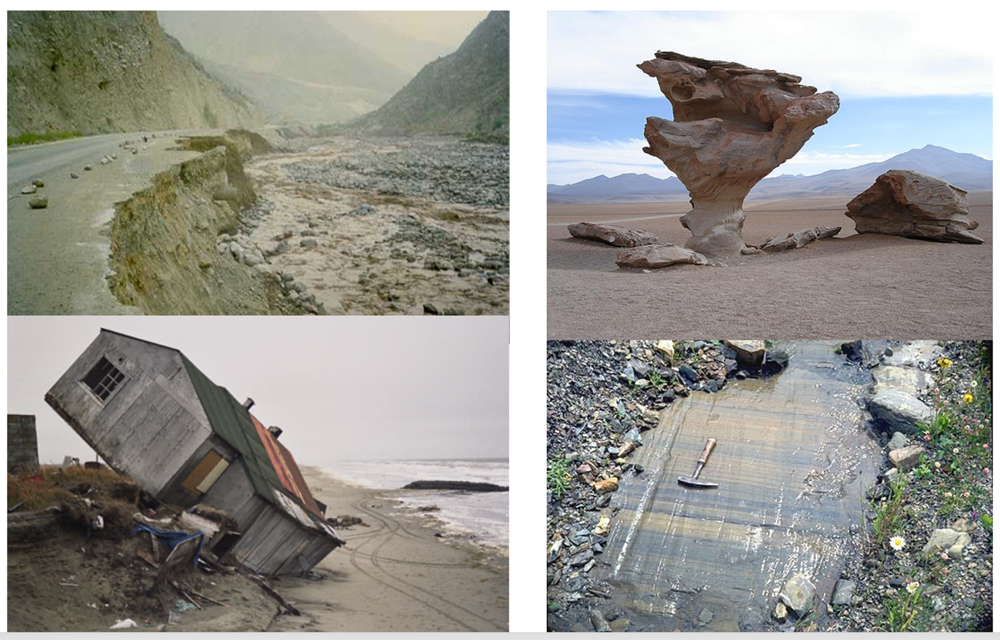{width="5.5in"}
:::

## 3.4. Transporte: el viaje de los sedimentos

Es el traslado de los materiales erosionados desde las zonas altas (donde se erosionan) hacia las zonas bajas. Durante el viaje, los fragmentos de roca chocan entre sí, se desgastan y se vuelven redondos (así nacen los cantos rodados).

El transporte se puede realizar de varias formas según la energía del agua o el viento:

- ***Rodadura o saltación:*** para los fragmentos más pesados que van por el fondo de los ríos.

- ***Suspensión:*** para las partículas finas (como la arcilla o el polvo) que flotan en el agua o el aire.

- ***Disolución:*** para las sales que van disueltas en el agua (no se ven a simple vista).

# 5. Sedimentación: la acumulación y creación de nuevo relieve

  Cuando el agente de transporte (el río, el viento, el glaciar) pierde fuerza y velocidad, ya no puede cargar con los materiales y los deja caer. A estos materiales depositados los llamamos sedimentos.

  **¿Dónde ocurre?** En las cuencas sedimentarias (zonas bajas como lagos, valles fluviales o fondos marinos).

  **Efectos sobre el relieve:** Es un proceso constructivo. Da lugar a formas del relieve como las dunas en los desiertos, las playas en la costa, los deltas en las desembocaduras de los ríos o las llanuras aluviales. Con el tiempo y la presión, estos sedimentos se compactarán y formarán nuevas rocas sedimentarias.

::: {style="text-align:center;"}
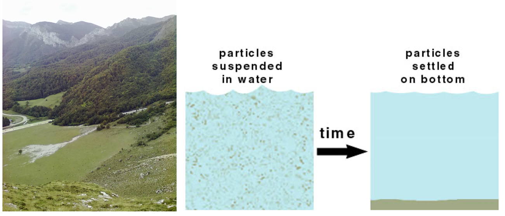{width="5.9in"}
:::

# 4. Agentes geológicos y formas de modelado asociadas

## 4.1. Aguas salvajes y escorrentía superficial

Las aguas salvajes son aguas de lluvia que circulan por la superficie sin cauce definido. Son muy eficaces en zonas con poca vegetación, suelos impermeables o lluvias intensas.

Pueden generar surcos, regueros, cárcavas y barrancos. En zonas arcillosas o margosas, la erosión puede ser muy intensa y originar paisajes de *badlands*.

::: {style="text-align:center;"}
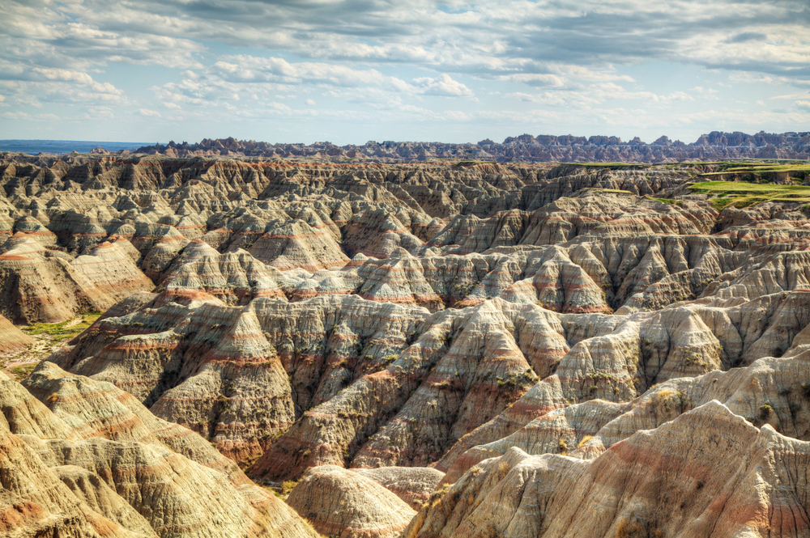{width="5.3in"}
:::

## 4.2. Ríos y modelado fluvial

Los ríos son uno de los agentes más importantes del modelado terrestre. En su curso alto predominan la erosión vertical y la formación de valles estrechos en V. En el curso medio aumenta el transporte y aparecen meandros. En el curso bajo domina la sedimentación, con llanuras de inundación, deltas y estuarios.

Los ríos también pueden formar terrazas fluviales, cañones y gargantas cuando excavan profundamente el terreno.

::: {style="text-align:center;"}
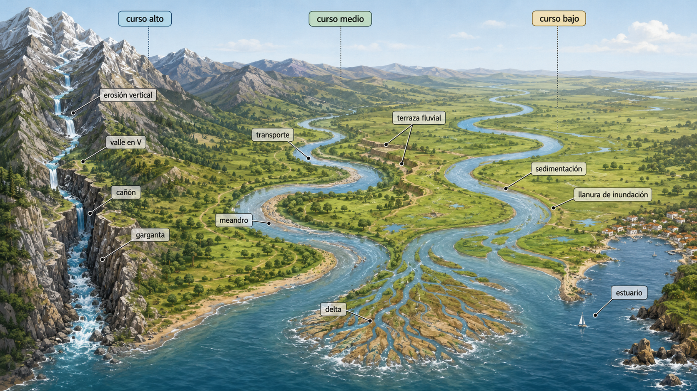{width="6.5in"}
:::

## 4.3. Aguas subterráneas y modelado kárstico

Las aguas subterráneas actúan especialmente sobre rocas solubles, como calizas, dolomías o yesos. El agua ligeramente ácida disuelve estas rocas y forma relieves kársticos.

Entre las formas superficiales destacan lapiaces, dolinas, poljés y cañones kársticos. En el interior se forman cuevas, galerías, simas, estalactitas y estalagmitas.

::: {style="text-align:center;"}
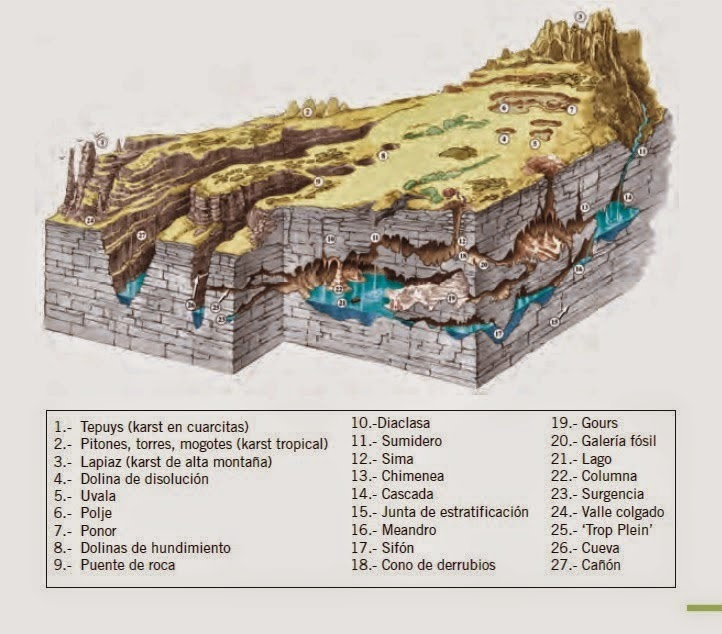{width="6.4in"}
:::

## 4.4. Glaciares y modelado glaciar

Los glaciares son masas de hielo que se desplazan lentamente por gravedad. Aunque su movimiento es lento, tienen gran capacidad erosiva. Arrancan y pulen materiales, formando valles en U, circos glaciares, aristas, *horns* y rocas aborregadas.

También transportan sedimentos de tamaños muy variados, que se depositan formando morrenas.

::: {style="text-align:center;"}
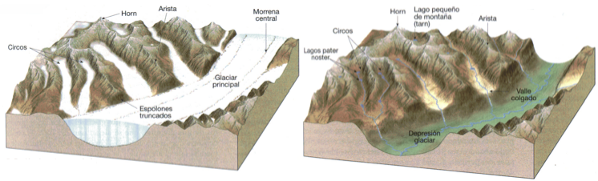{width="6.6in"}
:::

## 4.5. Viento y modelado eólico

El viento actúa sobre todo en zonas áridas, semiáridas y costeras, donde hay poca vegetación y abundan materiales sueltos. Puede erosionar por deflación, retirando partículas finas, y por abrasión, golpeando las rocas con granos de arena. Las formas más características son dunas, mantos de arena, *yardangs* y depósitos de loess.

::: {style="text-align:center;"}
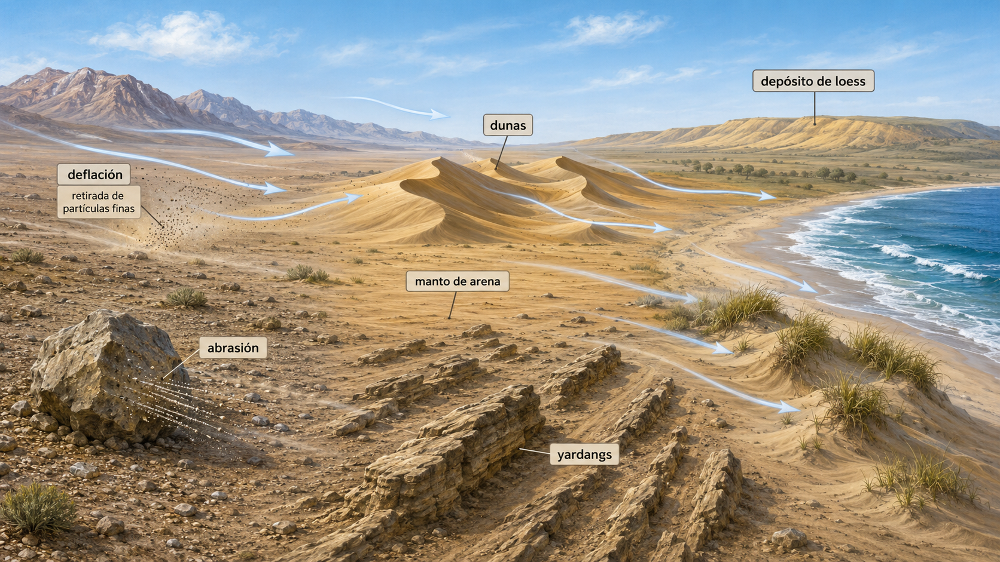{width="5.5in"}
:::

## 4.6. Mar y modelado litoral

El mar modela las costas mediante el oleaje, las mareas y las corrientes litorales. En zonas rocosas, la erosión marina forma acantilados, cuevas, arcos, farallones y plataformas de abrasión. En zonas de acumulación se forman playas, flechas litorales, tómbolos, barras y albuferas.

El litoral es un medio muy dinámico y sensible a la intervención humana.

::: {style="text-align:center;"}
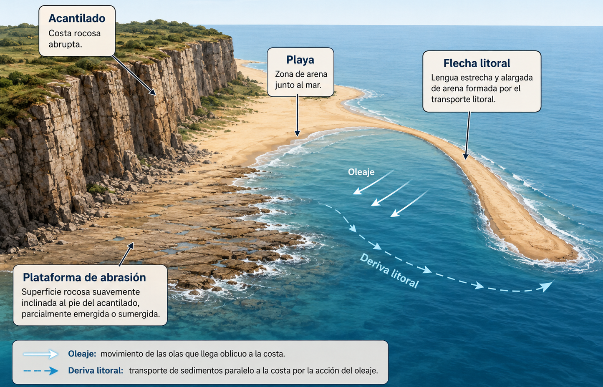{width="5.5in"}
:::

## 4.7. Gravedad y movimientos de ladera

La gravedad actúa de forma constante sobre las laderas. Cuando los materiales pierden estabilidad, pueden producirse desprendimientos, deslizamientos, reptación, coladas de barro o flujos de derrubios.

Estos procesos dependen de la pendiente, el tipo de material, la presencia de agua, la vegetación y las alteraciones humanas, como excavaciones o construcción de carreteras.

::: {style="text-align:center;"}
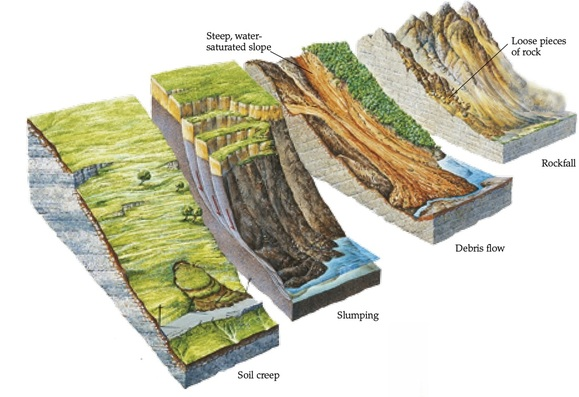{width="5.6in"}
:::

## 4.8. Seres vivos y acción humana

Los seres vivos también modifican el relieve. Las raíces fracturan rocas, los organismos del suelo remueven materiales y los arrecifes coralinos construyen grandes estructuras carbonatadas.

La acción humana es actualmente uno de los agentes más importantes de transformación del relieve. Las ciudades, carreteras, embalses, canteras, cultivos y movimientos de tierra alteran la dinámica natural de los sistemas superficiales.

# 5. Relación entre clima y formas de relieve

## 5.1. Relieves de climas áridos

En los climas áridos hay poca vegetación y lluvias escasas, aunque a veces muy intensas. Esto favorece una erosión rápida durante episodios torrenciales. Son frecuentes las ramblas, abanicos aluviales, pedimentos, cárcavas, desiertos pedregosos y dunas.

El contraste térmico entre el día y la noche también puede favorecer la meteorización física.

::: {style="text-align:center;"}
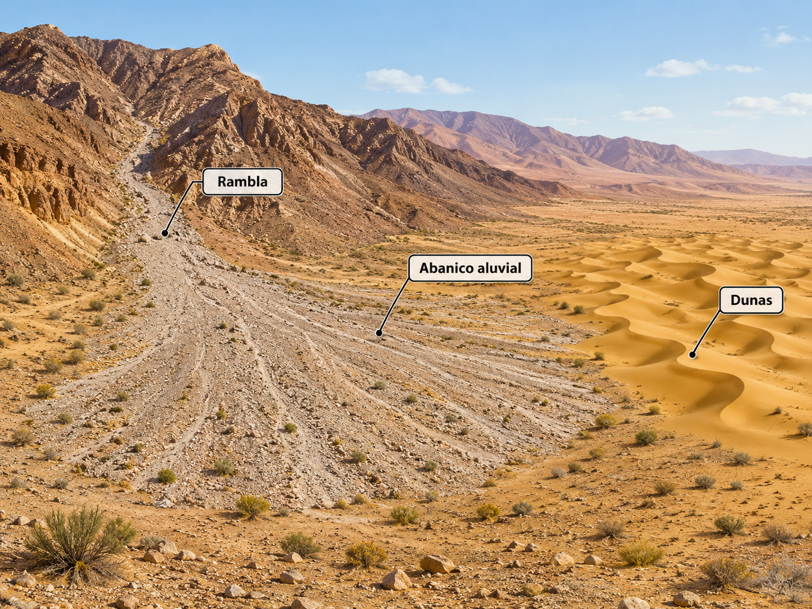{width="4.9in"}
:::

## 5.2. Relieves de climas húmedos

En climas húmedos, el agua corriente y la meteorización química son muy activas. Los ríos suelen tener caudales más regulares y pueden desarrollar redes de drenaje densas. La vegetación protege el suelo, aunque en zonas de fuertes pendientes puede haber deslizamientos si el terreno se satura de agua.

Son frecuentes valles fluviales, suelos profundos y relieves suavizados por la alteración química.

::: {style="text-align:center;"}
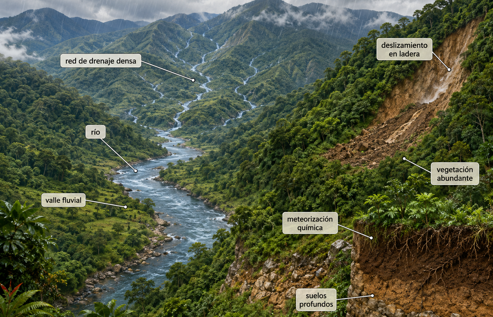{width="6.0in"}
:::

## 5.3. Relieves de climas fríos y glaciares

En climas fríos, el hielo tiene un papel fundamental. La congelación y descongelación del agua fractura las rocas, y los glaciares erosionan intensamente el relieve. Aparecen circos, valles en U, morrenas, lagos glaciares y crestas afiladas.

En zonas periglaciares, donde no hay glaciares permanentes, también son importantes los procesos de hielo-deshielo y los suelos congelados.

::: {style="text-align:center;"}
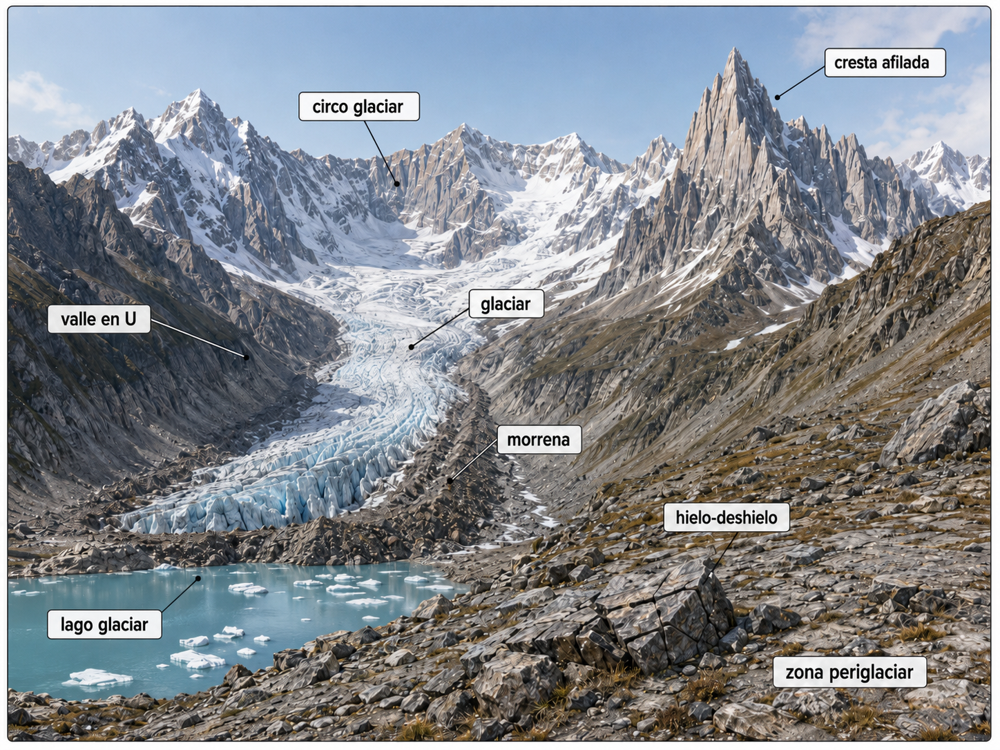{width="5.9in"}
:::

## 5.4. Relieves tropicales

En climas tropicales cálidos y húmedos predomina la meteorización química intensa. Las rocas se alteran profundamente y pueden formarse suelos muy desarrollados. En regiones calizas, el karst tropical puede originar torres, mogotes y depresiones cerradas.

La abundancia de agua y temperatura elevada acelera las reacciones químicas.

::: {style="text-align:center;"}
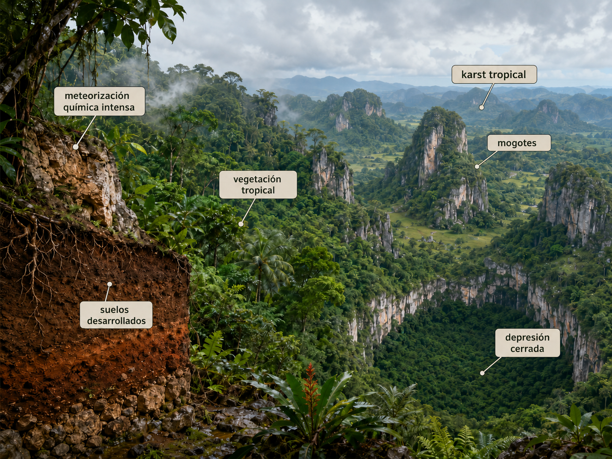{width="5.7in"}
:::

# 6. Riesgos naturales asociados a los procesos geológicos externos

## 6.1. Inundaciones

Las inundaciones se producen cuando el agua ocupa zonas que normalmente están secas. Pueden deberse a lluvias intensas, desbordamiento de ríos, escorrentía rápida o subida del nivel del mar en zonas costeras.

Son especialmente peligrosas en llanuras de inundación urbanizadas, donde el río recupera temporalmente un espacio que forma parte de su dinámica natural.

## 6.2. Avenidas torrenciales

Las avenidas torrenciales son crecidas rápidas y violentas, típicas de ramblas, barrancos y cuencas pequeñas con fuertes pendientes. Se producen cuando lluvias intensas generan una escorrentía repentina, capaz de transportar agua, barro, rocas y restos vegetales.

Son riesgosas porque pueden desarrollarse en poco tiempo y afectar a zonas aparentemente secas.

## 6.3. Movimientos de ladera

Los movimientos de ladera incluyen deslizamientos, desprendimientos, flujos de barro y caídas de bloques. Se producen cuando la gravedad supera la resistencia de los materiales.

El agua suele ser un factor desencadenante importante, porque aumenta el peso del terreno y reduce la cohesión. También pueden influir terremotos, excavaciones, carreteras o pérdida de vegetación.

::: {style="text-align:center;"}
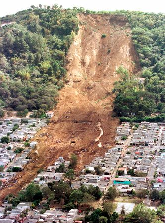{width="3.5in"}
:::
  
## 6.4. Erosión y desertificación

La erosión del suelo supone la pérdida de la capa fértil que sostiene la vegetación y la agricultura. Cuando esta pérdida se combina con sequía, sobrepastoreo, deforestación o uso intensivo del territorio, puede favorecer procesos de desertificación.

La desertificación no significa necesariamente que aparezca un desierto de arena, sino una degradación progresiva del suelo y de su capacidad productiva.

## 6.5. Subsidencia y colapsos kársticos

La subsidencia es el hundimiento progresivo del terreno. Puede deberse a compactación de sedimentos, extracción de agua subterránea o disolución de materiales como yesos y calizas.

En zonas kársticas pueden producirse colapsos cuando el techo de una cavidad subterránea se hunde, formando dolinas de colapso.

::: {style="text-align:center;"}
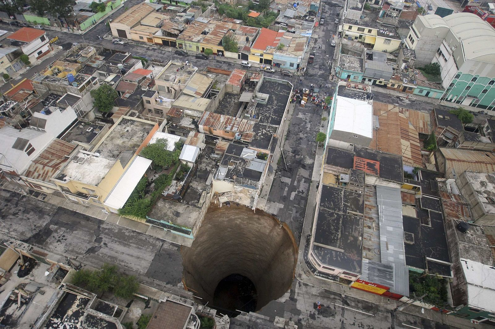{width="5.5710914260717415in" height="3.715220909886264in"}
:::

## 6.6. Riesgos litorales

Las costas están sometidas a temporales, oleaje, erosión costera, retroceso de acantilados y cambios en playas. Cuando se construye demasiado cerca del mar, estos procesos naturales se convierten en riesgos para viviendas, paseos marítimos, carreteras e infraestructuras turísticas.

La pérdida de dunas y vegetación costera reduce la protección natural frente a temporales.

## 6.7. Riesgos asociados a nieve, hielo y aludes

En zonas de montaña, la nieve y el hielo pueden generar riesgos específicos. Los aludes se producen cuando una masa de nieve se desplaza ladera abajo. También pueden darse caídas de hielo, deshielos rápidos y crecidas asociadas a fusión de nieve.

La pendiente, la acumulación de nieve, la temperatura y el viento influyen en la estabilidad del manto nivoso.

# 7. Relación entre riesgos naturales y actividades humanas

Los procesos naturales existen con independencia de la sociedad, pero el riesgo aumenta cuando las personas ocupan zonas peligrosas o modifican el medio ambiente sin tener en cuenta su dinámica.

## 7.1. Ocupación de llanuras de inundación

Las llanuras de inundación son espacios naturales del río. Aunque durante años puedan permanecer secas, forman parte del sistema fluvial. Construir viviendas, polígonos o carreteras en estas zonas aumenta la exposición a inundaciones.

## 7.2. Urbanización en laderas inestables

Las laderas con fuertes pendientes, materiales arcillosos o fracturados pueden ser inestables. Si se excavan taludes, se elimina vegetación o se añade peso con edificaciones, aumenta la probabilidad de deslizamientos o desprendimientos.

::: {style="text-align:center;"}
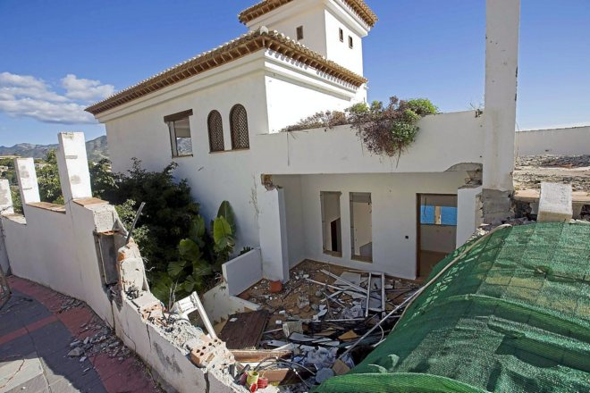{width="5.8in"}
:::

## 7.3. Construcción en zonas costeras vulnerables

La urbanización cercana a playas, dunas y acantilados incrementa los daños durante temporales. Además, algunas obras costeras alteran el transporte natural de sedimentos y pueden provocar erosión en otros puntos del litoral.

## 7.4. Deforestación, incendios y pérdida de suelo

La pérdida de vegetación deja el suelo expuesto al impacto directo de la lluvia. Después de incendios forestales, la escorrentía puede aumentar y arrastrar cenizas, suelo y sedimentos hacia barrancos y ríos.

## 7.5. Agricultura intensiva y sobreexplotación de acuíferos

La agricultura intensiva puede favorecer la erosión si elimina la cubierta vegetal o agota el suelo. La extracción excesiva de agua subterránea puede causar descenso del nivel freático, subsidencia o salinización en zonas costeras.

::: {style="text-align:center;"}
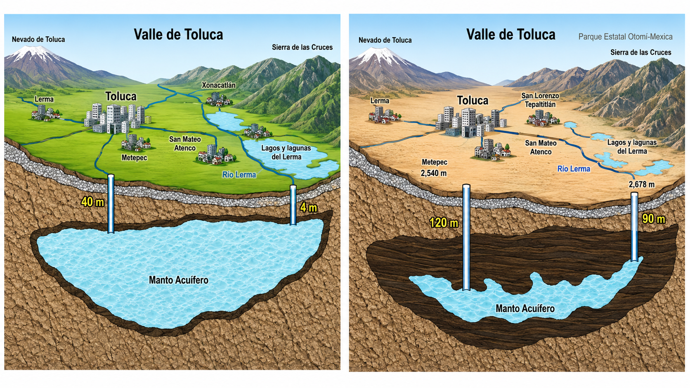{width="6.3in"}
:::

## 7.6. Obras públicas y modificación de cauces

Carreteras, presas, canalizaciones y movimientos de tierra modifican la circulación natural del agua y los sedimentos. Una presa retiene sedimentos que antes llegaban a la costa, lo que puede contribuir a la erosión litoral. Una carretera mal diseñada puede cortar drenajes naturales y concentrar la escorrentía en puntos peligrosos.

## 7.7. Cambio climático y vulnerabilidad

El cambio climático puede alterar la frecuencia e intensidad de algunos fenómenos extremos, como sequías, lluvias intensas, olas de calor o temporales costeros. Sus efectos dependen también de la vulnerabilidad del territorio: una misma lluvia causa menos daños en una cuenca bien gestionada que en una zona urbanizada sin planificación.

# 8. Ordenación territorial y prevención de riesgos

La ordenación territorial consiste en planificar el uso del territorio teniendo en cuenta sus características naturales, sus recursos y sus riesgos. Su objetivo es decidir dónde conviene construir, cultivar, proteger, restaurar o limitar determinados usos.

## 8.1. Mapas de peligrosidad, exposición y riesgo

Los mapas de peligrosidad muestran dónde puede ocurrir un fenómeno natural, como una inundación o un deslizamiento. Los mapas de exposición indican qué personas, edificios o infraestructuras se encuentran en esas zonas. El riesgo aparece al combinar peligrosidad, exposición y vulnerabilidad.

Una zona puede tener alta peligrosidad, pero bajo riesgo si no está ocupada. En cambio, una zona de peligrosidad moderada puede tener alto riesgo si está densamente urbanizada.

::: {style="text-align:center;"}
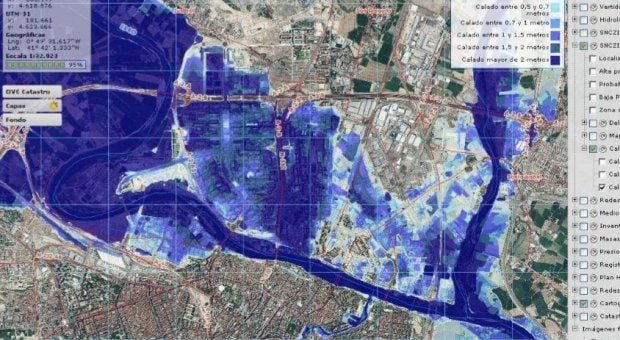{width="6.5in"}
:::

## 8.2. Zonificación del territorio

La zonificación divide el territorio en áreas según su aptitud y nivel de riesgo. Algunas zonas pueden ser adecuadas para urbanizar, otras para agricultura, otras para protección ambiental y otras deben mantenerse libres por su peligrosidad.

Esta herramienta es esencial en llanuras de inundación, costas, laderas inestables y áreas kársticas.

## 8.3. Medidas estructurales y no estructurales

Las medidas estructurales son obras físicas destinadas a reducir el peligro, como diques, muros de contención, drenajes, presas de laminación o estabilización de taludes.

Las medidas no estructurales se basan en planificación, normativa, educación, sistemas de alerta, seguros, evacuación y limitación de usos del suelo. A largo plazo, estas suelen ser más sostenibles, porque reducen la exposición al riesgo.

::: {style="text-align:center;"}
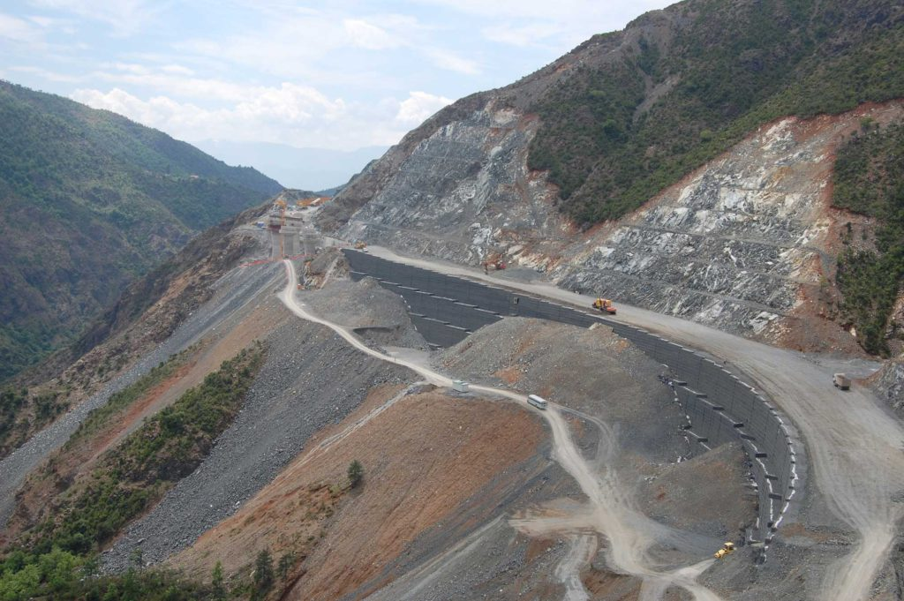{width="5.7in"}
:::

## 8.4. Restauración ambiental

Restaurar riberas, dunas, humedales, laderas degradadas o cubiertas vegetales ayuda a recuperar funciones naturales del territorio. Una ribera bien conservada puede reducir la velocidad del agua durante una crecida. Una duna protege la costa frente a temporales. Una ladera con vegetación estable pierde menos suelo.

## 8.5. Gestión y planificación

La prevención de inundaciones y erosión debe abordarse a escala de cuenca. Lo que ocurre en la cabecera de un río afecta a los tramos medios y bajos. La deforestación, urbanización o construcción de presas modifica la cantidad de agua y sedimentos que circulan por todo el sistema.

La planificación urbanística debe incorporar estudios geológicos, hidrológicos y geomorfológicos. Antes de construir conviene conocer si el terreno es inundable, inestable, erosionable, kárstico o vulnerable a temporales.

Planificar bien evita daños futuros y reduce costes económicos y humanos.

La prevención también depende de la educación. Conocer cómo funciona un río, una rambla, una ladera o una costa ayuda a tomar mejores decisiones. Una sociedad informada entiende que muchos desastres no se deben solo al fenómeno natural, sino a una ocupación inadecuada del territorio.