**1. INTRODUCCIÓN**

Desde tiempos remotos las formas y propiedades de los minerales, cristales y rocas han sido objeto de admiración, codicia, superstición y necesidad.

La civilización moderna depende extraordinariamente de los minerales. Su uso cotidiano está presente en diferentes campos de la actividad humana.

Todos los artículos inorgánicos comerciales o son minerales en sí mismos o son de origen mineral. Los minerales se usan por ejemplo en medicina, joyería, alimentación, cosmética y para fabricar diferentes productos, desde pinturas a herramientas, coches, edificios y ordenadores.

Además, los minerales y las rocas están presentes en el entorno físico en el que habitamos (por ejemplo, rocas de montañas, arenas de playa, suelos de parques y jardines) y su estudio contribuye al conocimiento de la formación de nuestro planeta y del universo.

::: {style="text-align:center;"}
{width="2in"}{width="3.8in"}{width="3in"}
:::

::: {style="text-align:center;"}
<figcaption class="figure-caption">
Objetos fabricados con materias primas derivadas de minerales

</figcaption>
:::

## 2. MINERALES Y CRISTALES

Un **mineral** es un *sólido homogéneo y natural*, normalmente de *origen inorgánico*, con una *composición química y una estructura interna definidas*, que puede dar lugar al desarrollo de superficies planas conocidas como *caras*. Los minerales pueden aparecer de forma aislada con desarrollo o no de caras, o formando agregados cristalinos como componentes fundamentales de las rocas.

La **Mineralogía** es la disciplina de la Geología que estudia el origen y las propiedades físicas y químicas de los minerales que se encuentran en el planeta.

::: {style="text-align:center;"}
{width="2.1in"}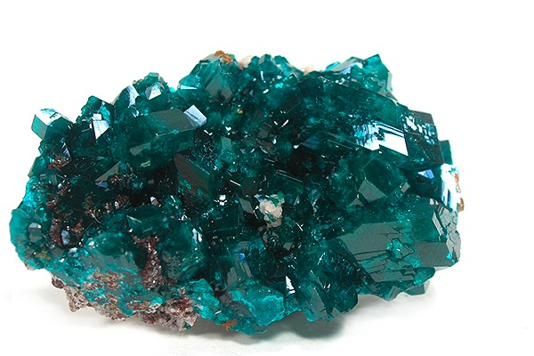{width="3.3in"}
:::
::: {style="text-align:center;"}
<figcaption class="figure-caption">
Ejemplo de minerales con desarrollo de caras cristalinas

</figcaption>
:::

Hoy en día hay descritos cerca de 2.000 minerales, pero sólo 200 son medianamente abundantes. Gran parte de la corteza terrestre, la capa más externa del planeta, está formada únicamente por una docena de minerales.

*Sólido homogéneo*: indica que un mineral consta de una única sustancia sólida. Están excluidas las sustancias en estado gaseoso o líquido. Por ejemplo, el hielo es un mineral, pero el agua en sí misma no lo es.

::: {style="text-align:center;"}
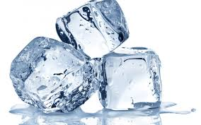{width="3.6in"}
:::

*Sólido natural*: los minerales se forman por procesos naturales. Las sustancias sintetizadas en laboratorio por el hombre no son estrictamente minerales.

*Origen inorgánico*: los minerales se forman normalmente mediante procesos que [NO]{.underline} involucran seres vivos. Los pocos minerales que pueden ser producidos por organismos \[por ejemplo la calcita de las conchas, CaCO~3~, o el apatito de los huesos, Ca~5~(PO~4~)~3~(OH,F)\] se definen *biominerales*.

::: {style="text-align:center;"}
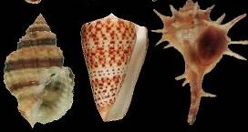{width="2.8in"}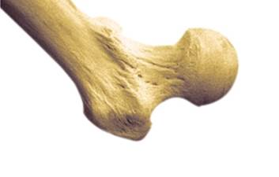{width="2.2in"}
:::

::: {style="text-align:center;"}
<figcaption class="figure-caption">
La calcita de las conchas y el apatito de los huesos son biominerales

</figcaption>
:::
*Composición química definida*: implica que la composición de los minerales puede expresarse mediante una fórmula química específica. La mayoría de los minerales tiene una composición definida pero no fija y presentan impurezas en diferentes proporciones.

*Estructura interna definida y periódica*: indica que en el interior de los minerales existe una ordenación de los átomos que sigue un modelo regular. Los minerales por lo tanto son **sólidos cristalinos** y la disciplina científica que estudia su estructura interna es la **Cristalografía**.

La periodicidad tridimensional de los átomos que forman un mineral le proporciona una *estructura interna organizada, fija, constante y única* para cada mineral, que puede dar lugar en el exterior a caras planas y raras veces a poliedros perfectos. Aunque no presenten caras cristalinas, todos los minerales tienen una estructura interna ordenada. Este orden interno fijo, periódico y constante de los átomos es característica de la **materia cristalina**.

Los materiales carentes de estructura interna ordenada, aunque externamente lo aparenten, están formados por materia amorfa. Por ejemplo, el **vidrio no es un mineral**, ya que su estructura no está geométricamente organizada según un patrón de repetición.

::: {style="text-align:center;"}
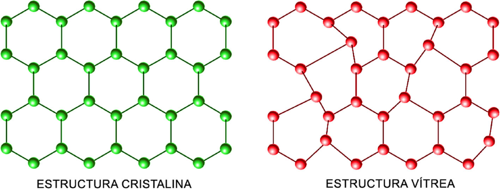{width="6.1in"}
:::

Un cristal es la manifestación externa de la materia cristalina con desarrollo de caras planas. Para que un mineral forme caras cristalinas necesita espacio, por lo que los minerales con caras cristalinas suelen aparecer en grietas o en cavidades vacías como las cuevas.

::: {style="text-align:center;"}
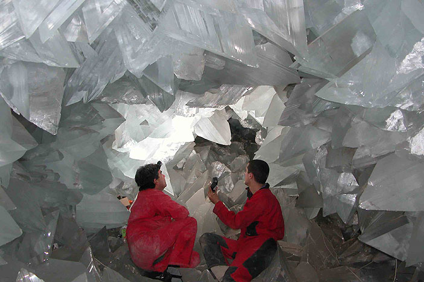{width="5.8in"}
:::

En un cristal, los átomos se organizan de forma simétrica en celdas elementales que se repiten indefinidamente formando una estructura ordenada en tres dimensiones. Esta organización reticular provoca que muchos cristales sean anisótropos, o sea que sus propiedades físicas varíen según la dirección dentro del cristal.

La distribución de los átomos dentro de las celdas elementales obedece a precisas reglas de simetría que definen **siete sistemas cristalográficos**: *cúbico, tetragonal, hexagonal, trigonal, ortorrómbico, monoclínico, y triclínico*.

::: {style="text-align:center;"}
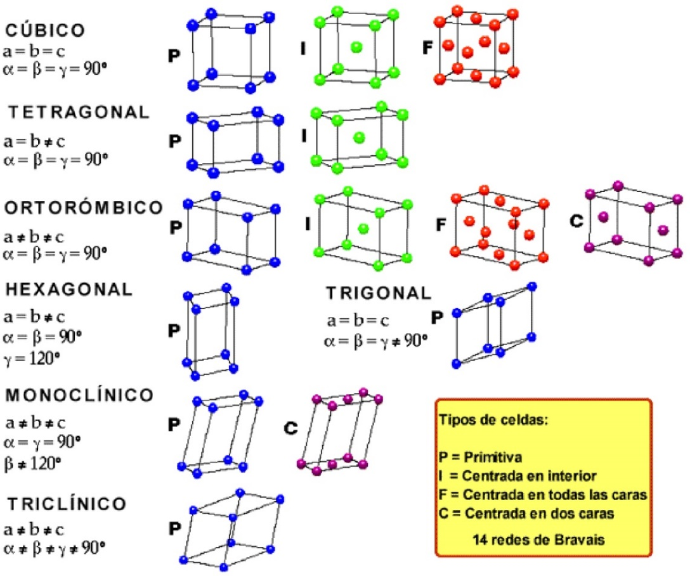{width="4.9in"}
:::

La materia cristalina no es exclusiva de los minerales. Por ejemplo, **las proteínas, las vitaminas, la cerámica, el nylon, los virus, los dientes son también materiales cristalinos**. Por lo tanto, la **Cristalografía** es una ciencia fundamental no solamente para la *[Geología]{.underline}* y las *[Ciencias Ambientales]{.underline}*, sino también para la *[Química]{.underline}*, la *[Biología]{.underline}*, la *[Medicina]{.underline}*, la *[Farmacología]{.underline}* y las *[Ciencias de los Materiales]{.underline}*. En España, desde más de una década se celebra un Concurso de Cristalización para alumnos de Educación secundaria y Bachillerato:

<https://www.youtube.com/watch?v=ZChqQPz3GmM>

## 3. NOMENCLATURA Y CLASIFICACIÓN DE LOS MINERALES

El nombre de los minerales deriva en general del nombre de un lugar (ej., andalucita), de una característica física (ej., albita = del latín *alba*, blanca), de su composición química (ej., cuprita, del latín *cuprum*, mineral de cobre), o de personajes más o menos conocidos (ej., goethita, de J.W. von Goethe, literato alemán). Desde el siglo XIX, la clasificación de los minerales se basa en criterios cristaloquímicos, es decir según qué elementos químicos están presentes y como se ordenan en la estructura interna de los cristales. Según estos criterios, los minerales se agrupan en diferentes [CLASES]{.underline} caracterizadas por la presencia de determinados [grupos de iones]{.underline}: por ejemplo, *elementos* (minerales con átomos de un único elemento químico), *sulfuros* (minerales con S^-^, S^2-^), *halogenuros* (minerales con Cl^-^, F^-^), *óxidos e hidróxidos* (minerales con O^2-^, OH^-^), *carbonatos* (minerales con CO~3~^2-^), *sulfatos* (minerales con SO~4~^2-^), *fosfatos* (minerales con PO~4~^3-^), *silicatos* (minerales con SiO~4~^4-^). Los silicatos son los minerales principales que constituyen la corteza terrestre y se dividen en subclases según como los tetraedros Si-O se disponen en el espacio.

::: {style="text-align:center;"}
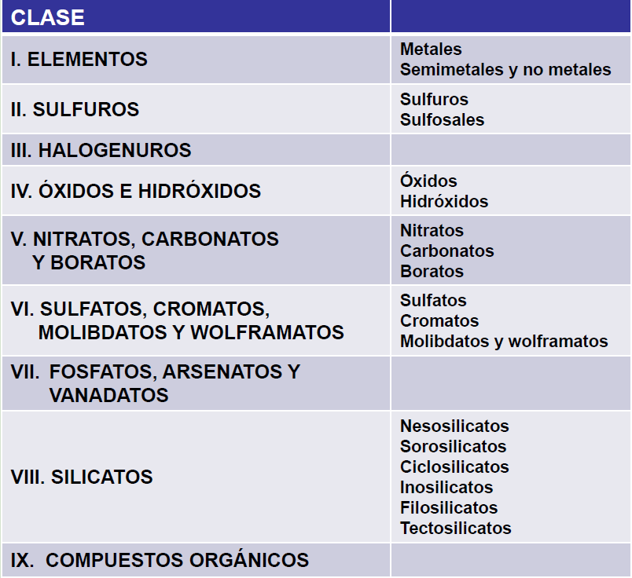{width="5.0in"}
:::

## 4. PROPIEDADES FÍSICAS DE LOS MINERALES

La composición química (tipo de átomos y de enlaces atómicos) y la estructura interna de los minerales (simetría del cristal) determinan sus propiedades. Las principales propiedades físicas que sirven para reconocer los minerales en muestra de mano son:

**a) Brillo**: aspecto o calidad de la luz reflejada por el mineral. Está relacionado con la composición química de los minerales. En general se clasifica como metálico o submetálico, y este último se subdivide en vítreo, resinoso, nacarado, graso, mate.

:::: {.columns}
::: {.column width="50%"}
::: {style="text-align:center;"}
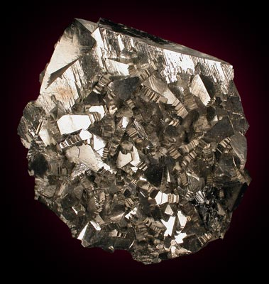{width="1.85in"}
:::
:::
::: {.column width="50%"}
::: {style="text-align:center;"}
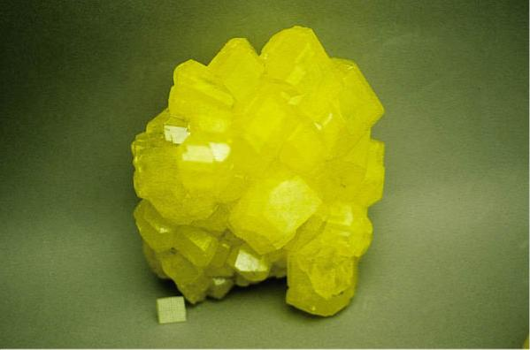{width="3in"}
:::
:::
::::

**b) Color**: raramente es diagnóstico de un mineral. Está relacionado con la composición química de los minerales. A menudo varía por la presencia de impurezas metálicas.

:::: {.columns}
::: {.column width="50%"}
::: {style="text-align:center;"}
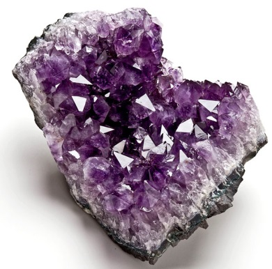{width="1.77in"}
:::
:::
::: {.column width="50%"}
::: {style="text-align:center;"}
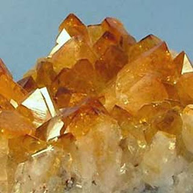{width="1.76in"}
:::
:::
::::

**c) Raya**: color de un mineral en polvo. Está relacionada con la composición química de los minerales. Suele ser más diagnóstica que el color de los cristales.

::: {style="text-align:center;"}
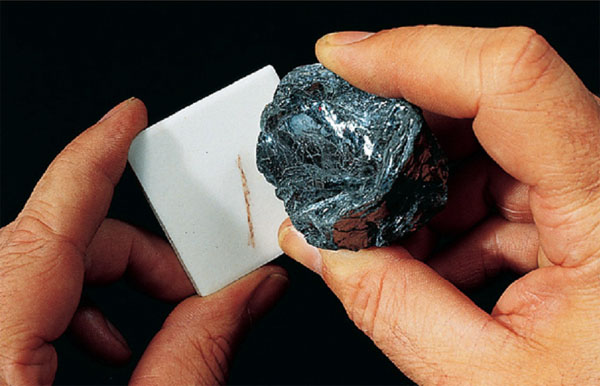{width="3.5in"}
:::

**d) Hábito**: forma común característica de los cristales en tres dimensiones. Está relacionado con la estructura interna de los minerales. Por ejemplo:

::: {style="text-align:center;"}
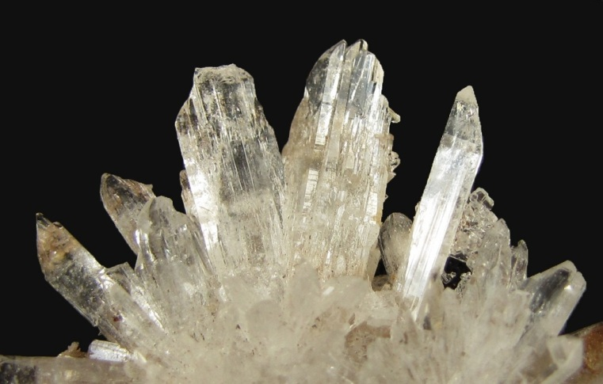{width="3.5in"}
:::

::: {style="text-align:center;"}
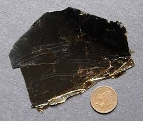{width="3.5in"}
:::

::: {style="text-align:center;"}
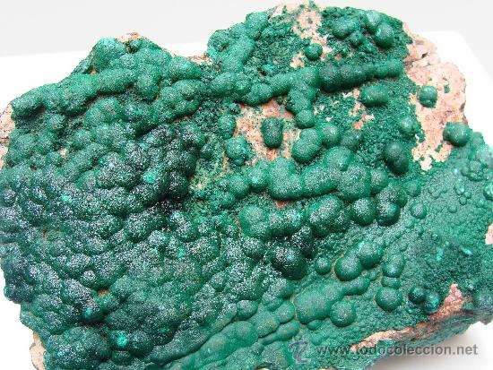{width="3.1in"}
:::

**e) Tenacidad**: resistencia de un mineral a romperse cuando es golpeado. Está relacionada con la estructura interna de los minerales.

**f) Dureza**: resistencia de un mineral a ser rayado. Está relacionada con la estructura interna de los minerales. Se mide en una escala empírica (escala de Mohs) donde los minerales son ordenados según su dureza relativa. El talco (grado 1) es el mineral más blando, y el diamante (grado 10) es el mineral más duro. En la escala de Mohs la uña tiene una dureza de grado 2,5 (raya el yeso y es rayada por la calcita).

::: {style="text-align:center;"}
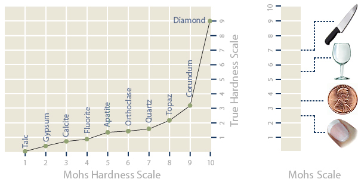{width="6.1in"}
:::

**g) Exfoliación**: tendencia de un mineral a romperse a lo largo de planos separados por enlaces débiles entre los átomos. Está relacionada con la estructura interna de los minerales.

::: {style="text-align:center;"}
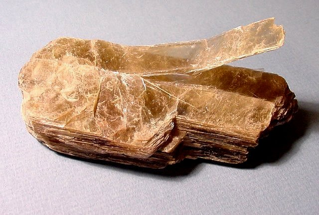{width="3.7in"}
:::

**h) Peso específico**: relación entre el peso del mineral y el peso de un volumen igual de agua. Está relacionado con la composición química y la estructura interna de los minerales. Para muchos minerales varía entre 2 y 3.

## 5. DIAGRAMAS DE FASES

Son diagramas que aplican las reglas de la termodinámica para predecir las condiciones de equilibrio y reacción entre minerales. Se construyen a partir de cálculos teóricos o resultados experimentales y ayudan a definir las condiciones de formación de los minerales. El diagrama siguiente representa las condiciones de presión y temperatura de equilibrio en las que se forman los tres minerales de composición **Al~2~SiO~5~**. Por ejemplo, un aumento de temperatura de 600 a 800 ºC a una presión constante de 7 kilobares causa la transformación de distena a sillimanita.

::: {style="text-align:center;"}
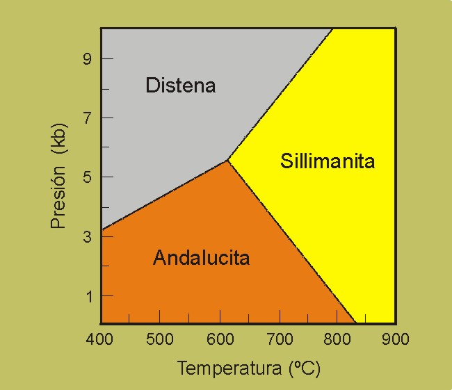{width="3.3in"}
:::