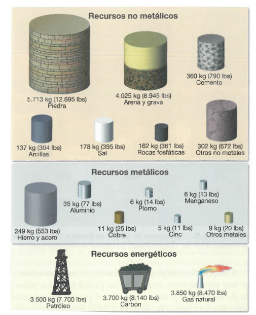
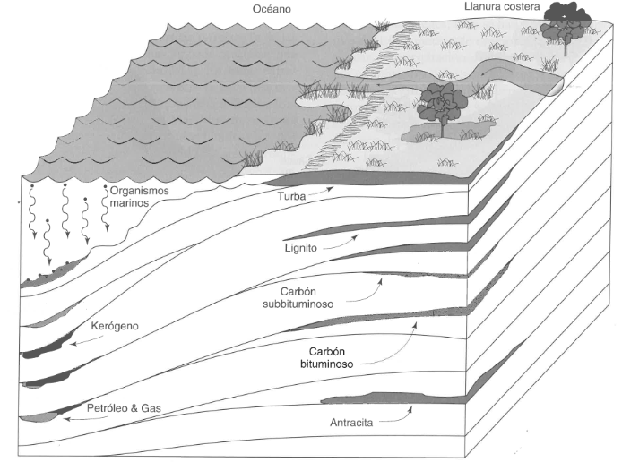
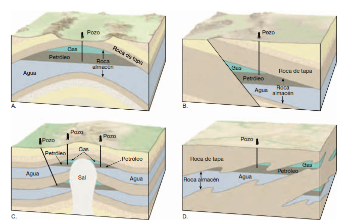
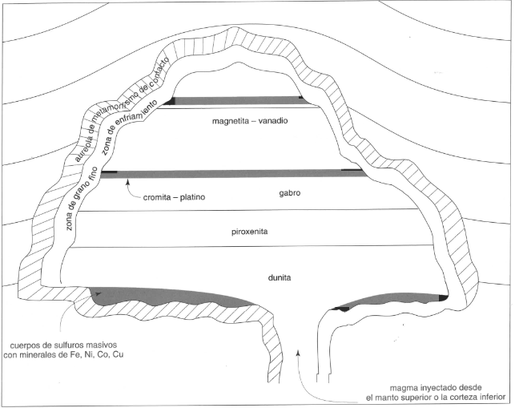
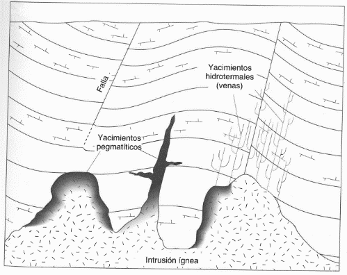
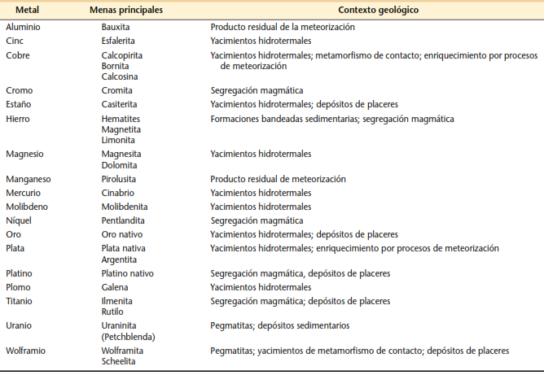
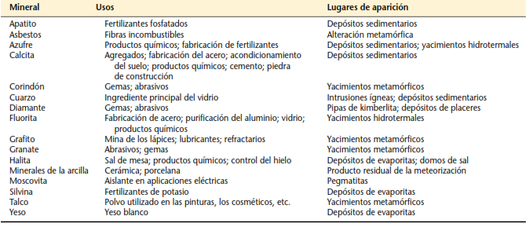
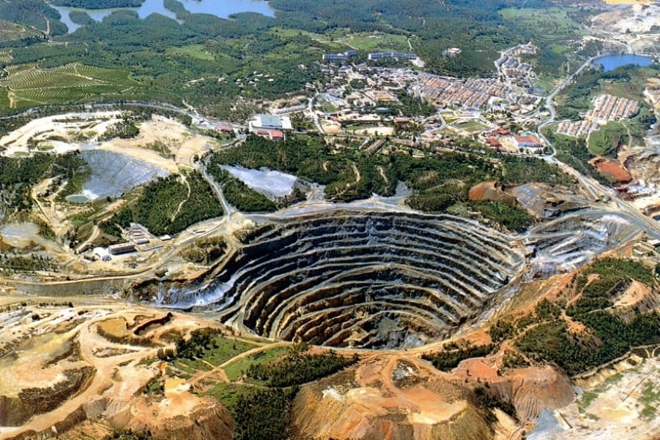
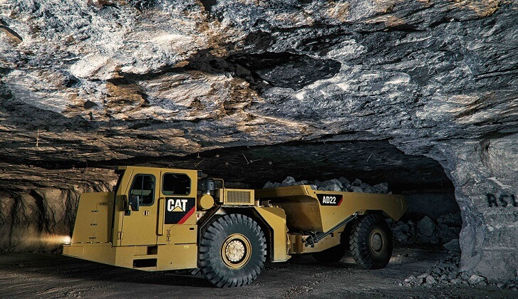

# 1. RECURSOS RENOVABLES Y NO RENOVABLES

Los materiales que extraemos de la Tierra son la base de la civilización moderna. Los **recursos minerales y energéticos** de la corteza son la materia prima a partir de la cual se fabrican los productos utilizados por la sociedad (ej., casas, coches, electrodomésticos, envases, cosméticos, etc.).

Los **recursos renovables** (plantas, animales, energía hidráulica, solar y eólica) pueden volver a recuperarse en tiempos relativamente cortos, de meses, años o decenios. Por el contrario, los **recursos no renovables** (ej., carbón, petróleo, gas natural, hierro, cobre, uranio, oro) se forman en la Tierra por procesos tan lentos que se tarda millones de años en acumular depósitos significativos.

::: {style="text-align:center;"}
{width="4.6in"}
:::

# 2. LOS COMBUSTIBLES FÓSILES

El carbón, el petróleo y el gas natural son los principales combustibles de nuestra moderna economía industrial. El **carbón** se origina por la descomposición de vegetales *terrestres* que se acumulan en zonas pantanosas, lagunares, o marinas de poca profundidad. Los restos vegetales se van acumulando en el fondo de una cuenca, quedan cubiertos de agua y depósitos arcillosos que los protegen del aire, y con el tiempo la acción de bacterias anaerobias causa un progresivo enriquecimiento en carbono generando una roca sedimentaria de color negro ([lignito]{.underline}). El aumento de la temperatura y de la presión causado por el progresivo soterramiento de estas rocas puede incluso transformarlas en rocas metamórficas de bajo grado con un alto poder calorífico ([antracita]{.underline}). El carbón sigue siendo el principal combustible para generar energía en centrales eléctricas. Sin embargo, su combustión libera a la atmosfera importantes cantidades de dióxido (SO~2~) y trióxido de azufre (SO~3~), que pueden favorecer la formación de *lluvias ácidas*, y de dióxido de carbono (CO~2~) que contribuye a aumentar el efecto invernadero responsable del *calentamiento global*.

El **petróleo** y el **gas natural** (mezcla de metano, etano, propano y butano) están constituidos por diversos hidrocarburos derivados de restos de organismos vegetales y animales de origen *marino*. En cuencas sedimentarias cercanas a la costa, grandes cantidades de materia orgánica se entierran y así se protegen de la oxidación, y a lo largo de millones de años se transforman en hidrocarburos líquidos (petróleo) o gaseosos (gas natural).

::: {style="text-align:center;"}
{width="5.0in"}
:::

Siendo poco densos, el petróleo y el gas natural migran hacia la superficie a través del sistema poroso de rocas y sedimentos (*rocas almacén*) y normalmente se evaporan en la atmósfera. Sin embargo, si una estructura geológica (ej., una roca de tapa impermeable) actúa como *trampa*, la migración ascendente se interrumpe y el petróleo y el gas se acumulan en el subsuelo en cantidades económicamente significativas.

::: {style="text-align:center;"}
{width="5.5in"}
:::

Como el carbón, la combustión de petróleo y gas natural posee efectos nocivos para el medioambiente, liberando a la atmósfera partículas y óxidos de azufre, óxidos de nitrógeno y CO~2~ que empeoran la calidad del aire y promueven el *calentamiento global*.

# 3. FUENTES DE ENERGÍA ALTERNATIVAS

Existen diferentes fuentes de energía alternativas a los combustibles fósiles. Las principales son: *la energía nuclear, la energía solar, la energía eólica, la energía hidroeléctrica y la energía geotérmica*.

La **energía nuclear** se produce por fisión de núcleos de átomos radioactivos dentro de un reactor. Los átomos pesados, como el ^235^U o el ^232^Th, son bombardeados por neutrones y se escinden en núcleos de átomos más ligeros emitiendo más neutrones y energía calorífica. La energía producida por la fisión nuclear es utilizada para impulsar turbinas de vapor que mueven generadores eléctricos. La fuente de uranio para los reactores nucleares son determinados **minerales** (ej., la uraninita, UO~2~) concentrados en depósitos de origen ígneo o sedimentario. El uso de la energía nuclear como fuente alternativa a los combustibles fósiles está supeditado a la mitigación de sus riesgos para la salud y el medioambiente, en particular el riesgo de explosiones y la producción de residuos radiactivos.

La explotación de **energía solar** se basa en la captación directa de los rayos del Sol. Los captadores más sofisticados consisten en espejos parabólicos que calientan un fluido generador de vapor que impulsa a una turbina, y en células fotovoltaicas que convierten la energía solar en eléctrica aumentando el estado energético de electrones.

La **energía eólica** es la energía cinética de una masa de aire que se desplaza (viento) y puede ser convertida en energía mecánica que alimenta turbinas eléctricas. La velocidad media del viento para que una planta de energía eólica sea rentable está alrededor de los 20 km/h.

La energía generada por caída de masas de agua puede ser utilizada para impulsar turbinas que producen electricidad, y por esta razón se llama **energía hidroeléctrica**. El agua suele almacenarse en embalses formados detrás de grandes presas. La vida media de una presa construida en un valle fluvial está determinada por la cantidad de sedimento en suspensión transportado por el río, y que tenderá a colmatar el embalse con el tiempo.

La **energía geotérmica** es la energía almacenada en vapor o aguas calientes subterráneas que puede ser utilizada como fuente de calor o para generar electricidad bombeando el vapor y el agua en presión a la superficie. Factores geológicos que favorecen la generación de energía geotérmica son una fuente de calor eficaz (ej., una cámara magmática mediamente profunda o un alto gradiente geotérmico), rocas porosas que permitan la circulación de agua, y una tapa de rocas impermeables que impida el flujo de agua y la dispersión del calor a la superficie.

:::: {.columns}
::: {.column width="50%"}
::: {style="text-align:center;"}
{width="3.5in"}
:::
:::
::: {.column width="50%"}
::: {style="text-align:center;"}
{width="3.5in"}
:::
:::
::::

# 4. RECURSOS MINERALES

Un **recurso mineral** es un material sólido natural concentrado en la corteza terrestre de forma y cantidad suficiente para que su explotación presente o futura resulte económicamente posible. Los recursos se subdividen en *probados*, *probables*, *posibles* y todavía *no identificados*. Los recursos están almacenados en **yacimientos** o **depósitos** explotados o no, cuyas **reservas** indican la parte de los recursos que puede ser extraída de forma económica y legal. El porcentaje de metal que se puede extraer a partir de un volumen determinado de reserva representa la **ley** del yacimiento. Un recurso mineral es una **mena** **metálica** cuando es una fuente económicamente rentable de un metal y se puede extraer de una *mina*.

Algunas de las concentraciones más importantes de metales, como el platino, el cromo y el níquel, son originadas generalmente por procesos ígneos. Por ejemplo, minerales pesados que concentran metales pueden acumularse en diferentes niveles de una cámara magmática por *segregación o acumulación magmática*, y constituir grandes depósitos rentables concentrados en estructuras estratiformes.

::: {style="text-align:center;"}
{width="6.1in"}
:::

Por otro lado, el fundido residual de la cristalización de magmas graníticos puede concentrar elementos raros y metales pesados, además de especies volátiles (H~2~O, CO~2~), y producir rocas con un tamaño de grano muy grande (llamadas *pegmatitas*) que pueden concentrar elementos de alto valor tecnológico (Li, Cs, U, W, tierras raras). Otros yacimientos de gran importancia económica son los generados por *fluidos hidrotermales*, es decir fluidos calientes ricos en metales (ej., Cu, Pb, Zn) producidos en las etapas tardías de enfriamiento de un magma o por circulación profunda de aguas subterráneas, y que pueden precipitar menas metálicas diseminadas o en fracturas.

::: {style="text-align:center;"}
{width="4.4in"}
:::

Depósitos hidrotermales de sulfuros ricos en metales se pueden formar en correspondencia de los márgenes de placa divergentes (dorsales oceánicas), donde el agua de mar se infiltra en la corteza oceánica caliente, se enriquece en azufre y metales, y vuelve a brotar en la superficie en forma de nubes ricas en partículas minerales (*fumarolas negras*), depositando así sulfuros masivos. Otros yacimientos de origen hidrotermal están relacionados con la circulación de fluidos calientes liberados por un magma que se está enfriando y que reaccionan con la roca de caja (*metamorfismo de contacto*).

Los procesos sedimentarios también pueden generar yacimientos minerales metálicos. En particular, la *meteorización* y el *transporte* pueden concentrar in situ o trasladar a otras áreas cantidades valiosas de metales inicialmente dispersos en la roca no meteorizada (*enriquecimiento secundario*). Un ejemplo de depósitos generados por procesos de meteorización son la bauxita (suelo rico en Al) y la laterita (suelo rico en Fe, Ni y Co), que se forman en regiones con clima tropical y lluvioso. En estas regiones, la meteorización química de una roca madre con abundantes silicatos ricos en Al (ej., feldespatos) o Fe-Mg (ej., olivino) causa la lixiviación de elementos solubles en agua y la concentración de Al y otros metales (Fe, Ni y Co) en determinados horizontes del suelo. Los procesos sedimentarios de transporte por agua, olas, o viento también pueden generar depósitos económicos llamados *placeres*, por concentración mecánica de menas metálicas resistentes a la meteorización (ej., oro, platino, óxido de estaño).

::: {style="text-align:center;"}
{width="6.1in"}
:::

Los **materiales de construcción** y los **minerales industriales** son recursos minerales que se extraen y procesan por la *utilidad de sus elementos no metálicos o por sus propiedades químico-físicas*.

La roca triturada, la arena y la grava son áridos ampliamente utilizados en la construcción de edificios y en las obras públicas. Otros importantes materiales de construcción son el yeso para recubrimientos, la arcilla para ladrillos, y el hormigón constituido por una mezcla de cemento y áridos.

Los *minerales industriales* se utilizan en la fabricación de productos químicos o por sus propiedades físicas. Ejemplos de estos minerales son la fluorita (CaF~2~) y la calcita (CaCO~3~) que se utilizan para la producción de acero y cemento, los feldespatos imprescindibles para fabricar vidrio y cerámica, el apatito \[Ca~5~(PO~4~)~3~(OH,F)\] fundamental como fuente de fosforo para fertilizantes, la halita o sal (NaCl) para alimentación o la industria química, las arcillas con importantes aplicaciones en la industria farmacéutica y del papel, y el corindón (Al~2~O~3~) utilizado como abrasivo para producir maquinaria.

::: {style="text-align:center;"}
{width="6.1in"}
:::

# 5. EL IMPACTO AMBIENTAL DE LA EXPLOTACIÓN Y USO DE RECURSOS

La minería, la explotación de canteras, los dragados, la perforación de pozos y la extracción de petróleo y gas son actividades que provocan impactos a menudo irreversibles en el paisaje y por lo tanto en el medioambiente.

La **minería de superficie** es particularmente importante para la producción de áridos, fosfatos, carbón, cobre, hierro y aluminio y suele llevarse a cabo mediante cortas, terrazas o canteras. Esta minería generalmente ocasiona los impactos ambientales más evidentes al mover grandes volúmenes de roca y causar una gran acumulación de estériles. De todos modos, la legislación actual prevé la implementación de medidas para paliar el daño ambiental y restaurar la zona de explotación cuando la operación minera termine.

La **minería subterránea** implica un sistema de operaciones bajo la superficie para extraer recursos profundos pero alcanzables a través de pozos, socavones o túneles inclinados que dan acceso a una zona de extracción o cámara de la mina. Esta modalidad de minería puede ser peligrosa por el riesgo potencial de caída de rocas, hundimientos, entrada de agua y acumulación de gases venenosos o explosivos. Por estos motivos, es esencial que la explotación minera ocurra bajo una extrema vigilancia de los efectos estructurales de las voladuras, y utilizando sistemas de ventilación eficaces que arrastren los gases naturales (metano) y los humos de las explosiones y de la maquinaria.

:::: {.columns}
::: {.column width="50%"}
::: {style="text-align:center;"}
{width="3.1in"}
:::
:::
::: {.column width="50%"}
::: {style="text-align:center;"}
{width="3.5in"}
:::
:::
::::

Además del impacto que las actividades mineras pueden tener en el paisaje, estas labores pueden también generar residuos tóxicos durante el tratamiento y fundición de los minerales, o afectar la composición química de las aguas superficiales o subterráneas. Este último fenómeno, llamado **drenaje ácido de minas**, se produce cuando grandes extensiones de minerales de sulfuros de hierro (principalmente pirita, marcasita, pirrotina) están expuestas a la oxidación por aire húmedo en cortas a cielo abierto o en escombreras de estériles abandonadas, y generan ácido sulfúrico, sulfatos y óxidos de hierro. El agua que entra en contacto con estos compuestos se acidifica y se enriquece en metales tóxicos (ej., As, Pb, Cd, Hg), generando soluciones contaminantes que pueden llegar a los ríos y a los acuíferos. Resulta entonces fundamental implementar acciones para reducir la acidez de las soluciones o evitar que alcancen el sistema de aguas superficiales y subterráneas.

La **perforación de pozos** para extraer recursos líquidos y gaseosos (petróleo, gas natural) o para producir energía geotérmica suele causar un daño directo leve para el medioambiente. Sin embargo, si se ocasiona una surgencia eruptiva de petróleo o de gas a alta presión se pueden verificar explosiones, incendios o contaminación del área circunstante. Este peligro es más alto para explotaciones marinas (offshore) que pueden causar importantes vertidos de petróleo al mar.

No solo las actividades de explotación, sino también el **uso de los recursos** puede tener efectos nocivos para el medioambiente. Por ejemplo, la ignición de combustibles fósiles en centrales eléctricas, casas, industrias, y por los motores de automóviles y aviones produce la emisión de gases (CO, SO~2~, SO~3~) y micropartículas que promueven la formación de lluvias ácidas y son perjudiciales para la calidad del aire. Además, la combustión continua de petróleo y gas aumenta la concentración de CO~2~ en la atmósfera, contribuyendo a retener el calor desprendido por la Tierra (*efecto invernadero*) y por lo tanto a incrementar su temperatura media (*calentamiento global*). También el uso de petróleo para fabricar una gran variedad de compuestos químicos industriales produce estériles y contaminantes. Finalmente, el empleo de combustibles nucleares en las centrales genera productos residuales radiactivos de extrema toxicidad, que exigen métodos especiales de almacenamiento y eliminación.